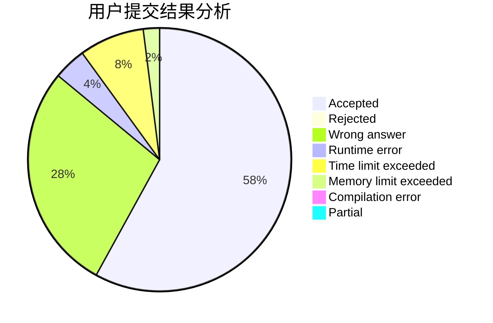
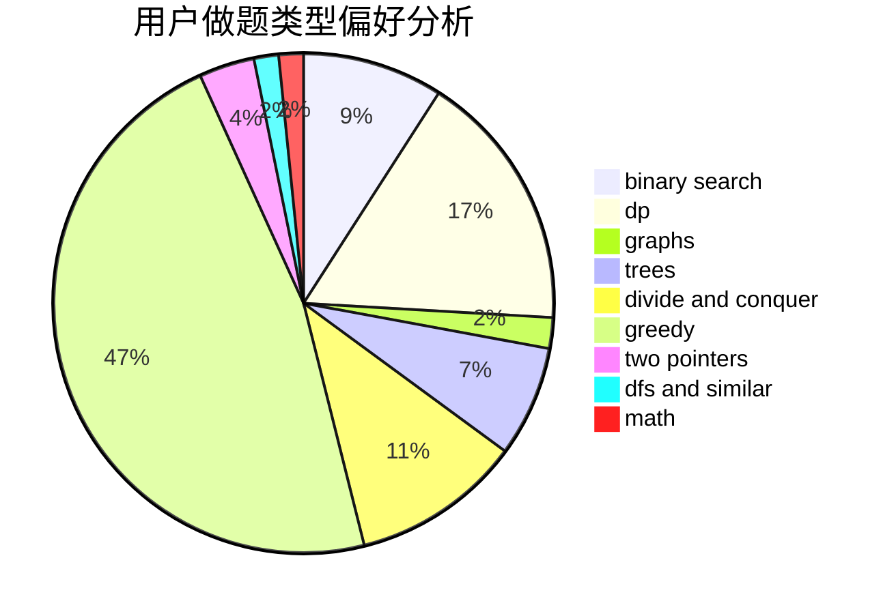

# HChhokmah

<!-- tabs:start -->

#### **用户提交结果分析**

#### **用户做题类型偏好分析**

<!-- tabs:end -->
# 推荐题目
[913A](https://codeforces.com/contest/913/problem/A)
[7C](https://codeforces.com/contest/7/problem/C)
[437B](https://codeforces.com/contest/437/problem/B)
[1086C](https://codeforces.com/contest/1086/problem/C)
[220C](https://codeforces.com/contest/220/problem/C)
[1038C](https://codeforces.com/contest/1038/problem/C)
[913B](https://codeforces.com/contest/913/problem/B)
[1322E](https://codeforces.com/contest/1322/problem/E)
[1362D](https://codeforces.com/contest/1362/problem/D)
[1033A](https://codeforces.com/contest/1033/problem/A)
