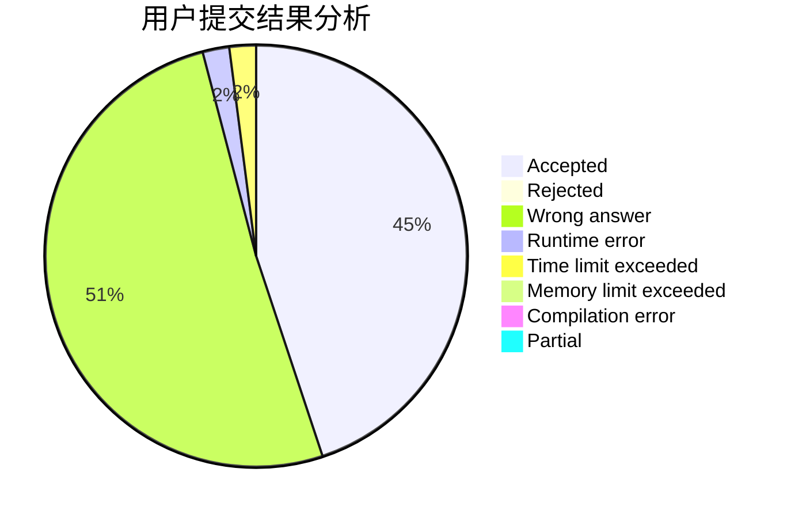
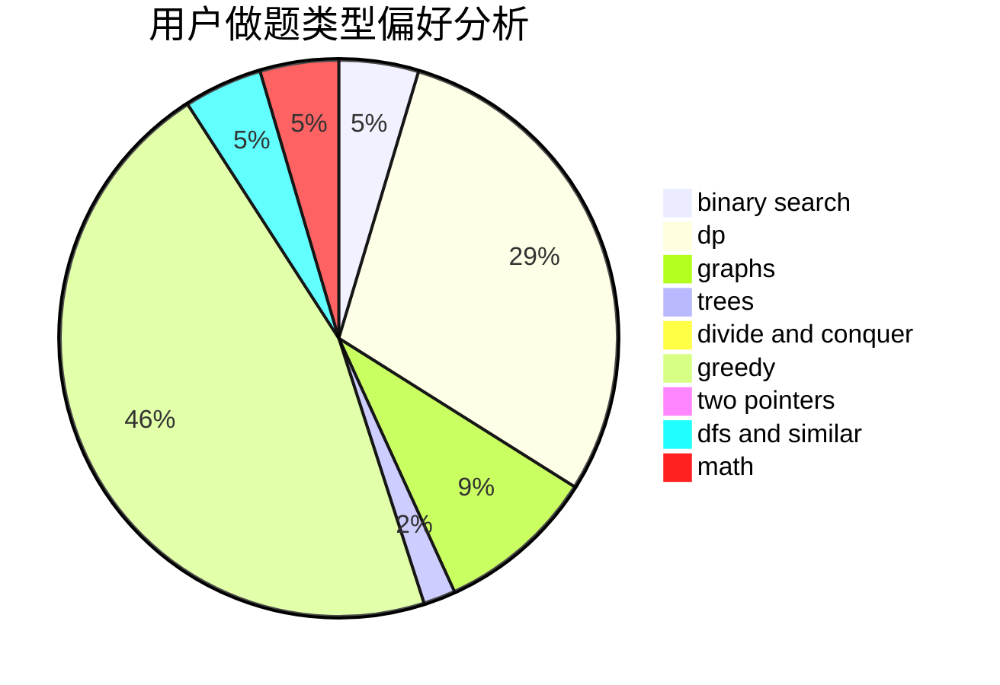

# HIT_One

<!-- tabs:start -->

#### **用户提交结果分析**

#### **用户做题类型偏好分析**

<!-- tabs:end -->
# 推荐题目
[585F](https://codeforces.com/contest/585/problem/F)
[185A](https://codeforces.com/contest/185/problem/A)
[1361A](https://codeforces.com/contest/1361/problem/A)
[300E](https://codeforces.com/contest/300/problem/E)
[1061F](https://codeforces.com/contest/1061/problem/F)
[183D](https://codeforces.com/contest/183/problem/D)
[1307D](https://codeforces.com/contest/1307/problem/D)
[235D](https://codeforces.com/contest/235/problem/D)
[913D](https://codeforces.com/contest/913/problem/D)
[689A](https://codeforces.com/contest/689/problem/A)
