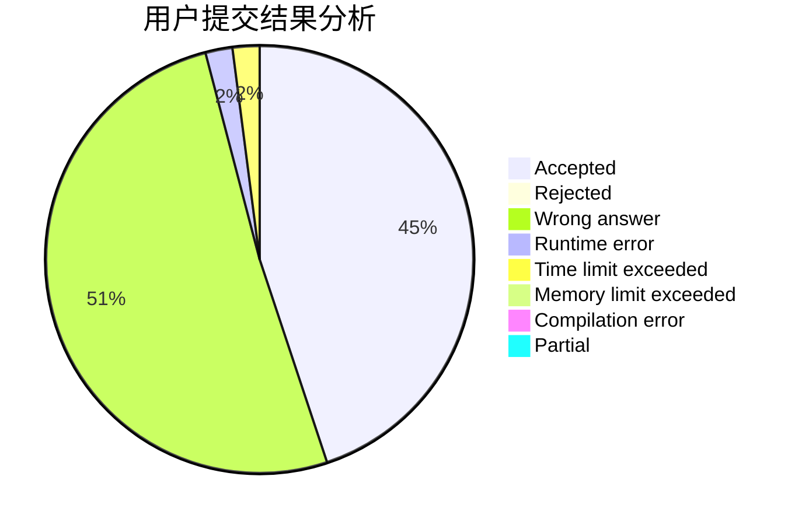
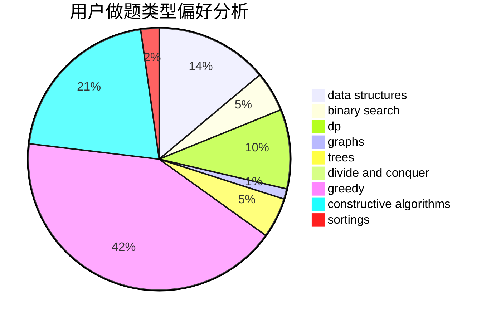
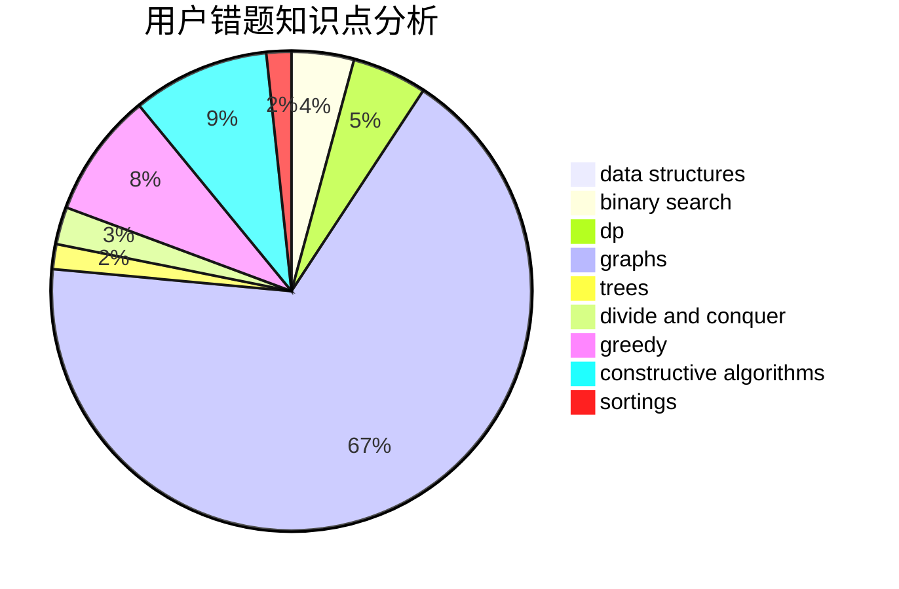

# HIT_One
<!-- tabs:start -->
#### **用户提交结果分析**

#### **用户做题类型偏好分析**

#### **用户错题知识点分析**

<!-- tabs:end -->
# 推荐题目
[567A](http://codeforces.com/problemset/problem/567/A)		greedy,
                        implementation		  
[160B](http://codeforces.com/problemset/problem/160/B)		greedy,
                        sortings		  
[216B](http://codeforces.com/problemset/problem/216/B)		dfs and similar,
                        implementation		  
[667A](http://codeforces.com/problemset/problem/667/A)		geometry,
                        math		  
[1061B](http://codeforces.com/problemset/problem/1061/B)		greedy,
                        implementation,
                        sortings		  
[12C](http://codeforces.com/problemset/problem/12/C)		greedy,
                        implementation,
                        sortings		  
[286D](http://codeforces.com/problemset/problem/286/D)		data structures,
                        sortings		  
[1354D](http://codeforces.com/problemset/problem/1354/D)		binary search,
                        data structures		  
[223C](http://codeforces.com/problemset/problem/223/C)		combinatorics,
                        math,
                        number theory		  
[799D](http://codeforces.com/problemset/problem/799/D)		brute force,
                        dp,
                        meet-in-the-middle		  
<!-- tabs:start -->
#### **data structures**
[286D](http://codeforces.com/problemset/problem/286/D)		data structures,
                        sortings		  
[1354D](http://codeforces.com/problemset/problem/1354/D)		binary search,
                        data structures		  
[1137F](http://codeforces.com/problemset/problem/1137/F)		data structures,
                        trees		  
[600B](http://codeforces.com/problemset/problem/600/B)		binary search,
                        data structures,
                        sortings,
                        two pointers		  
[1488F](http://codeforces.com/problemset/problem/1488/F)		*special problem,
                        *special problem,
                        binary search,
                        data structures		  
[213E](http://codeforces.com/problemset/problem/213/E)		data structures,
                        hashing,
                        strings		  
[1479B1](http://codeforces.com/problemset/problem/1479/B1)		constructive algorithms,
                        data structures,
                        dp,
                        greedy,
                        implementation		  
[1492C](http://codeforces.com/problemset/problem/1492/C)		binary search,
                        data structures,
                        dp,
                        greedy,
                        two pointers		  
[1490G](http://codeforces.com/problemset/problem/1490/G)		binary search,
                        data structures,
                        math		  
[1479D](http://codeforces.com/problemset/problem/1479/D)		binary search,
                        bitmasks,
                        brute force,
                        data structures,
                        probabilities,
                        trees		  
#### **binary search**
[1354D](http://codeforces.com/problemset/problem/1354/D)		binary search,
                        data structures		  
[492D](http://codeforces.com/problemset/problem/492/D)		binary search,
                        implementation,
                        math,
                        sortings		  
[1246C](https://codeforces.com/contest/1246/problem/C)		binary search,
                        dp		  
[807C](https://codeforces.com/contest/807/problem/C)		binary search,
                        math		  
[1076C](http://codeforces.com/problemset/problem/1076/C)		binary search,
                        math		  
[600B](http://codeforces.com/problemset/problem/600/B)		binary search,
                        data structures,
                        sortings,
                        two pointers		  
[1488F](http://codeforces.com/problemset/problem/1488/F)		*special problem,
                        *special problem,
                        binary search,
                        data structures		  
[896A](http://codeforces.com/problemset/problem/896/A)		binary search,
                        dfs and similar		  
[1426C](http://codeforces.com/problemset/problem/1426/C)		binary search,
                        constructive algorithms,
                        math		  
[1492C](http://codeforces.com/problemset/problem/1492/C)		binary search,
                        data structures,
                        dp,
                        greedy,
                        two pointers		  
#### **dp**
[799D](http://codeforces.com/problemset/problem/799/D)		brute force,
                        dp,
                        meet-in-the-middle		  
[1246C](https://codeforces.com/contest/1246/problem/C)		binary search,
                        dp		  
[128C](http://codeforces.com/problemset/problem/128/C)		combinatorics,
                        dp		  
[811C](http://codeforces.com/problemset/problem/811/C)		dp,
                        implementation		  
[1479B1](http://codeforces.com/problemset/problem/1479/B1)		constructive algorithms,
                        data structures,
                        dp,
                        greedy,
                        implementation		  
[1341D](https://codeforces.com/contest/1341/problem/D)		bitmasks,
                        dp,
                        graphs,
                        greedy		  
[1510H](http://codeforces.com/problemset/problem/1510/H)		dp		  
[1492C](http://codeforces.com/problemset/problem/1492/C)		binary search,
                        data structures,
                        dp,
                        greedy,
                        two pointers		  
[1457C](https://codeforces.com/contest/1457/problem/C)		brute force,
                        dp,
                        implementation		  
[1491C](http://codeforces.com/problemset/problem/1491/C)		brute force,
                        data structures,
                        dp,
                        greedy,
                        implementation		  
#### **graph**
[1385G](http://codeforces.com/problemset/problem/1385/G)		2-sat,
                        dfs and similar,
                        dsu,
                        graphs,
                        implementation		  
[1213G](http://codeforces.com/problemset/problem/1213/G)		divide and conquer,
                        dsu,
                        graphs,
                        sortings,
                        trees		  
[1360C](http://codeforces.com/problemset/problem/1360/C)		constructive algorithms,
                        graph matchings,
                        greedy,
                        sortings		  
[1320B](http://codeforces.com/problemset/problem/1320/B)		dfs and similar,
                        graphs,
                        shortest paths		  
[811D](http://codeforces.com/problemset/problem/811/D)		constructive algorithms,
                        dfs and similar,
                        graphs,
                        interactive		  
[1341D](https://codeforces.com/contest/1341/problem/D)		bitmasks,
                        dp,
                        graphs,
                        greedy		  
[1487C](http://codeforces.com/problemset/problem/1487/C)		brute force,
                        constructive algorithms,
                        dfs and similar,
                        graphs,
                        greedy,
                        implementation,
                        math		  
[1437C](http://codeforces.com/problemset/problem/1437/C)		dp,
                        flows,
                        graph matchings,
                        greedy,
                        math,
                        sortings		  
[1470D](http://codeforces.com/problemset/problem/1470/D)		constructive algorithms,
                        dfs and similar,
                        graph matchings,
                        graphs,
                        greedy		  
[1476C](http://codeforces.com/problemset/problem/1476/C)		dp,
                        graphs,
                        greedy		  
#### **trees**
[1137F](http://codeforces.com/problemset/problem/1137/F)		data structures,
                        trees		  
[1213G](http://codeforces.com/problemset/problem/1213/G)		divide and conquer,
                        dsu,
                        graphs,
                        sortings,
                        trees		  
[1479D](http://codeforces.com/problemset/problem/1479/D)		binary search,
                        bitmasks,
                        brute force,
                        data structures,
                        probabilities,
                        trees		  
[1511C](http://codeforces.com/problemset/problem/1511/C)		brute force,
                        data structures,
                        implementation,
                        trees		  
[1499F](http://codeforces.com/problemset/problem/1499/F)		combinatorics,
                        dfs and similar,
                        dp,
                        trees		  
[1491E](http://codeforces.com/problemset/problem/1491/E)		brute force,
                        dfs and similar,
                        divide and conquer,
                        number theory,
                        trees		  
[1466D](http://codeforces.com/problemset/problem/1466/D)		data structures,
                        greedy,
                        sortings,
                        trees		  
[1495D](http://codeforces.com/problemset/problem/1495/D)		combinatorics,
                        dfs and similar,
                        graphs,
                        math,
                        shortest paths,
                        trees		  
[1303G](http://codeforces.com/problemset/problem/1303/G)		data structures,
                        divide and conquer,
                        geometry,
                        trees		  
[1454E](http://codeforces.com/problemset/problem/1454/E)		combinatorics,
                        dfs and similar,
                        graphs,
                        trees		  
#### **divide and conquer**
[1213G](http://codeforces.com/problemset/problem/1213/G)		divide and conquer,
                        dsu,
                        graphs,
                        sortings,
                        trees		  
[1461D](http://codeforces.com/problemset/problem/1461/D)		binary search,
                        brute force,
                        data structures,
                        divide and conquer,
                        implementation,
                        sortings		  
[1466G](http://codeforces.com/problemset/problem/1466/G)		combinatorics,
                        divide and conquer,
                        hashing,
                        math,
                        string suffix structures,
                        strings		  
[1490D](http://codeforces.com/problemset/problem/1490/D)		dfs and similar,
                        divide and conquer,
                        implementation		  
[1483C](https://codeforces.com/contest/1483/problem/C)		data structures,
                        divide and conquer,
                        dp		  
[1491E](http://codeforces.com/problemset/problem/1491/E)		brute force,
                        dfs and similar,
                        divide and conquer,
                        number theory,
                        trees		  
[1303G](http://codeforces.com/problemset/problem/1303/G)		data structures,
                        divide and conquer,
                        geometry,
                        trees		  
[1494D](http://codeforces.com/problemset/problem/1494/D)		constructive algorithms,
                        data structures,
                        dfs and similar,
                        divide and conquer,
                        dsu,
                        greedy,
                        sortings,
                        trees		  
[1482E](http://codeforces.com/problemset/problem/1482/E)		data structures,
                        divide and conquer,
                        dp		  
[566C](http://codeforces.com/problemset/problem/566/C)		dfs and similar,
                        divide and conquer,
                        trees		  
#### **greedy**
[567A](http://codeforces.com/problemset/problem/567/A)		greedy,
                        implementation		  
[160B](http://codeforces.com/problemset/problem/160/B)		greedy,
                        sortings		  
[1061B](http://codeforces.com/problemset/problem/1061/B)		greedy,
                        implementation,
                        sortings		  
[12C](http://codeforces.com/problemset/problem/12/C)		greedy,
                        implementation,
                        sortings		  
[160A](http://codeforces.com/problemset/problem/160/A)		greedy,
                        sortings		  
[1175D](http://codeforces.com/problemset/problem/1175/D)		greedy,
                        sortings		  
[1360C](http://codeforces.com/problemset/problem/1360/C)		constructive algorithms,
                        graph matchings,
                        greedy,
                        sortings		  
[1230B](http://codeforces.com/problemset/problem/1230/B)		greedy,
                        implementation		  
[1479B1](http://codeforces.com/problemset/problem/1479/B1)		constructive algorithms,
                        data structures,
                        dp,
                        greedy,
                        implementation		  
[1341D](https://codeforces.com/contest/1341/problem/D)		bitmasks,
                        dp,
                        graphs,
                        greedy		  
#### **constructive algorithms**
[1109B](http://codeforces.com/problemset/problem/1109/B)		constructive algorithms,
                        hashing,
                        strings		  
[1360C](http://codeforces.com/problemset/problem/1360/C)		constructive algorithms,
                        graph matchings,
                        greedy,
                        sortings		  
[1426C](http://codeforces.com/problemset/problem/1426/C)		binary search,
                        constructive algorithms,
                        math		  
[1479B1](http://codeforces.com/problemset/problem/1479/B1)		constructive algorithms,
                        data structures,
                        dp,
                        greedy,
                        implementation		  
[811D](http://codeforces.com/problemset/problem/811/D)		constructive algorithms,
                        dfs and similar,
                        graphs,
                        interactive		  
[1493A](http://codeforces.com/problemset/problem/1493/A)		constructive algorithms,
                        greedy		  
[1463D](http://codeforces.com/problemset/problem/1463/D)		binary search,
                        constructive algorithms,
                        greedy,
                        two pointers		  
[1456B](https://codeforces.com/contest/1456/problem/B)		bitmasks,
                        brute force,
                        constructive algorithms		  
[1492D](http://codeforces.com/problemset/problem/1492/D)		bitmasks,
                        constructive algorithms,
                        greedy,
                        math		  
[1504D](https://codeforces.com/contest/1504/problem/D)		constructive algorithms,
                        games,
                        interactive		  
#### **sortings**
[160B](http://codeforces.com/problemset/problem/160/B)		greedy,
                        sortings		  
[1061B](http://codeforces.com/problemset/problem/1061/B)		greedy,
                        implementation,
                        sortings		  
[12C](http://codeforces.com/problemset/problem/12/C)		greedy,
                        implementation,
                        sortings		  
[286D](http://codeforces.com/problemset/problem/286/D)		data structures,
                        sortings		  
[492D](http://codeforces.com/problemset/problem/492/D)		binary search,
                        implementation,
                        math,
                        sortings		  
[1213G](http://codeforces.com/problemset/problem/1213/G)		divide and conquer,
                        dsu,
                        graphs,
                        sortings,
                        trees		  
[600B](http://codeforces.com/problemset/problem/600/B)		binary search,
                        data structures,
                        sortings,
                        two pointers		  
[160A](http://codeforces.com/problemset/problem/160/A)		greedy,
                        sortings		  
[1175D](http://codeforces.com/problemset/problem/1175/D)		greedy,
                        sortings		  
[1155A](http://codeforces.com/problemset/problem/1155/A)		implementation,
                        sortings,
                        strings		  
<!-- tabs:end -->
