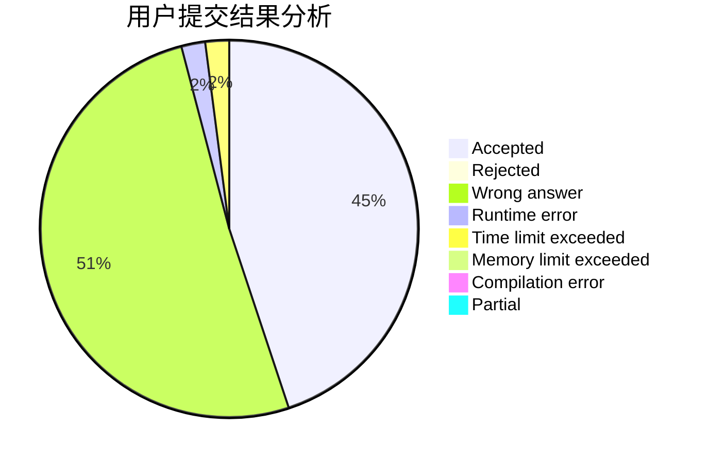
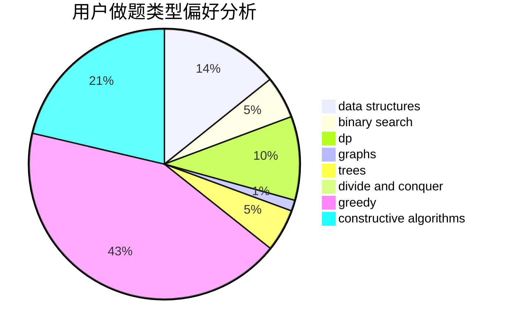
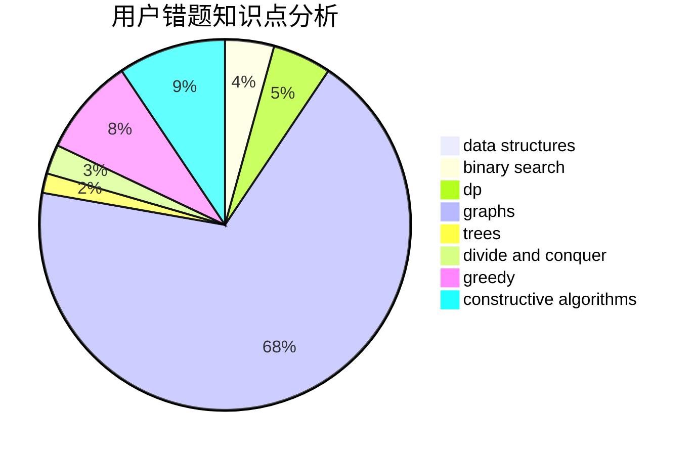

# HIT_One
<!-- tabs:start -->
#### **用户提交结果分析**

#### **用户做题类型偏好分析**

#### **用户错题知识点分析**

<!-- tabs:end -->
# 推荐题目
[Lineland Mail](http://codeforces.com/problemset/problem/567/A)		greedy,
                        implementation		  
[Unlucky Ticket](http://codeforces.com/problemset/problem/160/B)		greedy,
                        sortings		  
[Forming Teams](http://codeforces.com/problemset/problem/216/B)		dfs and similar,
                        implementation		  
[Pouring Rain](http://codeforces.com/problemset/problem/667/A)		geometry,
                        math		  
[Views Matter](http://codeforces.com/problemset/problem/1061/B)		greedy,
                        implementation,
                        sortings		  
[Fruits](http://codeforces.com/problemset/problem/12/C)		greedy,
                        implementation,
                        sortings		  
[Tourists](http://codeforces.com/problemset/problem/286/D)		data structures,
                        sortings		  
[Multiset](http://codeforces.com/problemset/problem/1354/D)		binary search,
                        data structures		  
[Partial Sums](http://codeforces.com/problemset/problem/223/C)		combinatorics,
                        math,
                        number theory		  
[Field expansion](http://codeforces.com/problemset/problem/799/D)		brute force,
                        dp,
                        meet-in-the-middle		  
<!-- tabs:start -->
#### **data structures**
[Tourists](http://codeforces.com/problemset/problem/286/D)		data structures,
                        sortings		  
[Multiset](http://codeforces.com/problemset/problem/1354/D)		binary search,
                        data structures		  
[Matches Are Not a Child's Play](http://codeforces.com/problemset/problem/1137/F)		data structures,
                        trees		  
[Queries about less or equal elements](http://codeforces.com/problemset/problem/600/B)		binary search,
                        data structures,
                        sortings,
                        two pointers		  
[Dogecoin](http://codeforces.com/problemset/problem/1488/F)		*special problem,
                        *special problem,
                        binary search,
                        data structures		  
[Two Permutations](http://codeforces.com/problemset/problem/213/E)		data structures,
                        hashing,
                        strings		  
[Painting the Array I](http://codeforces.com/problemset/problem/1479/B1)		constructive algorithms,
                        data structures,
                        dp,
                        greedy,
                        implementation		  
[Maximum width](http://codeforces.com/problemset/problem/1492/C)		binary search,
                        data structures,
                        dp,
                        greedy,
                        two pointers		  
[Old Floppy Drive](http://codeforces.com/problemset/problem/1490/G)		binary search,
                        data structures,
                        math		  
[Odd Mineral Resource](http://codeforces.com/problemset/problem/1479/D)		binary search,
                        bitmasks,
                        brute force,
                        data structures,
                        probabilities,
                        trees		  
#### **binary search**
[Multiset](http://codeforces.com/problemset/problem/1354/D)		binary search,
                        data structures		  
[Vanya and Computer Game](http://codeforces.com/problemset/problem/492/D)		binary search,
                        implementation,
                        math,
                        sortings		  
[Rock Is Push](https://codeforces.com/contest/1246/problem/C)		binary search,
                        dp		  
[Success Rate](https://codeforces.com/contest/807/problem/C)		binary search,
                        math		  
[Meme Problem](http://codeforces.com/problemset/problem/1076/C)		binary search,
                        math		  
[Queries about less or equal elements](http://codeforces.com/problemset/problem/600/B)		binary search,
                        data structures,
                        sortings,
                        two pointers		  
[Dogecoin](http://codeforces.com/problemset/problem/1488/F)		*special problem,
                        *special problem,
                        binary search,
                        data structures		  
[Nephren gives a riddle](http://codeforces.com/problemset/problem/896/A)		binary search,
                        dfs and similar		  
[Increase and Copy](http://codeforces.com/problemset/problem/1426/C)		binary search,
                        constructive algorithms,
                        math		  
[Maximum width](http://codeforces.com/problemset/problem/1492/C)		binary search,
                        data structures,
                        dp,
                        greedy,
                        two pointers		  
#### **dp**
[Field expansion](http://codeforces.com/problemset/problem/799/D)		brute force,
                        dp,
                        meet-in-the-middle		  
[Rock Is Push](https://codeforces.com/contest/1246/problem/C)		binary search,
                        dp		  
[Games with Rectangle](http://codeforces.com/problemset/problem/128/C)		combinatorics,
                        dp		  
[Vladik and Memorable Trip](http://codeforces.com/problemset/problem/811/C)		dp,
                        implementation		  
[Painting the Array I](http://codeforces.com/problemset/problem/1479/B1)		constructive algorithms,
                        data structures,
                        dp,
                        greedy,
                        implementation		  
[Nastya and Scoreboard](https://codeforces.com/contest/1341/problem/D)		bitmasks,
                        dp,
                        graphs,
                        greedy		  
[Hard Optimization](http://codeforces.com/problemset/problem/1510/H)		dp		  
[Maximum width](http://codeforces.com/problemset/problem/1492/C)		binary search,
                        data structures,
                        dp,
                        greedy,
                        two pointers		  
[Bouncing Ball](https://codeforces.com/contest/1457/problem/C)		brute force,
                        dp,
                        implementation		  
[Pekora and Trampoline](http://codeforces.com/problemset/problem/1491/C)		brute force,
                        data structures,
                        dp,
                        greedy,
                        implementation		  
#### **graph**
[Columns Swaps](http://codeforces.com/problemset/problem/1385/G)		2-sat,
                        dfs and similar,
                        dsu,
                        graphs,
                        implementation		  
[Path Queries](http://codeforces.com/problemset/problem/1213/G)		divide and conquer,
                        dsu,
                        graphs,
                        sortings,
                        trees		  
[Similar Pairs](http://codeforces.com/problemset/problem/1360/C)		constructive algorithms,
                        graph matchings,
                        greedy,
                        sortings		  
[Navigation System](http://codeforces.com/problemset/problem/1320/B)		dfs and similar,
                        graphs,
                        shortest paths		  
[Vladik and Favorite Game](http://codeforces.com/problemset/problem/811/D)		constructive algorithms,
                        dfs and similar,
                        graphs,
                        interactive		  
[Nastya and Scoreboard](https://codeforces.com/contest/1341/problem/D)		bitmasks,
                        dp,
                        graphs,
                        greedy		  
[Minimum Ties](http://codeforces.com/problemset/problem/1487/C)		brute force,
                        constructive algorithms,
                        dfs and similar,
                        graphs,
                        greedy,
                        implementation,
                        math		  
[Chef Monocarp](http://codeforces.com/problemset/problem/1437/C)		dp,
                        flows,
                        graph matchings,
                        greedy,
                        math,
                        sortings		  
[Strange Housing](http://codeforces.com/problemset/problem/1470/D)		constructive algorithms,
                        dfs and similar,
                        graph matchings,
                        graphs,
                        greedy		  
[Longest Simple Cycle](http://codeforces.com/problemset/problem/1476/C)		dp,
                        graphs,
                        greedy		  
#### **trees**
[Matches Are Not a Child's Play](http://codeforces.com/problemset/problem/1137/F)		data structures,
                        trees		  
[Path Queries](http://codeforces.com/problemset/problem/1213/G)		divide and conquer,
                        dsu,
                        graphs,
                        sortings,
                        trees		  
[Odd Mineral Resource](http://codeforces.com/problemset/problem/1479/D)		binary search,
                        bitmasks,
                        brute force,
                        data structures,
                        probabilities,
                        trees		  
[Yet Another Card Deck](http://codeforces.com/problemset/problem/1511/C)		brute force,
                        data structures,
                        implementation,
                        trees		  
[Diameter Cuts](http://codeforces.com/problemset/problem/1499/F)		combinatorics,
                        dfs and similar,
                        dp,
                        trees		  
[Fib-tree](http://codeforces.com/problemset/problem/1491/E)		brute force,
                        dfs and similar,
                        divide and conquer,
                        number theory,
                        trees		  
[13th Labour of Heracles](http://codeforces.com/problemset/problem/1466/D)		data structures,
                        greedy,
                        sortings,
                        trees		  
[BFS Trees](http://codeforces.com/problemset/problem/1495/D)		combinatorics,
                        dfs and similar,
                        graphs,
                        math,
                        shortest paths,
                        trees		  
[Sum of Prefix Sums](http://codeforces.com/problemset/problem/1303/G)		data structures,
                        divide and conquer,
                        geometry,
                        trees		  
[Number of Simple Paths](http://codeforces.com/problemset/problem/1454/E)		combinatorics,
                        dfs and similar,
                        graphs,
                        trees		  
#### **divide and conquer**
[Path Queries](http://codeforces.com/problemset/problem/1213/G)		divide and conquer,
                        dsu,
                        graphs,
                        sortings,
                        trees		  
[Divide and Summarize](http://codeforces.com/problemset/problem/1461/D)		binary search,
                        brute force,
                        data structures,
                        divide and conquer,
                        implementation,
                        sortings		  
[Song of the Sirens](http://codeforces.com/problemset/problem/1466/G)		combinatorics,
                        divide and conquer,
                        hashing,
                        math,
                        string suffix structures,
                        strings		  
[Permutation Transformation](http://codeforces.com/problemset/problem/1490/D)		dfs and similar,
                        divide and conquer,
                        implementation		  
[Skyline Photo](https://codeforces.com/contest/1483/problem/C)		data structures,
                        divide and conquer,
                        dp		  
[Fib-tree](http://codeforces.com/problemset/problem/1491/E)		brute force,
                        dfs and similar,
                        divide and conquer,
                        number theory,
                        trees		  
[Sum of Prefix Sums](http://codeforces.com/problemset/problem/1303/G)		data structures,
                        divide and conquer,
                        geometry,
                        trees		  
[Dogeforces](http://codeforces.com/problemset/problem/1494/D)		constructive algorithms,
                        data structures,
                        dfs and similar,
                        divide and conquer,
                        dsu,
                        greedy,
                        sortings,
                        trees		  
[Skyline Photo](http://codeforces.com/problemset/problem/1482/E)		data structures,
                        divide and conquer,
                        dp		  
[Logistical Questions](http://codeforces.com/problemset/problem/566/C)		dfs and similar,
                        divide and conquer,
                        trees		  
#### **greedy**
[Lineland Mail](http://codeforces.com/problemset/problem/567/A)		greedy,
                        implementation		  
[Unlucky Ticket](http://codeforces.com/problemset/problem/160/B)		greedy,
                        sortings		  
[Views Matter](http://codeforces.com/problemset/problem/1061/B)		greedy,
                        implementation,
                        sortings		  
[Fruits](http://codeforces.com/problemset/problem/12/C)		greedy,
                        implementation,
                        sortings		  
[Twins](http://codeforces.com/problemset/problem/160/A)		greedy,
                        sortings		  
[Array Splitting](http://codeforces.com/problemset/problem/1175/D)		greedy,
                        sortings		  
[Similar Pairs](http://codeforces.com/problemset/problem/1360/C)		constructive algorithms,
                        graph matchings,
                        greedy,
                        sortings		  
[Ania and Minimizing](http://codeforces.com/problemset/problem/1230/B)		greedy,
                        implementation		  
[Painting the Array I](http://codeforces.com/problemset/problem/1479/B1)		constructive algorithms,
                        data structures,
                        dp,
                        greedy,
                        implementation		  
[Nastya and Scoreboard](https://codeforces.com/contest/1341/problem/D)		bitmasks,
                        dp,
                        graphs,
                        greedy		  
#### **constructive algorithms**
[Sasha and One More Name](http://codeforces.com/problemset/problem/1109/B)		constructive algorithms,
                        hashing,
                        strings		  
[Similar Pairs](http://codeforces.com/problemset/problem/1360/C)		constructive algorithms,
                        graph matchings,
                        greedy,
                        sortings		  
[Increase and Copy](http://codeforces.com/problemset/problem/1426/C)		binary search,
                        constructive algorithms,
                        math		  
[Painting the Array I](http://codeforces.com/problemset/problem/1479/B1)		constructive algorithms,
                        data structures,
                        dp,
                        greedy,
                        implementation		  
[Vladik and Favorite Game](http://codeforces.com/problemset/problem/811/D)		constructive algorithms,
                        dfs and similar,
                        graphs,
                        interactive		  
[Anti-knapsack](http://codeforces.com/problemset/problem/1493/A)		constructive algorithms,
                        greedy		  
[Pairs](http://codeforces.com/problemset/problem/1463/D)		binary search,
                        constructive algorithms,
                        greedy,
                        two pointers		  
[XOR-gun](https://codeforces.com/contest/1456/problem/B)		bitmasks,
                        brute force,
                        constructive algorithms		  
[Genius's Gambit](http://codeforces.com/problemset/problem/1492/D)		bitmasks,
                        constructive algorithms,
                        greedy,
                        math		  
[3-Coloring](https://codeforces.com/contest/1504/problem/D)		constructive algorithms,
                        games,
                        interactive		  
#### **sortings**
[Unlucky Ticket](http://codeforces.com/problemset/problem/160/B)		greedy,
                        sortings		  
[Views Matter](http://codeforces.com/problemset/problem/1061/B)		greedy,
                        implementation,
                        sortings		  
[Fruits](http://codeforces.com/problemset/problem/12/C)		greedy,
                        implementation,
                        sortings		  
[Tourists](http://codeforces.com/problemset/problem/286/D)		data structures,
                        sortings		  
[Vanya and Computer Game](http://codeforces.com/problemset/problem/492/D)		binary search,
                        implementation,
                        math,
                        sortings		  
[Path Queries](http://codeforces.com/problemset/problem/1213/G)		divide and conquer,
                        dsu,
                        graphs,
                        sortings,
                        trees		  
[Queries about less or equal elements](http://codeforces.com/problemset/problem/600/B)		binary search,
                        data structures,
                        sortings,
                        two pointers		  
[Twins](http://codeforces.com/problemset/problem/160/A)		greedy,
                        sortings		  
[Array Splitting](http://codeforces.com/problemset/problem/1175/D)		greedy,
                        sortings		  
[Reverse a Substring](http://codeforces.com/problemset/problem/1155/A)		implementation,
                        sortings,
                        strings		  
<!-- tabs:end -->
