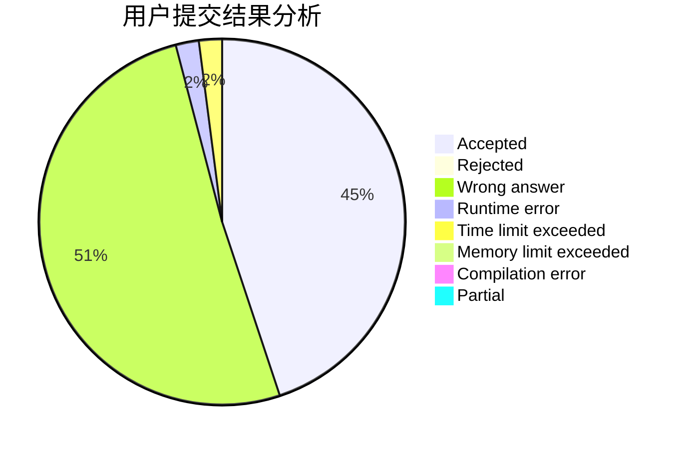
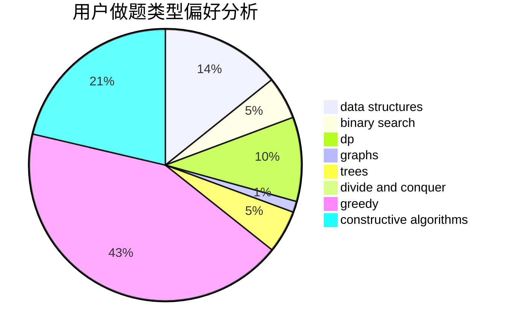
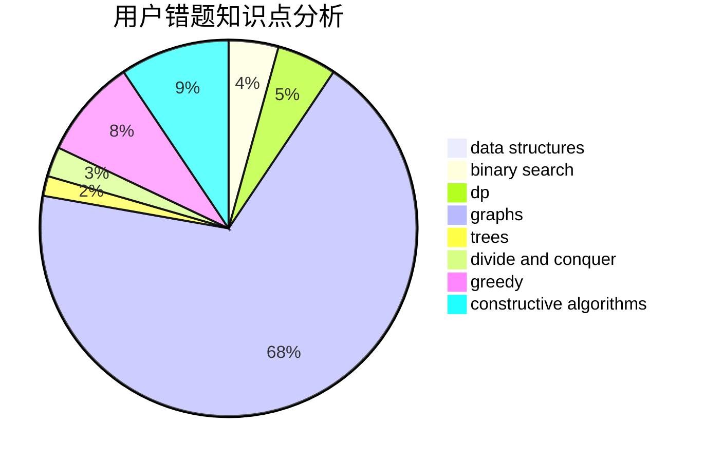

# HIT_One

<!-- tabs:start -->

#### **用户提交结果分析**

#### **用户做题类型偏好分析**

#### **用户错题知识点分析**

<!-- tabs:end -->
# 推荐题目
[567A](https://codeforces.com/contest/567/problem/A)		greedy,
                        implementation		  
[160B](https://codeforces.com/contest/160/problem/B)		greedy,
                        sortings		  
[1354D](https://codeforces.com/contest/1354/problem/D)		binary search,
                        data structures		  
[286D](https://codeforces.com/contest/286/problem/D)		data structures,
                        sortings		  
[1061B](https://codeforces.com/contest/1061/problem/B)		greedy,
                        implementation,
                        sortings		  
[160A](https://codeforces.com/contest/160/problem/A)		greedy,
                        sortings		  
[12C](https://codeforces.com/contest/12/problem/C)		greedy,
                        implementation,
                        sortings		  
[216B](https://codeforces.com/contest/216/problem/B)		dfs and similar,
                        implementation		  
[896A](https://codeforces.com/contest/896/problem/A)		binary search,
                        dfs and similar		  
[667A](https://codeforces.com/contest/667/problem/A)		geometry,
                        math		  
