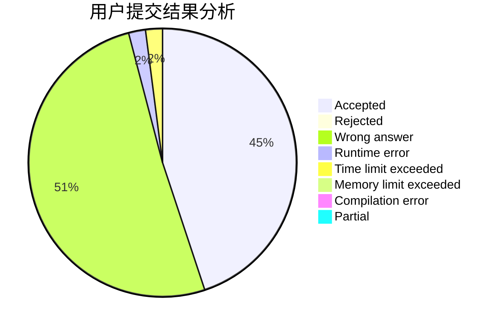
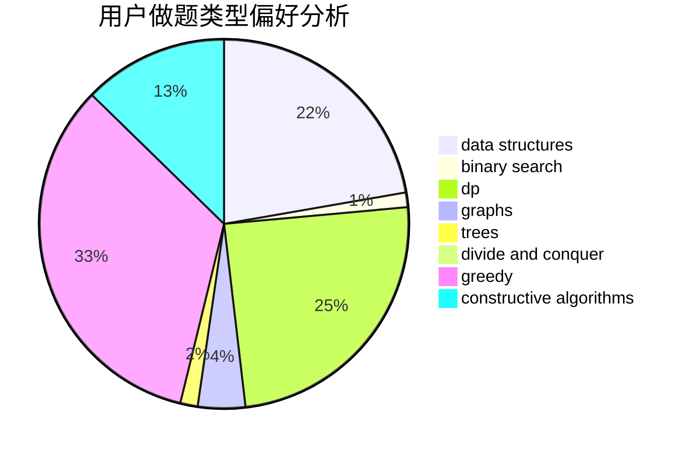
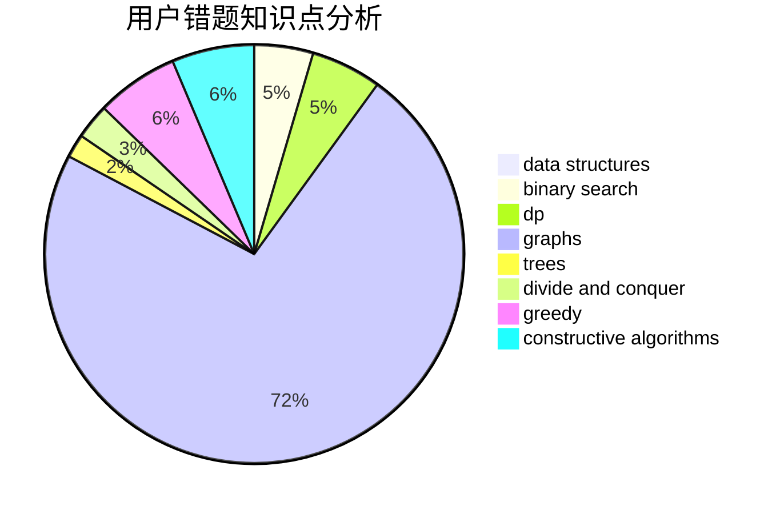

# HIT_One

<!-- tabs:start -->

#### **用户提交结果分析**

#### **用户做题类型偏好分析**

#### **用户错题知识点分析**

<!-- tabs:end -->
# 推荐题目
[585F](https://codeforces.com/contest/585/problem/F)		dp,
                        implementation,
                        strings		  
[185A](https://codeforces.com/contest/185/problem/A)		math		  
[1361A](https://codeforces.com/contest/1361/problem/A)		constructive algorithms,
                        graphs,
                        greedy,
                        sortings		  
[300E](https://codeforces.com/contest/300/problem/E)		binary search,
                        math,
                        number theory		  
[1061F](https://codeforces.com/contest/1061/problem/F)		interactive,
                        probabilities		  
[183D](https://codeforces.com/contest/183/problem/D)		dp,
                        greedy,
                        probabilities		  
[1307D](https://codeforces.com/contest/1307/problem/D)		binary search,
                        data structures,
                        dfs and similar,
                        graphs,
                        greedy,
                        shortest paths,
                        sortings		  
[235D](https://codeforces.com/contest/235/problem/D)		graphs		  
[913D](https://codeforces.com/contest/913/problem/D)		binary search,
                        brute force,
                        data structures,
                        greedy,
                        sortings		  
[689A](https://codeforces.com/contest/689/problem/A)		brute force,
                        constructive algorithms,
                        implementation		  
