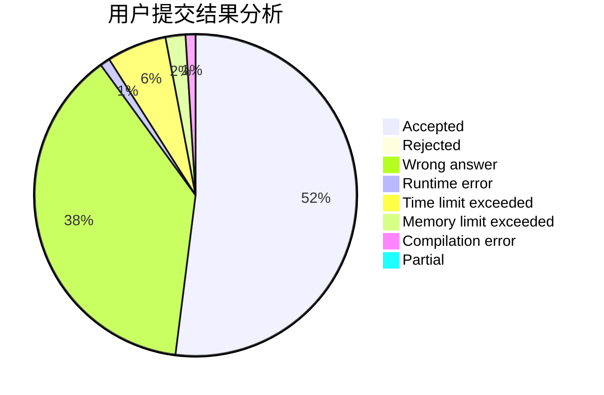
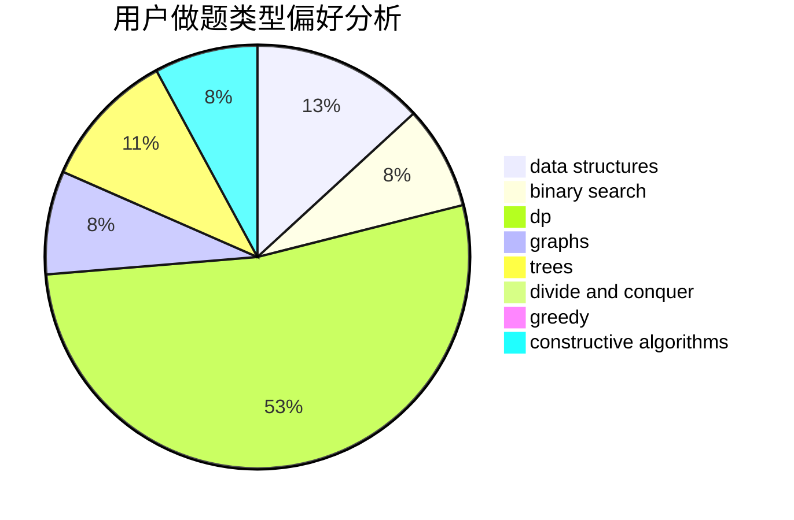
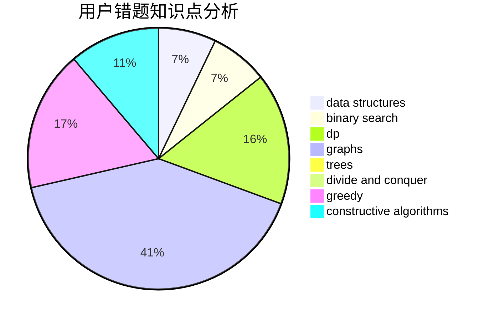

# HIT_Zero

<!-- tabs:start -->

#### **用户提交结果分析**

#### **用户做题类型偏好分析**

#### **用户错题知识点分析**

<!-- tabs:end -->
# 推荐题目
[1250B](https://codeforces.com/contest/1250/problem/B)		brute force,
                        constructive algorithms,
                        greedy,
                        math		  
[1250F](https://codeforces.com/contest/1250/problem/F)		brute force,
                        implementation		  
[12131](https://codeforces.com/contest/1213/problem/1)		dsu,graphs,sortings,trees		  
[433B](https://codeforces.com/contest/433/problem/B)		dp,
                        implementation,
                        sortings		  
[633G](https://codeforces.com/contest/633/problem/G)		bitmasks,
                        data structures,
                        dfs and similar,
                        math,
                        number theory		  
[852I](https://codeforces.com/contest/852/problem/I)		brute force,
                        dfs and similar,
                        graphs,
                        trees		  
[1155F](https://codeforces.com/contest/1155/problem/F)		brute force,
                        dp,
                        graphs		  
[477C](https://codeforces.com/contest/477/problem/C)		dsu,graphs,sortings,trees		  
[620A](https://codeforces.com/contest/620/problem/A)		implementation,
                        math		  
[205B](https://codeforces.com/contest/205/problem/B)		brute force,
                        greedy		  
