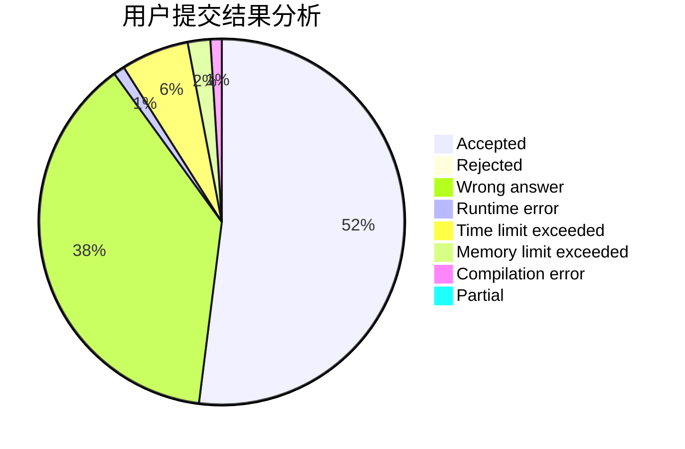
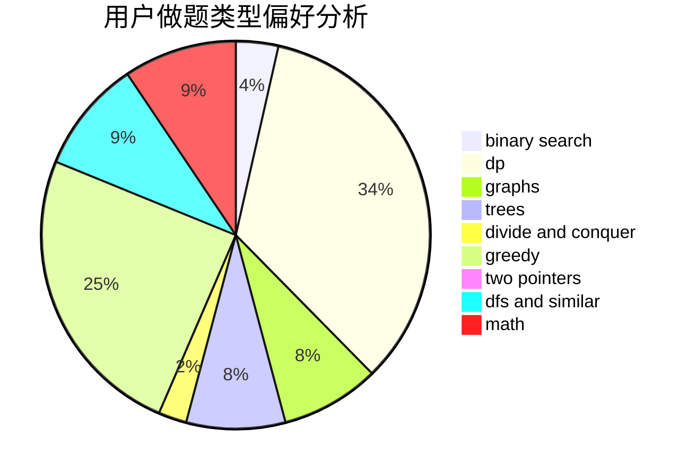

# HIT_Zero

<!-- tabs:start -->

#### **用户提交结果分析**

#### **用户做题类型偏好分析**

<!-- tabs:end -->
# 推荐题目
[1250B](https://codeforces.com/contest/1250/problem/B)
[1250F](https://codeforces.com/contest/1250/problem/F)
[12131](https://codeforces.com/contest/1213/problem/1)
[433B](https://codeforces.com/contest/433/problem/B)
[633G](https://codeforces.com/contest/633/problem/G)
[852I](https://codeforces.com/contest/852/problem/I)
[1155F](https://codeforces.com/contest/1155/problem/F)
[477C](https://codeforces.com/contest/477/problem/C)
[620A](https://codeforces.com/contest/620/problem/A)
[205B](https://codeforces.com/contest/205/problem/B)
