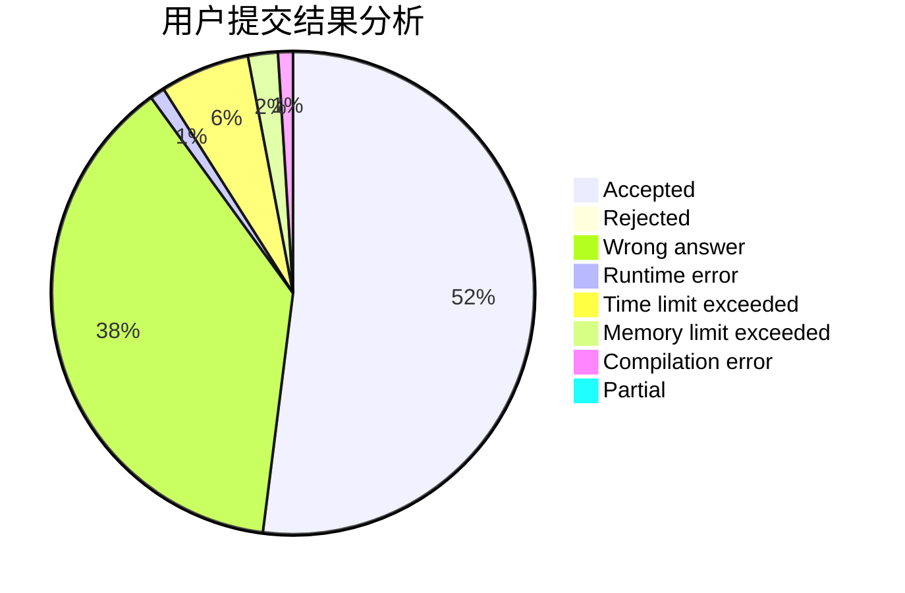
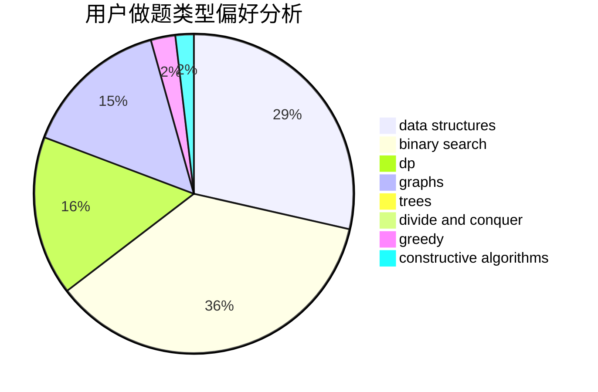

# HIT_Zero

<!-- tabs:start -->

#### **用户提交结果分析**

#### **用户做题类型偏好分析**

#### **用户错题知识点分析**

<!-- tabs:end -->
# 推荐题目
[1244G](https://codeforces.com/contest/1244/problem/G)		constructive algorithms,
                        greedy,
                        math		  
[1245D](https://codeforces.com/contest/1245/problem/D)		dsu,
                        graphs,
                        greedy,
                        shortest paths,
                        trees		  
[1207C](https://codeforces.com/contest/1207/problem/C)		dp,
                        greedy		  
[404C](https://codeforces.com/contest/404/problem/C)		dfs and similar,
                        graphs,
                        sortings		  
[616B](https://codeforces.com/contest/616/problem/B)		games,
                        greedy		  
[835B](https://codeforces.com/contest/835/problem/B)		greedy		  
[1153F](https://codeforces.com/contest/1153/problem/F)		combinatorics,
                        dp,
                        math,
                        probabilities		  
[457C](https://codeforces.com/contest/457/problem/C)		brute force		  
[600E](https://codeforces.com/contest/600/problem/E)		data structures,
                        dfs and similar,
                        dsu,
                        trees		  
[17C](https://codeforces.com/contest/17/problem/C)		dp		  
