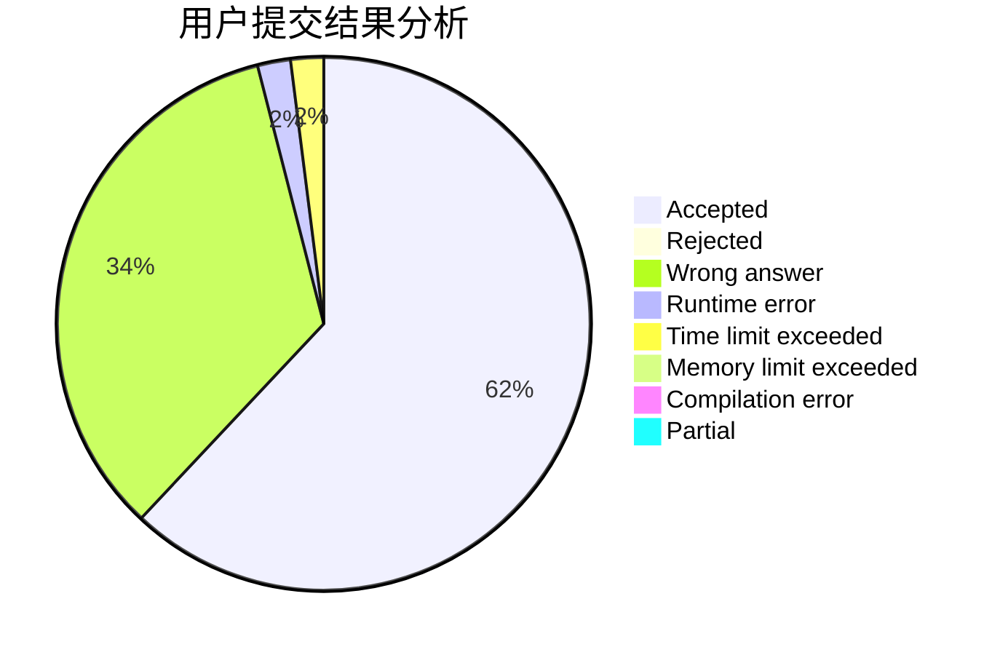
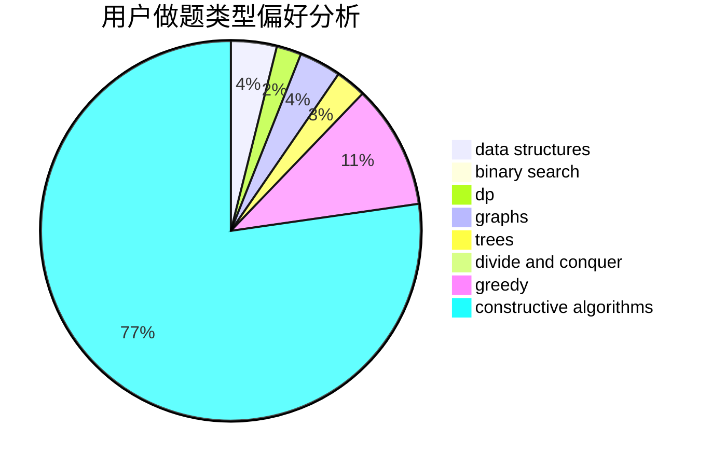
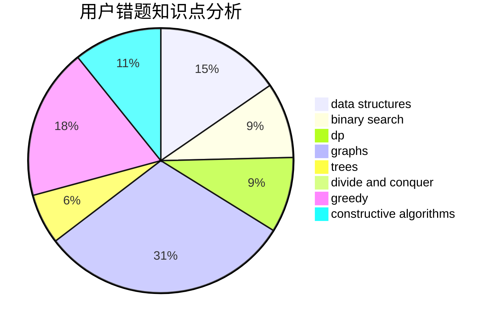

# HJDXG
<!-- tabs:start -->
#### **用户提交结果分析**

#### **用户做题类型偏好分析**

#### **用户错题知识点分析**

<!-- tabs:end -->
# 推荐题目
[Daleks' Invasion (hard)](http://codeforces.com/problemset/problem/1184/E3)		data structures,
                        dsu,
                        graphs,
                        trees		  
[New Year Cards](http://codeforces.com/problemset/problem/140/B)		brute force,
                        greedy,
                        implementation		  
[Minimizing Difference](http://codeforces.com/problemset/problem/1244/E)		binary search,
                        constructive algorithms,
                        greedy,
                        sortings,
                        ternary search,
                        two pointers		  
[Cipher](http://codeforces.com/problemset/problem/156/C)		combinatorics,
                        dp		  
[Gripping Story](http://codeforces.com/problemset/problem/198/E)		binary search,
                        data structures,
                        sortings		  
[Nephren Runs a Cinema](http://codeforces.com/problemset/problem/896/D)		chinese remainder theorem,
                        combinatorics,
                        math,
                        number theory		  
[Covered Path](http://codeforces.com/problemset/problem/534/B)		dp,
                        greedy,
                        math		  
[Friends and Presents](http://codeforces.com/problemset/problem/483/B)		binary search,
                        math		  
[Set of Strings](http://codeforces.com/problemset/problem/544/A)		implementation,
                        strings		  
[Information Graph](http://codeforces.com/problemset/problem/466/E)		dfs and similar,
                        dsu,
                        graphs,
                        trees		  
<!-- tabs:start -->
#### **data structures**
[Daleks' Invasion (hard)](http://codeforces.com/problemset/problem/1184/E3)		data structures,
                        dsu,
                        graphs,
                        trees		  
[New Year Cards](http://codeforces.com/problemset/problem/198/E)		binary search,
                        data structures,
                        sortings		  
[Minimizing Difference](http://codeforces.com/problemset/problem/414/E)		data structures		  
[Cipher](http://codeforces.com/problemset/problem/226/E)		data structures,
                        trees		  
[Gripping Story](http://codeforces.com/problemset/problem/896/E)		data structures,
                        dsu		  
[Nephren Runs a Cinema](http://codeforces.com/problemset/problem/1374/E1)		data structures,
                        greedy,
                        sortings		  
[Covered Path](http://codeforces.com/problemset/problem/797/E)		brute force,
                        data structures,
                        dp		  
[Friends and Presents](http://codeforces.com/problemset/problem/896/C)		data structures,
                        probabilities		  
[Set of Strings](https://codeforces.com/contest/1484/problem/D)		data structures,
                        dsu,
                        implementation,
                        shortest paths		  
[Information Graph](http://codeforces.com/problemset/problem/1492/C)		binary search,
                        data structures,
                        dp,
                        greedy,
                        two pointers		  
#### **binary search**
[Daleks' Invasion (hard)](http://codeforces.com/problemset/problem/1244/E)		binary search,
                        constructive algorithms,
                        greedy,
                        sortings,
                        ternary search,
                        two pointers		  
[New Year Cards](http://codeforces.com/problemset/problem/198/E)		binary search,
                        data structures,
                        sortings		  
[Minimizing Difference](http://codeforces.com/problemset/problem/483/B)		binary search,
                        math		  
[Cipher](http://codeforces.com/problemset/problem/50/D)		binary search,
                        dp,
                        probabilities		  
[Gripping Story](http://codeforces.com/problemset/problem/1165/F2)		binary search,
                        greedy,
                        implementation		  
[Nephren Runs a Cinema](http://codeforces.com/problemset/problem/1372/F)		binary search,
                        divide and conquer,
                        interactive		  
[Covered Path](http://codeforces.com/problemset/problem/1492/C)		binary search,
                        data structures,
                        dp,
                        greedy,
                        two pointers		  
[Friends and Presents](http://codeforces.com/problemset/problem/1463/D)		binary search,
                        constructive algorithms,
                        greedy,
                        two pointers		  
[Set of Strings](http://codeforces.com/problemset/problem/1490/G)		binary search,
                        data structures,
                        math		  
[Information Graph](http://codeforces.com/problemset/problem/1479/D)		binary search,
                        bitmasks,
                        brute force,
                        data structures,
                        probabilities,
                        trees		  
#### **dp**
[Daleks' Invasion (hard)](http://codeforces.com/problemset/problem/156/C)		combinatorics,
                        dp		  
[New Year Cards](http://codeforces.com/problemset/problem/534/B)		dp,
                        greedy,
                        math		  
[Minimizing Difference](http://codeforces.com/problemset/problem/50/D)		binary search,
                        dp,
                        probabilities		  
[Cipher](http://codeforces.com/problemset/problem/1295/C)		dp,
                        greedy,
                        strings		  
[Gripping Story](http://codeforces.com/problemset/problem/354/C)		brute force,
                        dp,
                        number theory		  
[Nephren Runs a Cinema](http://codeforces.com/problemset/problem/797/E)		brute force,
                        data structures,
                        dp		  
[Covered Path](http://codeforces.com/problemset/problem/1492/C)		binary search,
                        data structures,
                        dp,
                        greedy,
                        two pointers		  
[Friends and Presents](https://codeforces.com/contest/1457/problem/C)		brute force,
                        dp,
                        implementation		  
[Set of Strings](http://codeforces.com/problemset/problem/1491/C)		brute force,
                        data structures,
                        dp,
                        greedy,
                        implementation		  
[Information Graph](http://codeforces.com/problemset/problem/1437/C)		dp,
                        flows,
                        graph matchings,
                        greedy,
                        math,
                        sortings		  
#### **graph**
[Daleks' Invasion (hard)](http://codeforces.com/problemset/problem/1184/E3)		data structures,
                        dsu,
                        graphs,
                        trees		  
[New Year Cards](http://codeforces.com/problemset/problem/466/E)		dfs and similar,
                        dsu,
                        graphs,
                        trees		  
[Minimizing Difference](http://codeforces.com/problemset/problem/666/B)		graphs,
                        shortest paths		  
[Cipher](http://codeforces.com/problemset/problem/1383/F)		flows,
                        graphs		  
[Gripping Story](http://codeforces.com/problemset/problem/1487/C)		brute force,
                        constructive algorithms,
                        dfs and similar,
                        graphs,
                        greedy,
                        implementation,
                        math		  
[Nephren Runs a Cinema](http://codeforces.com/problemset/problem/1437/C)		dp,
                        flows,
                        graph matchings,
                        greedy,
                        math,
                        sortings		  
[Covered Path](http://codeforces.com/problemset/problem/1470/D)		constructive algorithms,
                        dfs and similar,
                        graph matchings,
                        graphs,
                        greedy		  
[Friends and Presents](http://codeforces.com/problemset/problem/1476/C)		dp,
                        graphs,
                        greedy		  
[Set of Strings](http://codeforces.com/problemset/problem/1304/D)		constructive algorithms,
                        graphs,
                        greedy,
                        two pointers		  
[Information Graph](http://codeforces.com/problemset/problem/1475/C)		combinatorics,
                        graphs,
                        math		  
#### **trees**
[Daleks' Invasion (hard)](http://codeforces.com/problemset/problem/1184/E3)		data structures,
                        dsu,
                        graphs,
                        trees		  
[New Year Cards](http://codeforces.com/problemset/problem/466/E)		dfs and similar,
                        dsu,
                        graphs,
                        trees		  
[Minimizing Difference](http://codeforces.com/problemset/problem/226/E)		data structures,
                        trees		  
[Cipher](http://codeforces.com/problemset/problem/1479/D)		binary search,
                        bitmasks,
                        brute force,
                        data structures,
                        probabilities,
                        trees		  
[Gripping Story](http://codeforces.com/problemset/problem/1511/C)		brute force,
                        data structures,
                        implementation,
                        trees		  
[Nephren Runs a Cinema](http://codeforces.com/problemset/problem/1499/F)		combinatorics,
                        dfs and similar,
                        dp,
                        trees		  
[Covered Path](http://codeforces.com/problemset/problem/1491/E)		brute force,
                        dfs and similar,
                        divide and conquer,
                        number theory,
                        trees		  
[Friends and Presents](http://codeforces.com/problemset/problem/1466/D)		data structures,
                        greedy,
                        sortings,
                        trees		  
[Set of Strings](http://codeforces.com/problemset/problem/1495/D)		combinatorics,
                        dfs and similar,
                        graphs,
                        math,
                        shortest paths,
                        trees		  
[Information Graph](http://codeforces.com/problemset/problem/1303/G)		data structures,
                        divide and conquer,
                        geometry,
                        trees		  
#### **divide and conquer**
[Daleks' Invasion (hard)](http://codeforces.com/problemset/problem/1250/M)		constructive algorithms,
                        divide and conquer		  
[New Year Cards](http://codeforces.com/problemset/problem/1372/F)		binary search,
                        divide and conquer,
                        interactive		  
[Minimizing Difference](http://codeforces.com/problemset/problem/1461/D)		binary search,
                        brute force,
                        data structures,
                        divide and conquer,
                        implementation,
                        sortings		  
[Cipher](http://codeforces.com/problemset/problem/1466/G)		combinatorics,
                        divide and conquer,
                        hashing,
                        math,
                        string suffix structures,
                        strings		  
[Gripping Story](http://codeforces.com/problemset/problem/1490/D)		dfs and similar,
                        divide and conquer,
                        implementation		  
[Nephren Runs a Cinema](https://codeforces.com/contest/1483/problem/C)		data structures,
                        divide and conquer,
                        dp		  
[Covered Path](http://codeforces.com/problemset/problem/1491/E)		brute force,
                        dfs and similar,
                        divide and conquer,
                        number theory,
                        trees		  
[Friends and Presents](http://codeforces.com/problemset/problem/1303/G)		data structures,
                        divide and conquer,
                        geometry,
                        trees		  
[Set of Strings](http://codeforces.com/problemset/problem/1494/D)		constructive algorithms,
                        data structures,
                        dfs and similar,
                        divide and conquer,
                        dsu,
                        greedy,
                        sortings,
                        trees		  
[Information Graph](http://codeforces.com/problemset/problem/1482/E)		data structures,
                        divide and conquer,
                        dp		  
#### **greedy**
[Daleks' Invasion (hard)](http://codeforces.com/problemset/problem/140/B)		brute force,
                        greedy,
                        implementation		  
[New Year Cards](http://codeforces.com/problemset/problem/1244/E)		binary search,
                        constructive algorithms,
                        greedy,
                        sortings,
                        ternary search,
                        two pointers		  
[Minimizing Difference](http://codeforces.com/problemset/problem/534/B)		dp,
                        greedy,
                        math		  
[Cipher](http://codeforces.com/problemset/problem/1165/F2)		binary search,
                        greedy,
                        implementation		  
[Gripping Story](http://codeforces.com/problemset/problem/1295/C)		dp,
                        greedy,
                        strings		  
[Nephren Runs a Cinema](http://codeforces.com/problemset/problem/1374/E1)		data structures,
                        greedy,
                        sortings		  
[Covered Path](http://codeforces.com/problemset/problem/1492/C)		binary search,
                        data structures,
                        dp,
                        greedy,
                        two pointers		  
[Friends and Presents](https://codeforces.com/contest/1496/problem/C)		geometry,
                        greedy,
                        math,
                        sortings		  
[Set of Strings](http://codeforces.com/problemset/problem/1493/A)		constructive algorithms,
                        greedy		  
[Information Graph](http://codeforces.com/problemset/problem/1463/D)		binary search,
                        constructive algorithms,
                        greedy,
                        two pointers		  
#### **constructive algorithms**
[Daleks' Invasion (hard)](http://codeforces.com/problemset/problem/1244/E)		binary search,
                        constructive algorithms,
                        greedy,
                        sortings,
                        ternary search,
                        two pointers		  
[New Year Cards](http://codeforces.com/problemset/problem/1250/M)		constructive algorithms,
                        divide and conquer		  
[Minimizing Difference](http://codeforces.com/problemset/problem/1493/A)		constructive algorithms,
                        greedy		  
[Cipher](http://codeforces.com/problemset/problem/1463/D)		binary search,
                        constructive algorithms,
                        greedy,
                        two pointers		  
[Gripping Story](https://codeforces.com/contest/1456/problem/B)		bitmasks,
                        brute force,
                        constructive algorithms		  
[Nephren Runs a Cinema](http://codeforces.com/problemset/problem/1492/D)		bitmasks,
                        constructive algorithms,
                        greedy,
                        math		  
[Covered Path](https://codeforces.com/contest/1504/problem/D)		constructive algorithms,
                        games,
                        interactive		  
[Friends and Presents](https://codeforces.com/contest/1483/problem/A)		brute force,
                        constructive algorithms,
                        greedy,
                        implementation		  
[Set of Strings](https://codeforces.com/contest/1457/problem/D)		bitmasks,
                        brute force,
                        constructive algorithms		  
[Information Graph](http://codeforces.com/problemset/problem/1513/A)		constructive algorithms,
                        implementation		  
#### **sortings**
[Daleks' Invasion (hard)](http://codeforces.com/problemset/problem/1244/E)		binary search,
                        constructive algorithms,
                        greedy,
                        sortings,
                        ternary search,
                        two pointers		  
[New Year Cards](http://codeforces.com/problemset/problem/198/E)		binary search,
                        data structures,
                        sortings		  
[Minimizing Difference](http://codeforces.com/problemset/problem/160/C)		implementation,
                        math,
                        sortings		  
[Cipher](http://codeforces.com/problemset/problem/1374/E1)		data structures,
                        greedy,
                        sortings		  
[Gripping Story](https://codeforces.com/contest/1496/problem/C)		geometry,
                        greedy,
                        math,
                        sortings		  
[Nephren Runs a Cinema](http://codeforces.com/problemset/problem/1495/A)		geometry,
                        greedy,
                        math,
                        sortings		  
[Covered Path](http://codeforces.com/problemset/problem/1497/A)		brute force,
                        data structures,
                        greedy,
                        sortings		  
[Friends and Presents](http://codeforces.com/problemset/problem/1427/A)		math,
                        sortings		  
[Set of Strings](http://codeforces.com/problemset/problem/1461/D)		binary search,
                        brute force,
                        data structures,
                        divide and conquer,
                        implementation,
                        sortings		  
[Information Graph](http://codeforces.com/problemset/problem/1437/C)		dp,
                        flows,
                        graph matchings,
                        greedy,
                        math,
                        sortings		  
<!-- tabs:end -->
