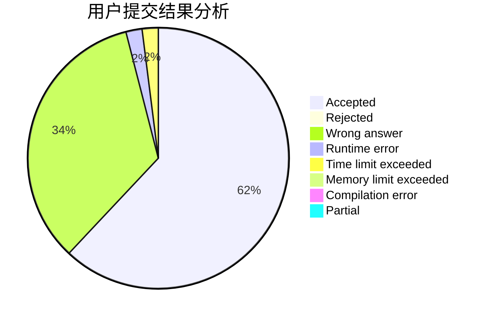
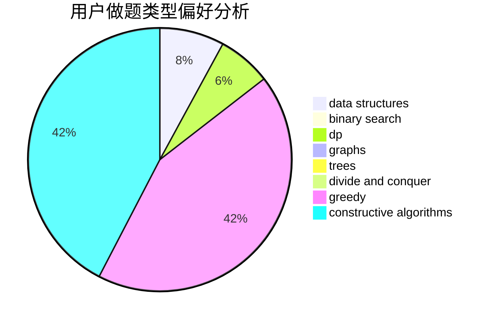
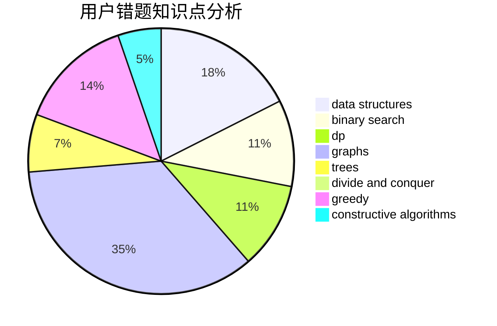

# HJDXG

<!-- tabs:start -->

#### **用户提交结果分析**

#### **用户做题类型偏好分析**

#### **用户错题知识点分析**

<!-- tabs:end -->
# 推荐题目
[555E](https://codeforces.com/contest/555/problem/E)		dfs and similar,
                        graphs,
                        trees		  
[1771](https://codeforces.com/contest/177/problem/1)		dsu,graphs,sortings,trees		  
[913G](https://codeforces.com/contest/913/problem/G)		math,
                        number theory		  
[1188E](https://codeforces.com/contest/1188/problem/E)		combinatorics		  
[1117G](https://codeforces.com/contest/1117/problem/G)		data structures		  
[913H](https://codeforces.com/contest/913/problem/H)		math,
                        probabilities		  
[124A](https://codeforces.com/contest/124/problem/A)		math		  
[1255D](https://codeforces.com/contest/1255/problem/D)		dsu,graphs,sortings,trees		  
[504A](https://codeforces.com/contest/504/problem/A)		dsu,graphs,sortings,trees		  
[43B](https://codeforces.com/contest/43/problem/B)		implementation,
                        strings		  
