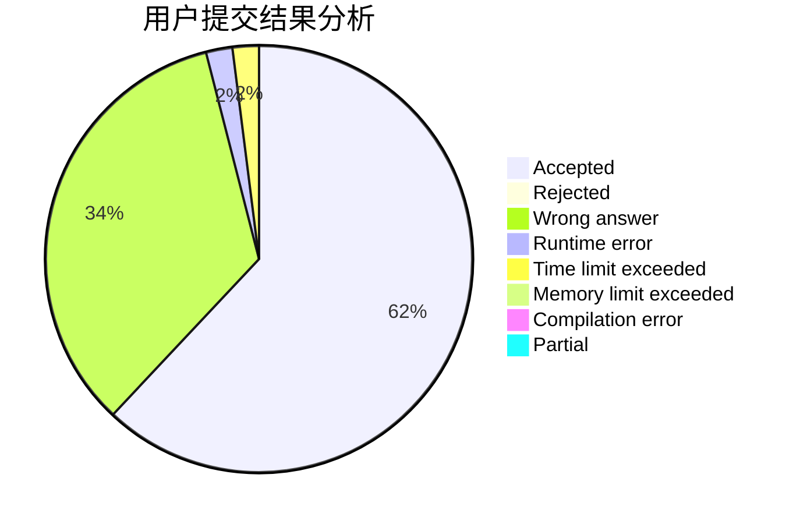
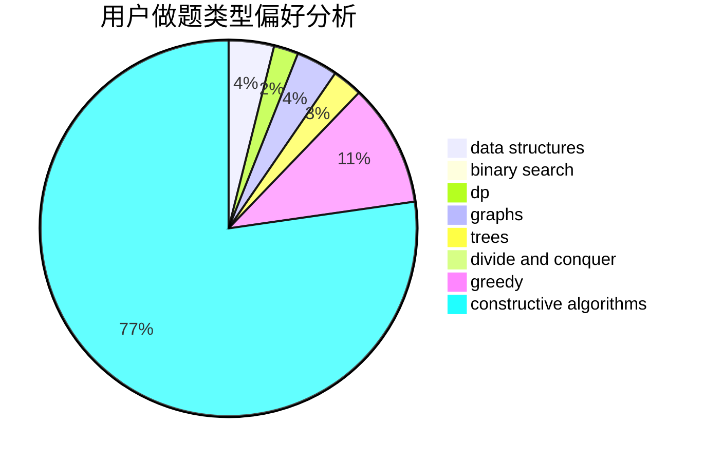
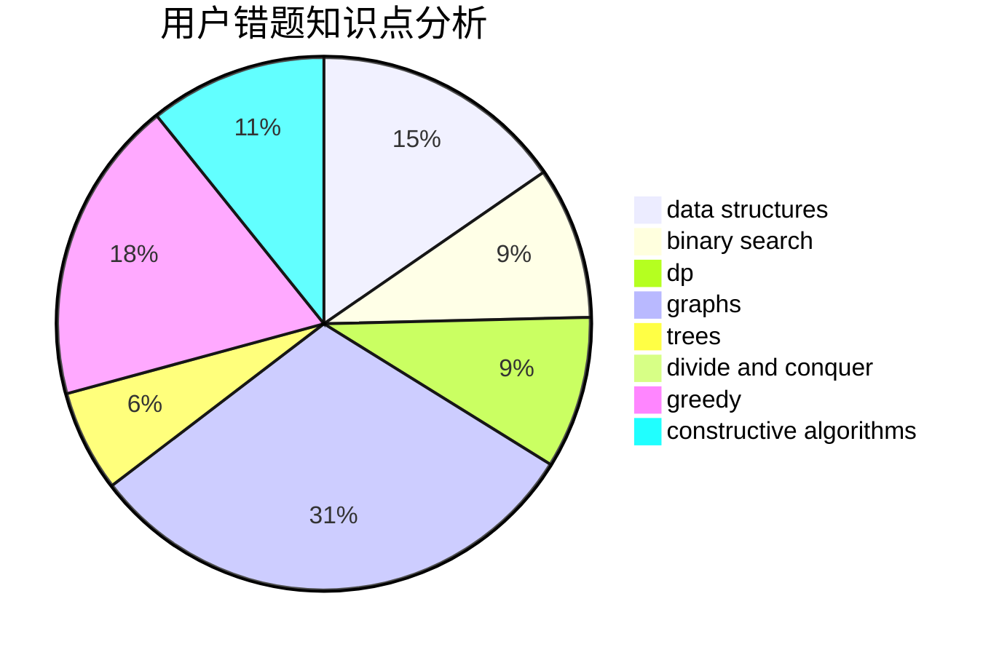

# HJDXG

<!-- tabs:start -->

#### **用户提交结果分析**

#### **用户做题类型偏好分析**

#### **用户错题知识点分析**

<!-- tabs:end -->
# 推荐题目
[534B](https://codeforces.com/contest/534/problem/B)		dp,
                        greedy,
                        math		  
[156C](https://codeforces.com/contest/156/problem/C)		combinatorics,
                        dp		  
[896D](https://codeforces.com/contest/896/problem/D)		chinese remainder theorem,
                        combinatorics,
                        math,
                        number theory		  
[1184E3](https://codeforces.com/contest/1184E/problem/3)		data structures,
                        dsu,
                        graphs,
                        trees		  
[1116C1](https://codeforces.com/contest/1116C/problem/1)		nan		  
[896E](https://codeforces.com/contest/896/problem/E)		data structures,
                        dsu		  
[1244E](https://codeforces.com/contest/1244/problem/E)		binary search,
                        constructive algorithms,
                        greedy,
                        sortings,
                        ternary search,
                        two pointers		  
[1250M](https://codeforces.com/contest/1250/problem/M)		constructive algorithms,
                        divide and conquer		  
[483B](https://codeforces.com/contest/483/problem/B)		binary search,
                        math		  
[414E](https://codeforces.com/contest/414/problem/E)		data structures		  
