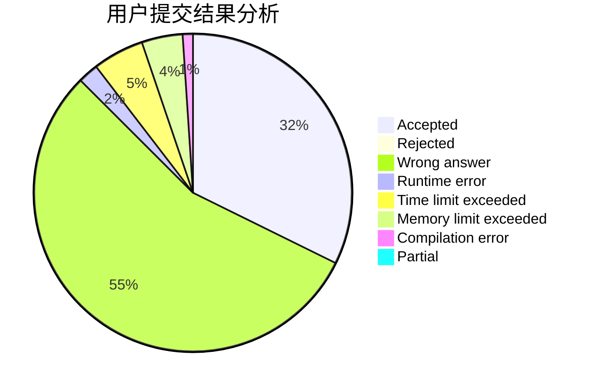
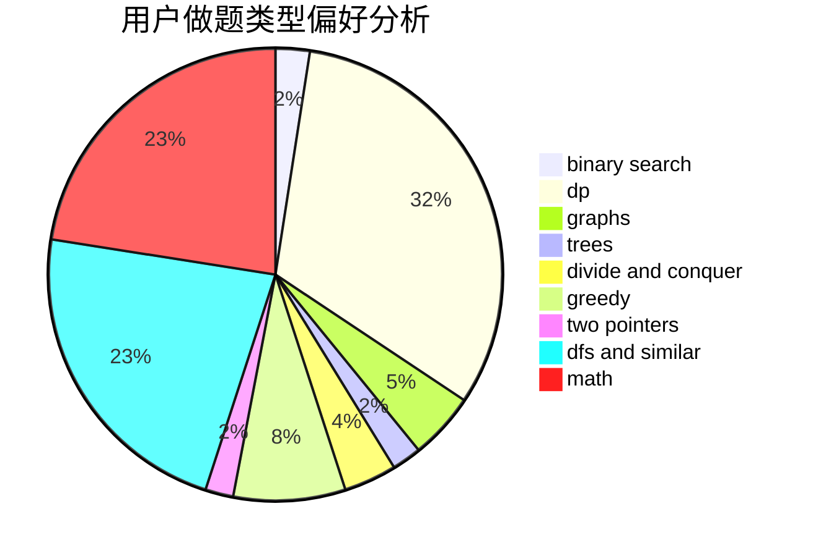

# HKer_YM

<!-- tabs:start -->

#### **用户提交结果分析**

#### **用户做题类型偏好分析**

<!-- tabs:end -->
# 推荐题目
[914A](https://codeforces.com/contest/914/problem/A)
[441D](https://codeforces.com/contest/441/problem/D)
[1260C](https://codeforces.com/contest/1260/problem/C)
[17C](https://codeforces.com/contest/17/problem/C)
[235A](https://codeforces.com/contest/235/problem/A)
[233C](https://codeforces.com/contest/233/problem/C)
[1107F](https://codeforces.com/contest/1107/problem/F)
[403C](https://codeforces.com/contest/403/problem/C)
[120J](https://codeforces.com/contest/120/problem/J)
[875D](https://codeforces.com/contest/875/problem/D)
