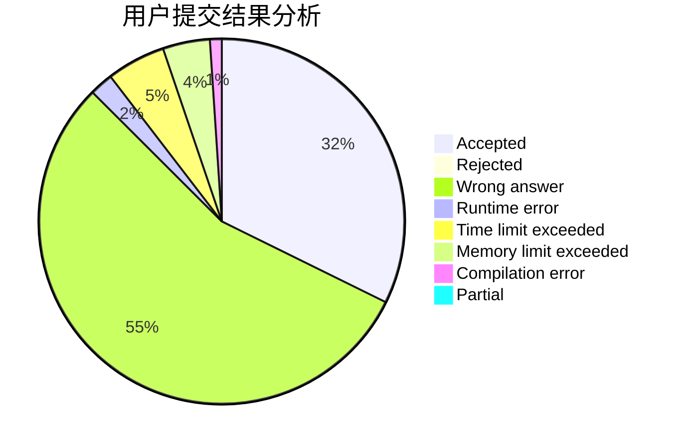
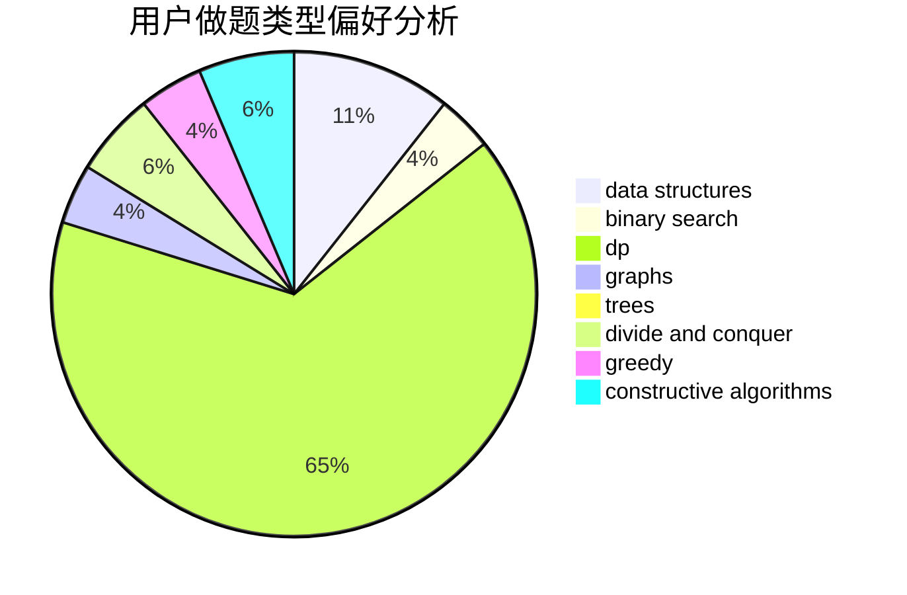
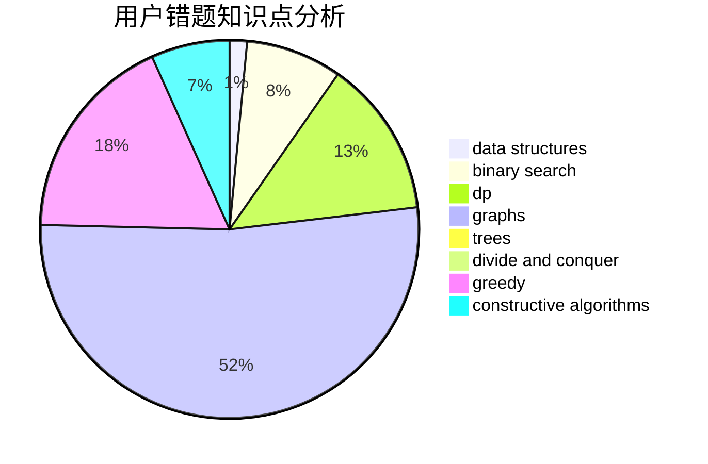

# HKer_YM

<!-- tabs:start -->

#### **用户提交结果分析**

#### **用户做题类型偏好分析**

#### **用户错题知识点分析**

<!-- tabs:end -->
# 推荐题目
[914A](https://codeforces.com/contest/914/problem/A)		brute force,
                        implementation,
                        math		  
[441D](https://codeforces.com/contest/441/problem/D)		constructive algorithms,
                        dsu,
                        graphs,
                        implementation,
                        math,
                        string suffix structures		  
[1260C](https://codeforces.com/contest/1260/problem/C)		greedy,
                        math,
                        number theory		  
[17C](https://codeforces.com/contest/17/problem/C)		dp		  
[235A](https://codeforces.com/contest/235/problem/A)		number theory		  
[233C](https://codeforces.com/contest/233/problem/C)		dsu,graphs,sortings,trees		  
[1107F](https://codeforces.com/contest/1107/problem/F)		dp,
                        flows,
                        graph matchings,
                        graphs,
                        sortings		  
[403C](https://codeforces.com/contest/403/problem/C)		dsu,graphs,sortings,trees		  
[120J](https://codeforces.com/contest/120/problem/J)		divide and conquer,
                        geometry,
                        sortings		  
[875D](https://codeforces.com/contest/875/problem/D)		binary search,
                        bitmasks,
                        combinatorics,
                        data structures,
                        divide and conquer		  
