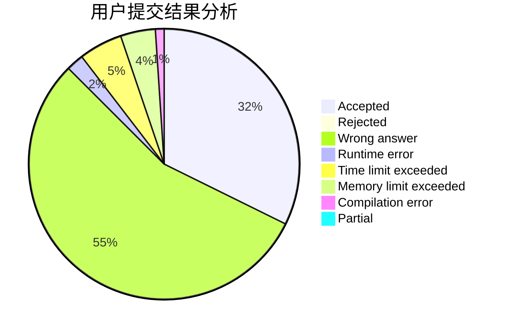
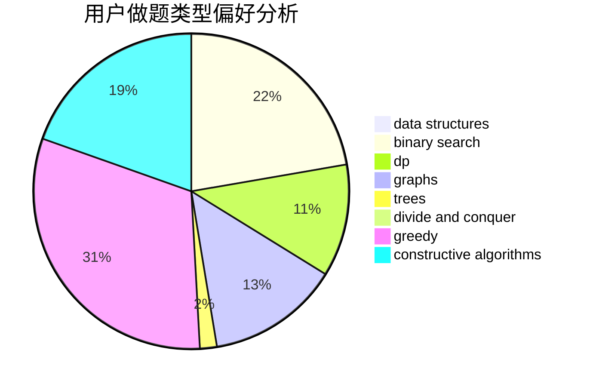

# HKer_YM

<!-- tabs:start -->

#### **用户提交结果分析**

#### **用户做题类型偏好分析**

#### **用户错题知识点分析**

<!-- tabs:end -->
# 推荐题目
[897B](https://codeforces.com/contest/897/problem/B)		brute force		  
[416D](https://codeforces.com/contest/416/problem/D)		greedy,
                        implementation,
                        math		  
[1253A](https://codeforces.com/contest/1253/problem/A)		implementation		  
[158A](https://codeforces.com/contest/158/problem/A)		*special problem,
                        implementation		  
[215D](https://codeforces.com/contest/215/problem/D)		greedy		  
[215A](https://codeforces.com/contest/215/problem/A)		brute force,
                        implementation		  
[1107C](https://codeforces.com/contest/1107/problem/C)		greedy,
                        sortings,
                        two pointers		  
[375C](https://codeforces.com/contest/375/problem/C)		bitmasks,
                        shortest paths		  
[1205F](https://codeforces.com/contest/1205/problem/F)		constructive algorithms,
                        math		  
[856D](https://codeforces.com/contest/856/problem/D)		dp,
                        trees		  
