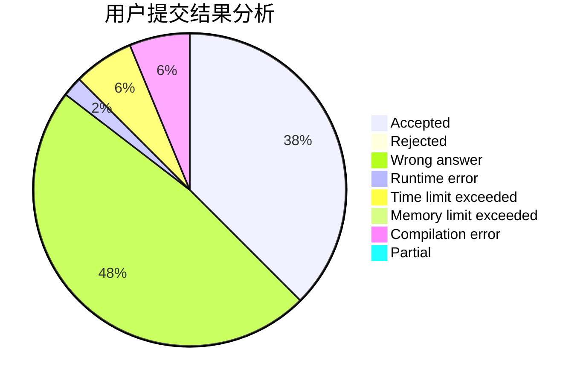
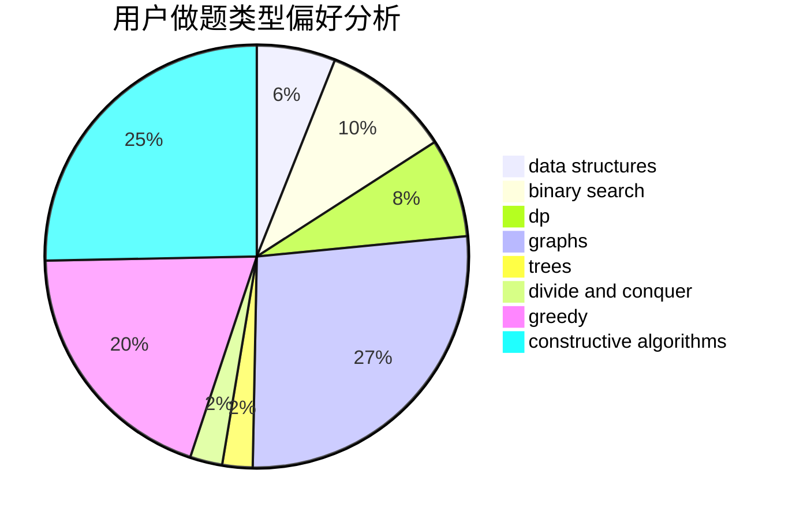
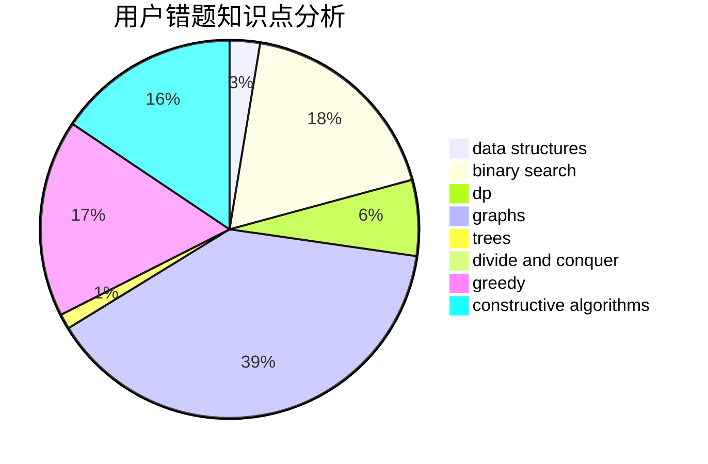

# HKing147

<!-- tabs:start -->

#### **用户提交结果分析**

#### **用户做题类型偏好分析**

#### **用户错题知识点分析**

<!-- tabs:end -->
# 推荐题目
[699B](https://codeforces.com/contest/699/problem/B)		implementation		  
[1081A](https://codeforces.com/contest/1081/problem/A)		constructive algorithms,
                        math		  
[205B](https://codeforces.com/contest/205/problem/B)		brute force,
                        greedy		  
[1312G](https://codeforces.com/contest/1312/problem/G)		data structures,
                        dfs and similar,
                        dp		  
[1354F](https://codeforces.com/contest/1354/problem/F)		constructive algorithms,
                        dp,
                        flows,
                        graph matchings,
                        greedy,
                        sortings		  
[609B](https://codeforces.com/contest/609/problem/B)		constructive algorithms,
                        implementation		  
[727A](https://codeforces.com/contest/727/problem/A)		brute force,
                        dfs and similar,
                        math		  
[814D](https://codeforces.com/contest/814/problem/D)		dfs and similar,
                        dp,
                        geometry,
                        greedy,
                        trees		  
[1221C](https://codeforces.com/contest/1221/problem/C)		binary search,
                        math		  
[283B](https://codeforces.com/contest/283/problem/B)		dfs and similar,
                        dp,
                        graphs		  
