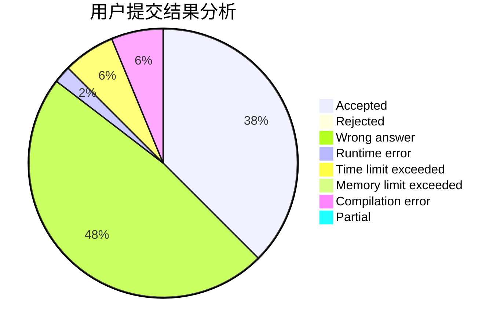
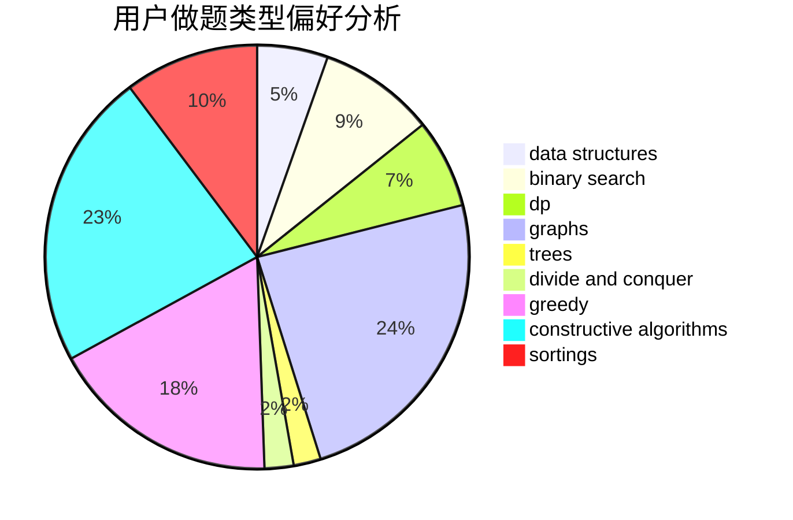
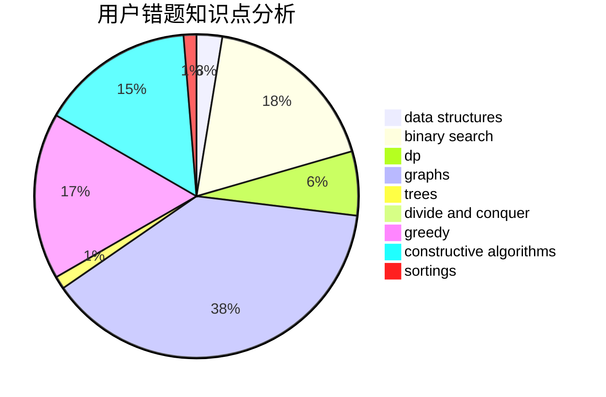

# HKing147
<!-- tabs:start -->
#### **用户提交结果分析**

#### **用户做题类型偏好分析**

#### **用户错题知识点分析**

<!-- tabs:end -->
# 推荐题目
[1326B](http://codeforces.com/problemset/problem/1326/B)		implementation,
                        math		  
[687C](http://codeforces.com/problemset/problem/687/C)		dp		  
[676D](http://codeforces.com/problemset/problem/676/D)		graphs,
                        implementation,
                        shortest paths		  
[1327F](http://codeforces.com/problemset/problem/1327/F)		bitmasks,
                        combinatorics,
                        data structures,
                        dp,
                        two pointers		  
[785D](http://codeforces.com/problemset/problem/785/D)		combinatorics,
                        dp,
                        math,
                        number theory		  
[1312G](http://codeforces.com/problemset/problem/1312/G)		data structures,
                        dfs and similar,
                        dp		  
[1354F](http://codeforces.com/problemset/problem/1354/F)		constructive algorithms,
                        dp,
                        flows,
                        graph matchings,
                        greedy,
                        sortings		  
[727A](http://codeforces.com/problemset/problem/727/A)		brute force,
                        dfs and similar,
                        math		  
[699B](http://codeforces.com/problemset/problem/699/B)		implementation		  
[1081A](http://codeforces.com/problemset/problem/1081/A)		constructive algorithms,
                        math		  
<!-- tabs:start -->
#### **data structures**
[1327F](http://codeforces.com/problemset/problem/1327/F)		bitmasks,
                        combinatorics,
                        data structures,
                        dp,
                        two pointers		  
[1312G](http://codeforces.com/problemset/problem/1312/G)		data structures,
                        dfs and similar,
                        dp		  
[371D](http://codeforces.com/problemset/problem/371/D)		data structures,
                        dsu,
                        implementation,
                        trees		  
[1236E](http://codeforces.com/problemset/problem/1236/E)		binary search,
                        data structures,
                        dp,
                        dsu		  
[1008C](https://codeforces.com/contest/1008/problem/C)		combinatorics,
                        data structures,
                        math,
                        sortings,
                        two pointers		  
[1192B](http://codeforces.com/problemset/problem/1192/B)		*special problem,
                        data structures,
                        dfs and similar,
                        divide and conquer,
                        trees		  
[466C](http://codeforces.com/problemset/problem/466/C)		binary search,
                        brute force,
                        data structures,
                        dp,
                        two pointers		  
[1350C](https://codeforces.com/contest/1350/problem/C)		data structures,
                        math,
                        number theory		  
[1056E](http://codeforces.com/problemset/problem/1056/E)		brute force,
                        data structures,
                        hashing,
                        strings		  
[1492C](http://codeforces.com/problemset/problem/1492/C)		binary search,
                        data structures,
                        dp,
                        greedy,
                        two pointers		  
#### **binary search**
[1236E](http://codeforces.com/problemset/problem/1236/E)		binary search,
                        data structures,
                        dp,
                        dsu		  
[492B](http://codeforces.com/problemset/problem/492/B)		binary search,
                        implementation,
                        math,
                        sortings		  
[897C](https://codeforces.com/contest/897/problem/C)		binary search,
                        dfs and similar		  
[466C](http://codeforces.com/problemset/problem/466/C)		binary search,
                        brute force,
                        data structures,
                        dp,
                        two pointers		  
[1221C](http://codeforces.com/problemset/problem/1221/C)		binary search,
                        math		  
[1492C](http://codeforces.com/problemset/problem/1492/C)		binary search,
                        data structures,
                        dp,
                        greedy,
                        two pointers		  
[1463D](http://codeforces.com/problemset/problem/1463/D)		binary search,
                        constructive algorithms,
                        greedy,
                        two pointers		  
[1490G](http://codeforces.com/problemset/problem/1490/G)		binary search,
                        data structures,
                        math		  
[1479D](http://codeforces.com/problemset/problem/1479/D)		binary search,
                        bitmasks,
                        brute force,
                        data structures,
                        probabilities,
                        trees		  
[1436E](http://codeforces.com/problemset/problem/1436/E)		binary search,
                        data structures,
                        two pointers		  
#### **dp**
[687C](http://codeforces.com/problemset/problem/687/C)		dp		  
[1327F](http://codeforces.com/problemset/problem/1327/F)		bitmasks,
                        combinatorics,
                        data structures,
                        dp,
                        two pointers		  
[785D](http://codeforces.com/problemset/problem/785/D)		combinatorics,
                        dp,
                        math,
                        number theory		  
[1312G](http://codeforces.com/problemset/problem/1312/G)		data structures,
                        dfs and similar,
                        dp		  
[1354F](http://codeforces.com/problemset/problem/1354/F)		constructive algorithms,
                        dp,
                        flows,
                        graph matchings,
                        greedy,
                        sortings		  
[283B](http://codeforces.com/problemset/problem/283/B)		dfs and similar,
                        dp,
                        graphs		  
[1236E](http://codeforces.com/problemset/problem/1236/E)		binary search,
                        data structures,
                        dp,
                        dsu		  
[814D](http://codeforces.com/problemset/problem/814/D)		dfs and similar,
                        dp,
                        geometry,
                        greedy,
                        trees		  
[466C](http://codeforces.com/problemset/problem/466/C)		binary search,
                        brute force,
                        data structures,
                        dp,
                        two pointers		  
[1197D](http://codeforces.com/problemset/problem/1197/D)		dp,
                        greedy,
                        math		  
#### **graph**
[676D](http://codeforces.com/problemset/problem/676/D)		graphs,
                        implementation,
                        shortest paths		  
[1354F](http://codeforces.com/problemset/problem/1354/F)		constructive algorithms,
                        dp,
                        flows,
                        graph matchings,
                        greedy,
                        sortings		  
[283B](http://codeforces.com/problemset/problem/283/B)		dfs and similar,
                        dp,
                        graphs		  
[1219B](https://codeforces.com/contest/1219/problem/B)		divide and conquer,
                        fft,
                        graphs		  
[1184E1](http://codeforces.com/problemset/problem/1184/E1)		graphs,
                        trees		  
[1023F](http://codeforces.com/problemset/problem/1023/F)		dfs and similar,
                        dsu,
                        graphs,
                        trees		  
[1239D](http://codeforces.com/problemset/problem/1239/D)		2-sat,
                        dfs and similar,
                        graph matchings,
                        graphs		  
[1487C](http://codeforces.com/problemset/problem/1487/C)		brute force,
                        constructive algorithms,
                        dfs and similar,
                        graphs,
                        greedy,
                        implementation,
                        math		  
[1437C](http://codeforces.com/problemset/problem/1437/C)		dp,
                        flows,
                        graph matchings,
                        greedy,
                        math,
                        sortings		  
[1470D](http://codeforces.com/problemset/problem/1470/D)		constructive algorithms,
                        dfs and similar,
                        graph matchings,
                        graphs,
                        greedy		  
#### **trees**
[371D](http://codeforces.com/problemset/problem/371/D)		data structures,
                        dsu,
                        implementation,
                        trees		  
[814D](http://codeforces.com/problemset/problem/814/D)		dfs and similar,
                        dp,
                        geometry,
                        greedy,
                        trees		  
[1192B](http://codeforces.com/problemset/problem/1192/B)		*special problem,
                        data structures,
                        dfs and similar,
                        divide and conquer,
                        trees		  
[1184E1](http://codeforces.com/problemset/problem/1184/E1)		graphs,
                        trees		  
[1023F](http://codeforces.com/problemset/problem/1023/F)		dfs and similar,
                        dsu,
                        graphs,
                        trees		  
[1479D](http://codeforces.com/problemset/problem/1479/D)		binary search,
                        bitmasks,
                        brute force,
                        data structures,
                        probabilities,
                        trees		  
[1511C](http://codeforces.com/problemset/problem/1511/C)		brute force,
                        data structures,
                        implementation,
                        trees		  
[1499F](http://codeforces.com/problemset/problem/1499/F)		combinatorics,
                        dfs and similar,
                        dp,
                        trees		  
[1491E](http://codeforces.com/problemset/problem/1491/E)		brute force,
                        dfs and similar,
                        divide and conquer,
                        number theory,
                        trees		  
[1466D](http://codeforces.com/problemset/problem/1466/D)		data structures,
                        greedy,
                        sortings,
                        trees		  
#### **divide and conquer**
[1219B](https://codeforces.com/contest/1219/problem/B)		divide and conquer,
                        fft,
                        graphs		  
[1192B](http://codeforces.com/problemset/problem/1192/B)		*special problem,
                        data structures,
                        dfs and similar,
                        divide and conquer,
                        trees		  
[1461D](http://codeforces.com/problemset/problem/1461/D)		binary search,
                        brute force,
                        data structures,
                        divide and conquer,
                        implementation,
                        sortings		  
[1466G](http://codeforces.com/problemset/problem/1466/G)		combinatorics,
                        divide and conquer,
                        hashing,
                        math,
                        string suffix structures,
                        strings		  
[1490D](http://codeforces.com/problemset/problem/1490/D)		dfs and similar,
                        divide and conquer,
                        implementation		  
[1483C](https://codeforces.com/contest/1483/problem/C)		data structures,
                        divide and conquer,
                        dp		  
[1491E](http://codeforces.com/problemset/problem/1491/E)		brute force,
                        dfs and similar,
                        divide and conquer,
                        number theory,
                        trees		  
[1303G](http://codeforces.com/problemset/problem/1303/G)		data structures,
                        divide and conquer,
                        geometry,
                        trees		  
[1494D](http://codeforces.com/problemset/problem/1494/D)		constructive algorithms,
                        data structures,
                        dfs and similar,
                        divide and conquer,
                        dsu,
                        greedy,
                        sortings,
                        trees		  
[1482E](http://codeforces.com/problemset/problem/1482/E)		data structures,
                        divide and conquer,
                        dp		  
#### **greedy**
[1354F](http://codeforces.com/problemset/problem/1354/F)		constructive algorithms,
                        dp,
                        flows,
                        graph matchings,
                        greedy,
                        sortings		  
[205B](http://codeforces.com/problemset/problem/205/B)		brute force,
                        greedy		  
[814D](http://codeforces.com/problemset/problem/814/D)		dfs and similar,
                        dp,
                        geometry,
                        greedy,
                        trees		  
[516A](https://codeforces.com/contest/516/problem/A)		greedy,
                        math,
                        sortings		  
[1197D](http://codeforces.com/problemset/problem/1197/D)		dp,
                        greedy,
                        math		  
[1492C](http://codeforces.com/problemset/problem/1492/C)		binary search,
                        data structures,
                        dp,
                        greedy,
                        two pointers		  
[1496C](https://codeforces.com/contest/1496/problem/C)		geometry,
                        greedy,
                        math,
                        sortings		  
[1493A](http://codeforces.com/problemset/problem/1493/A)		constructive algorithms,
                        greedy		  
[1463D](http://codeforces.com/problemset/problem/1463/D)		binary search,
                        constructive algorithms,
                        greedy,
                        two pointers		  
[1462C](http://codeforces.com/problemset/problem/1462/C)		brute force,
                        greedy,
                        math		  
#### **constructive algorithms**
[1354F](http://codeforces.com/problemset/problem/1354/F)		constructive algorithms,
                        dp,
                        flows,
                        graph matchings,
                        greedy,
                        sortings		  
[1081A](http://codeforces.com/problemset/problem/1081/A)		constructive algorithms,
                        math		  
[304C](https://codeforces.com/contest/304/problem/C)		constructive algorithms,
                        implementation,
                        math		  
[609B](http://codeforces.com/problemset/problem/609/B)		constructive algorithms,
                        implementation		  
[1365G](http://codeforces.com/problemset/problem/1365/G)		bitmasks,
                        combinatorics,
                        constructive algorithms,
                        interactive,
                        math		  
[1512C](http://codeforces.com/problemset/problem/1512/C)		constructive algorithms,
                        implementation,
                        strings		  
[1493A](http://codeforces.com/problemset/problem/1493/A)		constructive algorithms,
                        greedy		  
[1463D](http://codeforces.com/problemset/problem/1463/D)		binary search,
                        constructive algorithms,
                        greedy,
                        two pointers		  
[1456B](https://codeforces.com/contest/1456/problem/B)		bitmasks,
                        brute force,
                        constructive algorithms		  
[1492D](http://codeforces.com/problemset/problem/1492/D)		bitmasks,
                        constructive algorithms,
                        greedy,
                        math		  
#### **sortings**
[1354F](http://codeforces.com/problemset/problem/1354/F)		constructive algorithms,
                        dp,
                        flows,
                        graph matchings,
                        greedy,
                        sortings		  
[1013C](https://codeforces.com/contest/1013/problem/C)		brute force,
                        implementation,
                        math,
                        sortings		  
[492B](http://codeforces.com/problemset/problem/492/B)		binary search,
                        implementation,
                        math,
                        sortings		  
[1008C](https://codeforces.com/contest/1008/problem/C)		combinatorics,
                        data structures,
                        math,
                        sortings,
                        two pointers		  
[516A](https://codeforces.com/contest/516/problem/A)		greedy,
                        math,
                        sortings		  
[1496C](https://codeforces.com/contest/1496/problem/C)		geometry,
                        greedy,
                        math,
                        sortings		  
[1495A](http://codeforces.com/problemset/problem/1495/A)		geometry,
                        greedy,
                        math,
                        sortings		  
[1497A](http://codeforces.com/problemset/problem/1497/A)		brute force,
                        data structures,
                        greedy,
                        sortings		  
[1427A](http://codeforces.com/problemset/problem/1427/A)		math,
                        sortings		  
[1461D](http://codeforces.com/problemset/problem/1461/D)		binary search,
                        brute force,
                        data structures,
                        divide and conquer,
                        implementation,
                        sortings		  
<!-- tabs:end -->
