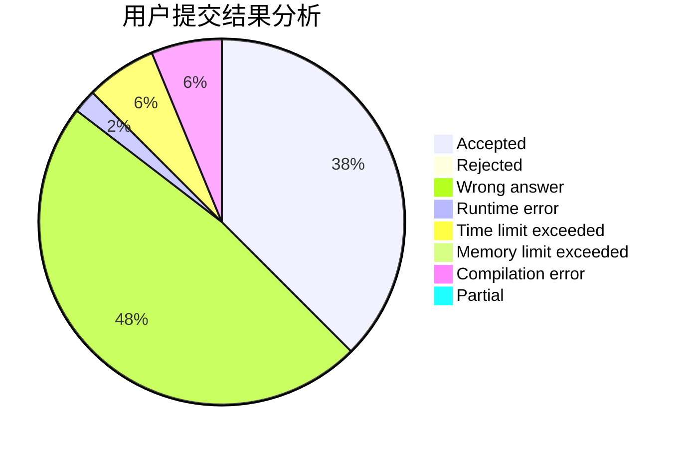
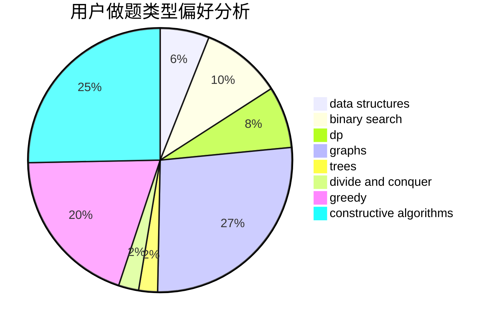
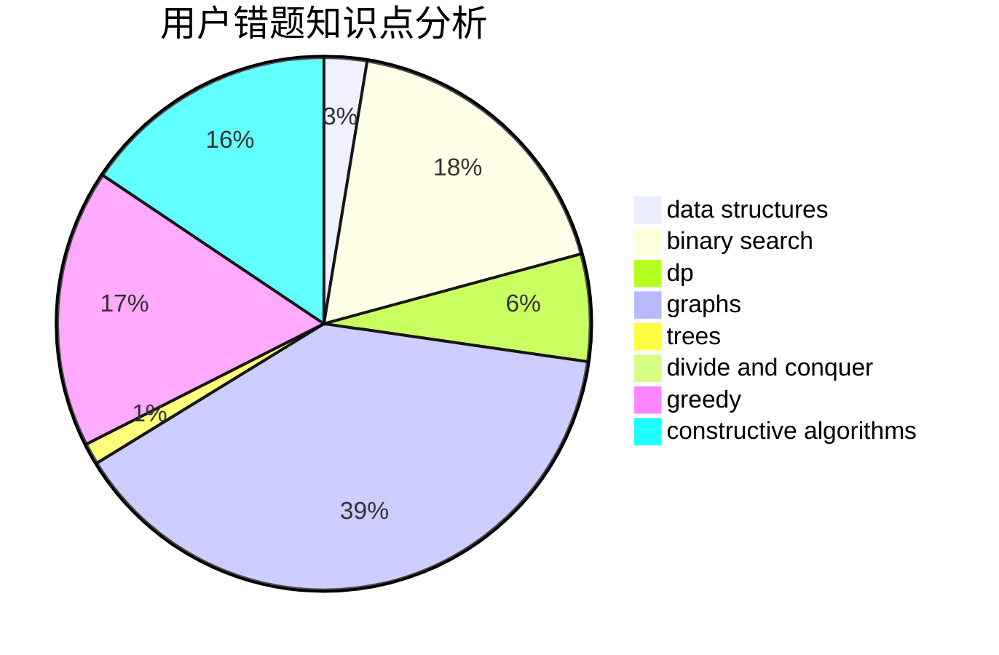

# HKing147
<!-- tabs:start -->
#### **用户提交结果分析**

#### **用户做题类型偏好分析**

#### **用户错题知识点分析**

<!-- tabs:end -->
# 推荐题目
[Maximums](http://codeforces.com/problemset/problem/1326/B)		implementation,
                        math		  
[The Values You Can Make](http://codeforces.com/problemset/problem/687/C)		dp		  
[Theseus and labyrinth](http://codeforces.com/problemset/problem/676/D)		graphs,
                        implementation,
                        shortest paths		  
[AND Segments](http://codeforces.com/problemset/problem/1327/F)		bitmasks,
                        combinatorics,
                        data structures,
                        dp,
                        two pointers		  
[Anton and School - 2](http://codeforces.com/problemset/problem/785/D)		combinatorics,
                        dp,
                        math,
                        number theory		  
[Autocompletion](http://codeforces.com/problemset/problem/1312/G)		data structures,
                        dfs and similar,
                        dp		  
[Summoning Minions](http://codeforces.com/problemset/problem/1354/F)		constructive algorithms,
                        dp,
                        flows,
                        graph matchings,
                        greedy,
                        sortings		  
[Transformation: from A to B](http://codeforces.com/problemset/problem/727/A)		brute force,
                        dfs and similar,
                        math		  
[One Bomb](http://codeforces.com/problemset/problem/699/B)		implementation		  
[Definite Game](http://codeforces.com/problemset/problem/1081/A)		constructive algorithms,
                        math		  
<!-- tabs:start -->
#### **data structures**
[Maximums](http://codeforces.com/problemset/problem/1327/F)		bitmasks,
                        combinatorics,
                        data structures,
                        dp,
                        two pointers		  
[The Values You Can Make](http://codeforces.com/problemset/problem/1312/G)		data structures,
                        dfs and similar,
                        dp		  
[Theseus and labyrinth](http://codeforces.com/problemset/problem/371/D)		data structures,
                        dsu,
                        implementation,
                        trees		  
[AND Segments](http://codeforces.com/problemset/problem/1236/E)		binary search,
                        data structures,
                        dp,
                        dsu		  
[Anton and School - 2](https://codeforces.com/contest/1008/problem/C)		combinatorics,
                        data structures,
                        math,
                        sortings,
                        two pointers		  
[Autocompletion](http://codeforces.com/problemset/problem/1192/B)		*special problem,
                        data structures,
                        dfs and similar,
                        divide and conquer,
                        trees		  
[Summoning Minions](http://codeforces.com/problemset/problem/466/C)		binary search,
                        brute force,
                        data structures,
                        dp,
                        two pointers		  
[Transformation: from A to B](https://codeforces.com/contest/1350/problem/C)		data structures,
                        math,
                        number theory		  
[One Bomb](http://codeforces.com/problemset/problem/1056/E)		brute force,
                        data structures,
                        hashing,
                        strings		  
[Definite Game](http://codeforces.com/problemset/problem/1492/C)		binary search,
                        data structures,
                        dp,
                        greedy,
                        two pointers		  
#### **binary search**
[Maximums](http://codeforces.com/problemset/problem/1236/E)		binary search,
                        data structures,
                        dp,
                        dsu		  
[The Values You Can Make](http://codeforces.com/problemset/problem/492/B)		binary search,
                        implementation,
                        math,
                        sortings		  
[Theseus and labyrinth](https://codeforces.com/contest/897/problem/C)		binary search,
                        dfs and similar		  
[AND Segments](http://codeforces.com/problemset/problem/466/C)		binary search,
                        brute force,
                        data structures,
                        dp,
                        two pointers		  
[Anton and School - 2](http://codeforces.com/problemset/problem/1221/C)		binary search,
                        math		  
[Autocompletion](http://codeforces.com/problemset/problem/1492/C)		binary search,
                        data structures,
                        dp,
                        greedy,
                        two pointers		  
[Summoning Minions](http://codeforces.com/problemset/problem/1463/D)		binary search,
                        constructive algorithms,
                        greedy,
                        two pointers		  
[Transformation: from A to B](http://codeforces.com/problemset/problem/1490/G)		binary search,
                        data structures,
                        math		  
[One Bomb](http://codeforces.com/problemset/problem/1479/D)		binary search,
                        bitmasks,
                        brute force,
                        data structures,
                        probabilities,
                        trees		  
[Definite Game](http://codeforces.com/problemset/problem/1436/E)		binary search,
                        data structures,
                        two pointers		  
#### **dp**
[Maximums](http://codeforces.com/problemset/problem/687/C)		dp		  
[The Values You Can Make](http://codeforces.com/problemset/problem/1327/F)		bitmasks,
                        combinatorics,
                        data structures,
                        dp,
                        two pointers		  
[Theseus and labyrinth](http://codeforces.com/problemset/problem/785/D)		combinatorics,
                        dp,
                        math,
                        number theory		  
[AND Segments](http://codeforces.com/problemset/problem/1312/G)		data structures,
                        dfs and similar,
                        dp		  
[Anton and School - 2](http://codeforces.com/problemset/problem/1354/F)		constructive algorithms,
                        dp,
                        flows,
                        graph matchings,
                        greedy,
                        sortings		  
[Autocompletion](http://codeforces.com/problemset/problem/283/B)		dfs and similar,
                        dp,
                        graphs		  
[Summoning Minions](http://codeforces.com/problemset/problem/1236/E)		binary search,
                        data structures,
                        dp,
                        dsu		  
[Transformation: from A to B](http://codeforces.com/problemset/problem/814/D)		dfs and similar,
                        dp,
                        geometry,
                        greedy,
                        trees		  
[One Bomb](http://codeforces.com/problemset/problem/466/C)		binary search,
                        brute force,
                        data structures,
                        dp,
                        two pointers		  
[Definite Game](http://codeforces.com/problemset/problem/1197/D)		dp,
                        greedy,
                        math		  
#### **graph**
[Maximums](http://codeforces.com/problemset/problem/676/D)		graphs,
                        implementation,
                        shortest paths		  
[The Values You Can Make](http://codeforces.com/problemset/problem/1354/F)		constructive algorithms,
                        dp,
                        flows,
                        graph matchings,
                        greedy,
                        sortings		  
[Theseus and labyrinth](http://codeforces.com/problemset/problem/283/B)		dfs and similar,
                        dp,
                        graphs		  
[AND Segments](https://codeforces.com/contest/1219/problem/B)		divide and conquer,
                        fft,
                        graphs		  
[Anton and School - 2](http://codeforces.com/problemset/problem/1184/E1)		graphs,
                        trees		  
[Autocompletion](http://codeforces.com/problemset/problem/1023/F)		dfs and similar,
                        dsu,
                        graphs,
                        trees		  
[Summoning Minions](http://codeforces.com/problemset/problem/1239/D)		2-sat,
                        dfs and similar,
                        graph matchings,
                        graphs		  
[Transformation: from A to B](http://codeforces.com/problemset/problem/1487/C)		brute force,
                        constructive algorithms,
                        dfs and similar,
                        graphs,
                        greedy,
                        implementation,
                        math		  
[One Bomb](http://codeforces.com/problemset/problem/1437/C)		dp,
                        flows,
                        graph matchings,
                        greedy,
                        math,
                        sortings		  
[Definite Game](http://codeforces.com/problemset/problem/1470/D)		constructive algorithms,
                        dfs and similar,
                        graph matchings,
                        graphs,
                        greedy		  
#### **trees**
[Maximums](http://codeforces.com/problemset/problem/371/D)		data structures,
                        dsu,
                        implementation,
                        trees		  
[The Values You Can Make](http://codeforces.com/problemset/problem/814/D)		dfs and similar,
                        dp,
                        geometry,
                        greedy,
                        trees		  
[Theseus and labyrinth](http://codeforces.com/problemset/problem/1192/B)		*special problem,
                        data structures,
                        dfs and similar,
                        divide and conquer,
                        trees		  
[AND Segments](http://codeforces.com/problemset/problem/1184/E1)		graphs,
                        trees		  
[Anton and School - 2](http://codeforces.com/problemset/problem/1023/F)		dfs and similar,
                        dsu,
                        graphs,
                        trees		  
[Autocompletion](http://codeforces.com/problemset/problem/1479/D)		binary search,
                        bitmasks,
                        brute force,
                        data structures,
                        probabilities,
                        trees		  
[Summoning Minions](http://codeforces.com/problemset/problem/1511/C)		brute force,
                        data structures,
                        implementation,
                        trees		  
[Transformation: from A to B](http://codeforces.com/problemset/problem/1499/F)		combinatorics,
                        dfs and similar,
                        dp,
                        trees		  
[One Bomb](http://codeforces.com/problemset/problem/1491/E)		brute force,
                        dfs and similar,
                        divide and conquer,
                        number theory,
                        trees		  
[Definite Game](http://codeforces.com/problemset/problem/1466/D)		data structures,
                        greedy,
                        sortings,
                        trees		  
#### **divide and conquer**
[Maximums](https://codeforces.com/contest/1219/problem/B)		divide and conquer,
                        fft,
                        graphs		  
[The Values You Can Make](http://codeforces.com/problemset/problem/1192/B)		*special problem,
                        data structures,
                        dfs and similar,
                        divide and conquer,
                        trees		  
[Theseus and labyrinth](http://codeforces.com/problemset/problem/1461/D)		binary search,
                        brute force,
                        data structures,
                        divide and conquer,
                        implementation,
                        sortings		  
[AND Segments](http://codeforces.com/problemset/problem/1466/G)		combinatorics,
                        divide and conquer,
                        hashing,
                        math,
                        string suffix structures,
                        strings		  
[Anton and School - 2](http://codeforces.com/problemset/problem/1490/D)		dfs and similar,
                        divide and conquer,
                        implementation		  
[Autocompletion](https://codeforces.com/contest/1483/problem/C)		data structures,
                        divide and conquer,
                        dp		  
[Summoning Minions](http://codeforces.com/problemset/problem/1491/E)		brute force,
                        dfs and similar,
                        divide and conquer,
                        number theory,
                        trees		  
[Transformation: from A to B](http://codeforces.com/problemset/problem/1303/G)		data structures,
                        divide and conquer,
                        geometry,
                        trees		  
[One Bomb](http://codeforces.com/problemset/problem/1494/D)		constructive algorithms,
                        data structures,
                        dfs and similar,
                        divide and conquer,
                        dsu,
                        greedy,
                        sortings,
                        trees		  
[Definite Game](http://codeforces.com/problemset/problem/1482/E)		data structures,
                        divide and conquer,
                        dp		  
#### **greedy**
[Maximums](http://codeforces.com/problemset/problem/1354/F)		constructive algorithms,
                        dp,
                        flows,
                        graph matchings,
                        greedy,
                        sortings		  
[The Values You Can Make](http://codeforces.com/problemset/problem/205/B)		brute force,
                        greedy		  
[Theseus and labyrinth](http://codeforces.com/problemset/problem/814/D)		dfs and similar,
                        dp,
                        geometry,
                        greedy,
                        trees		  
[AND Segments](https://codeforces.com/contest/516/problem/A)		greedy,
                        math,
                        sortings		  
[Anton and School - 2](http://codeforces.com/problemset/problem/1197/D)		dp,
                        greedy,
                        math		  
[Autocompletion](http://codeforces.com/problemset/problem/1492/C)		binary search,
                        data structures,
                        dp,
                        greedy,
                        two pointers		  
[Summoning Minions](https://codeforces.com/contest/1496/problem/C)		geometry,
                        greedy,
                        math,
                        sortings		  
[Transformation: from A to B](http://codeforces.com/problemset/problem/1493/A)		constructive algorithms,
                        greedy		  
[One Bomb](http://codeforces.com/problemset/problem/1463/D)		binary search,
                        constructive algorithms,
                        greedy,
                        two pointers		  
[Definite Game](http://codeforces.com/problemset/problem/1462/C)		brute force,
                        greedy,
                        math		  
#### **constructive algorithms**
[Maximums](http://codeforces.com/problemset/problem/1354/F)		constructive algorithms,
                        dp,
                        flows,
                        graph matchings,
                        greedy,
                        sortings		  
[The Values You Can Make](http://codeforces.com/problemset/problem/1081/A)		constructive algorithms,
                        math		  
[Theseus and labyrinth](https://codeforces.com/contest/304/problem/C)		constructive algorithms,
                        implementation,
                        math		  
[AND Segments](http://codeforces.com/problemset/problem/609/B)		constructive algorithms,
                        implementation		  
[Anton and School - 2](http://codeforces.com/problemset/problem/1365/G)		bitmasks,
                        combinatorics,
                        constructive algorithms,
                        interactive,
                        math		  
[Autocompletion](http://codeforces.com/problemset/problem/1512/C)		constructive algorithms,
                        implementation,
                        strings		  
[Summoning Minions](http://codeforces.com/problemset/problem/1493/A)		constructive algorithms,
                        greedy		  
[Transformation: from A to B](http://codeforces.com/problemset/problem/1463/D)		binary search,
                        constructive algorithms,
                        greedy,
                        two pointers		  
[One Bomb](https://codeforces.com/contest/1456/problem/B)		bitmasks,
                        brute force,
                        constructive algorithms		  
[Definite Game](http://codeforces.com/problemset/problem/1492/D)		bitmasks,
                        constructive algorithms,
                        greedy,
                        math		  
#### **sortings**
[Maximums](http://codeforces.com/problemset/problem/1354/F)		constructive algorithms,
                        dp,
                        flows,
                        graph matchings,
                        greedy,
                        sortings		  
[The Values You Can Make](https://codeforces.com/contest/1013/problem/C)		brute force,
                        implementation,
                        math,
                        sortings		  
[Theseus and labyrinth](http://codeforces.com/problemset/problem/492/B)		binary search,
                        implementation,
                        math,
                        sortings		  
[AND Segments](https://codeforces.com/contest/1008/problem/C)		combinatorics,
                        data structures,
                        math,
                        sortings,
                        two pointers		  
[Anton and School - 2](https://codeforces.com/contest/516/problem/A)		greedy,
                        math,
                        sortings		  
[Autocompletion](https://codeforces.com/contest/1496/problem/C)		geometry,
                        greedy,
                        math,
                        sortings		  
[Summoning Minions](http://codeforces.com/problemset/problem/1495/A)		geometry,
                        greedy,
                        math,
                        sortings		  
[Transformation: from A to B](http://codeforces.com/problemset/problem/1497/A)		brute force,
                        data structures,
                        greedy,
                        sortings		  
[One Bomb](http://codeforces.com/problemset/problem/1427/A)		math,
                        sortings		  
[Definite Game](http://codeforces.com/problemset/problem/1461/D)		binary search,
                        brute force,
                        data structures,
                        divide and conquer,
                        implementation,
                        sortings		  
<!-- tabs:end -->
