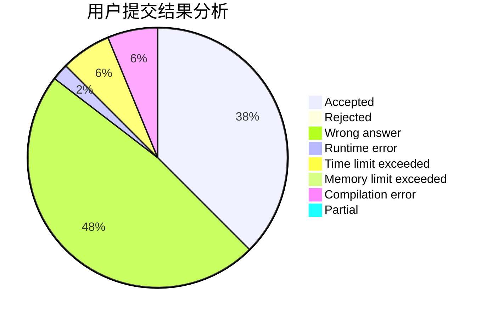
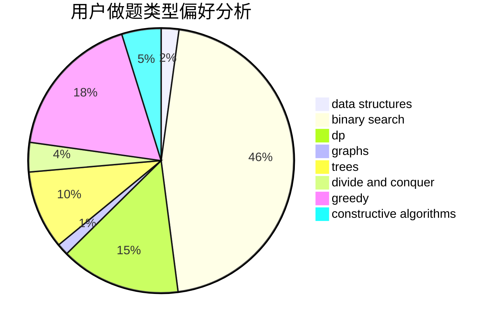
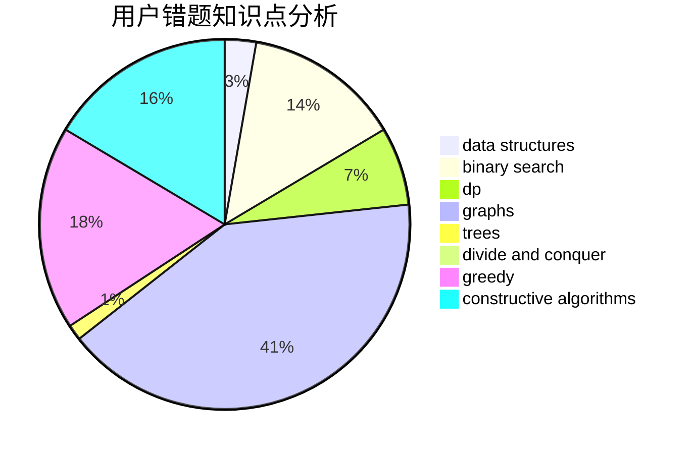

# HKing147

<!-- tabs:start -->

#### **用户提交结果分析**

#### **用户做题类型偏好分析**

#### **用户错题知识点分析**

<!-- tabs:end -->
# 推荐题目
[716A](https://codeforces.com/contest/716/problem/A)		implementation		  
[1081D](https://codeforces.com/contest/1081/problem/D)		dsu,
                        graphs,
                        shortest paths,
                        sortings		  
[229D](https://codeforces.com/contest/229/problem/D)		dp,
                        greedy,
                        two pointers		  
[1322C](https://codeforces.com/contest/1322/problem/C)		graphs,
                        hashing,
                        math,
                        number theory		  
[1361C](https://codeforces.com/contest/1361/problem/C)		binary search,
                        bitmasks,
                        constructive algorithms,
                        dfs and similar,
                        dsu,
                        graphs		  
[628B](https://codeforces.com/contest/628/problem/B)		dp		  
[744C](https://codeforces.com/contest/744/problem/C)		bitmasks,
                        brute force,
                        dp		  
[833B](https://codeforces.com/contest/833/problem/B)		binary search,
                        data structures,
                        divide and conquer,
                        dp,
                        two pointers		  
[1229D](https://codeforces.com/contest/1229/problem/D)		dsu,graphs,sortings,trees		  
[29B](https://codeforces.com/contest/29/problem/B)		implementation		  
