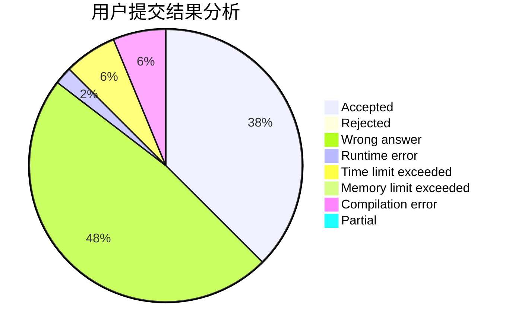
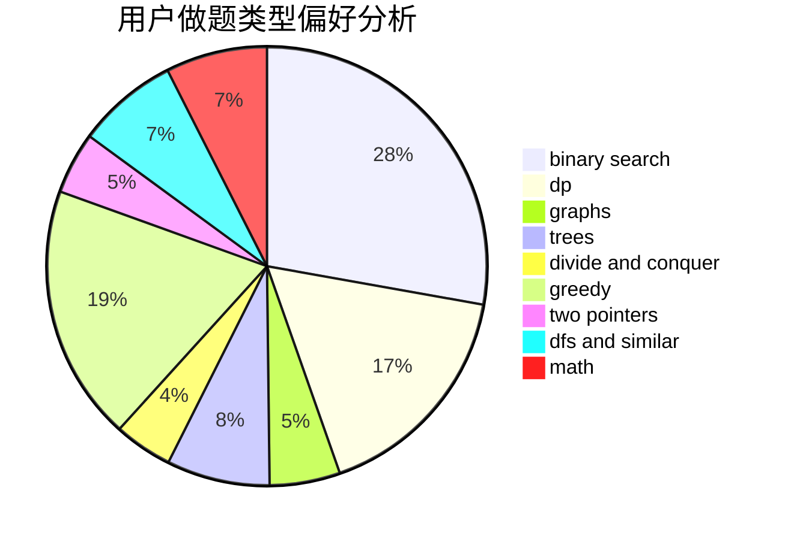

# HKing147

<!-- tabs:start -->

#### **用户提交结果分析**

#### **用户做题类型偏好分析**

<!-- tabs:end -->
# 推荐题目
[716A](https://codeforces.com/contest/716/problem/A)
[1081D](https://codeforces.com/contest/1081/problem/D)
[229D](https://codeforces.com/contest/229/problem/D)
[1322C](https://codeforces.com/contest/1322/problem/C)
[1361C](https://codeforces.com/contest/1361/problem/C)
[628B](https://codeforces.com/contest/628/problem/B)
[744C](https://codeforces.com/contest/744/problem/C)
[833B](https://codeforces.com/contest/833/problem/B)
[1229D](https://codeforces.com/contest/1229/problem/D)
[29B](https://codeforces.com/contest/29/problem/B)
