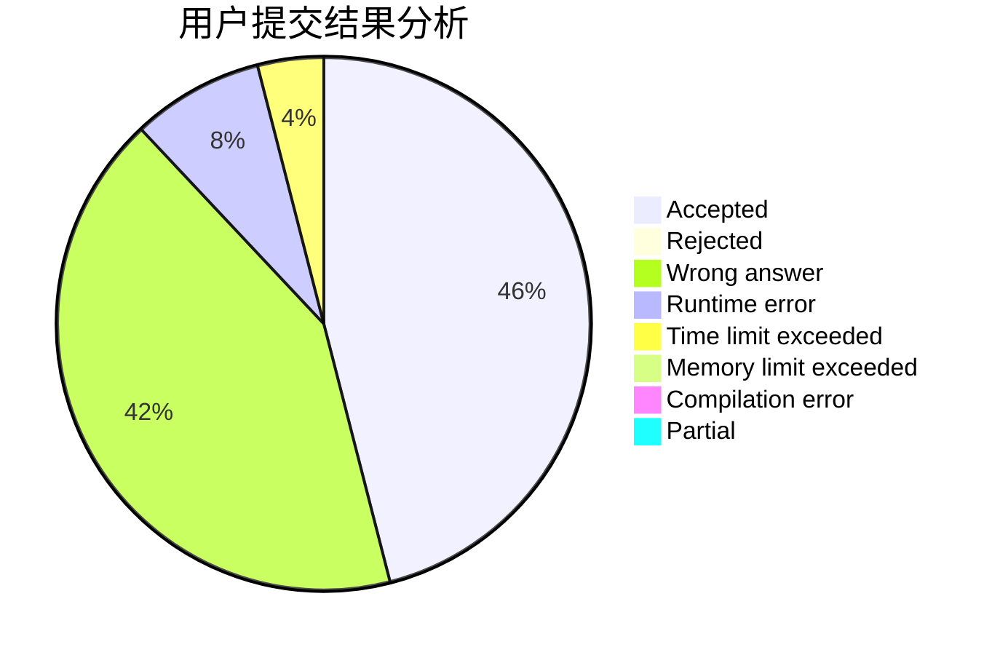
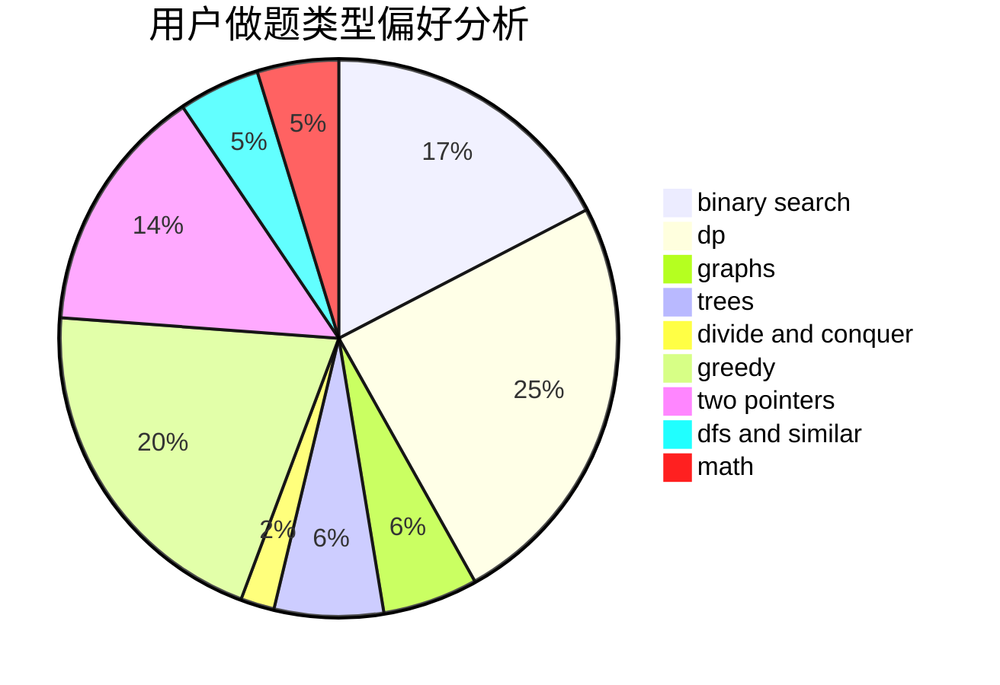

# HLF_rr

<!-- tabs:start -->

#### **用户提交结果分析**

#### **用户做题类型偏好分析**

<!-- tabs:end -->
# 推荐题目
[25D](https://codeforces.com/contest/25/problem/D)
[616A](https://codeforces.com/contest/616/problem/A)
[1292F](https://codeforces.com/contest/1292/problem/F)
[1060E](https://codeforces.com/contest/1060/problem/E)
[776D](https://codeforces.com/contest/776/problem/D)
[85A](https://codeforces.com/contest/85/problem/A)
[1070E](https://codeforces.com/contest/1070/problem/E)
[633G](https://codeforces.com/contest/633/problem/G)
[600C](https://codeforces.com/contest/600/problem/C)
[317B](https://codeforces.com/contest/317/problem/B)
