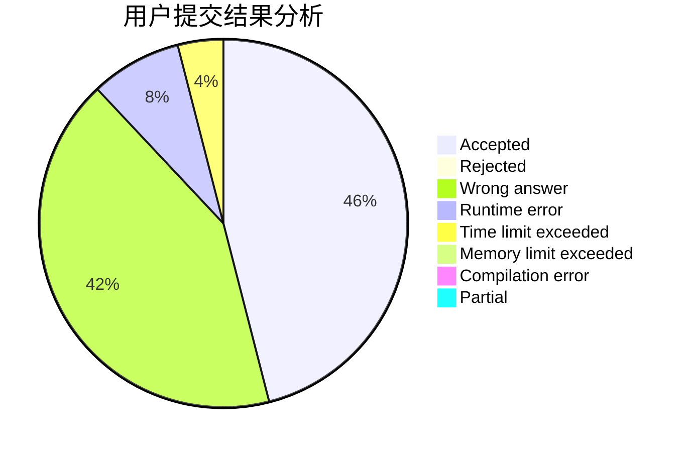
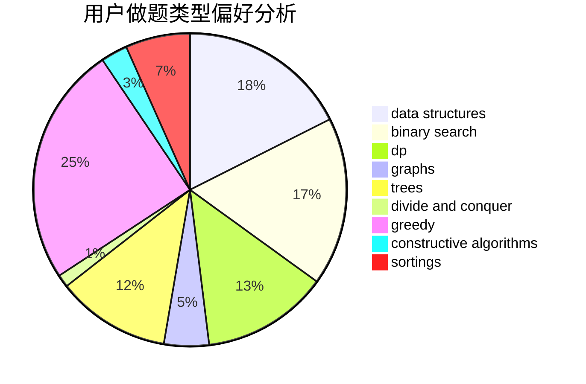

# HLF_rr
<!-- tabs:start -->
#### **用户提交结果分析**

#### **用户做题类型偏好分析**

#### **用户错题知识点分析**

<!-- tabs:end -->
# 推荐题目
[1285E](http://codeforces.com/problemset/problem/1285/E)		brute force,
                        constructive algorithms,
                        data structures,
                        dp,
                        graphs,
                        sortings,
                        trees,
                        two pointers		  
[757E](http://codeforces.com/problemset/problem/757/E)		brute force,
                        combinatorics,
                        dp,
                        number theory		  
[600C](http://codeforces.com/problemset/problem/600/C)		constructive algorithms,
                        greedy,
                        strings		  
[634A](http://codeforces.com/problemset/problem/634/A)		constructive algorithms,
                        implementation		  
[544A](http://codeforces.com/problemset/problem/544/A)		implementation,
                        strings		  
[616B](http://codeforces.com/problemset/problem/616/B)		games,
                        greedy		  
[1281E](https://codeforces.com/contest/1281/problem/E)		dfs and similar,
                        graphs,
                        greedy,
                        trees		  
[898A](http://codeforces.com/problemset/problem/898/A)		implementation,
                        math		  
[238A](http://codeforces.com/problemset/problem/238/A)		constructive algorithms,
                        math		  
[1070B](http://codeforces.com/problemset/problem/1070/B)		data structures,
                        greedy		  
<!-- tabs:start -->
#### **data structures**
[1285E](http://codeforces.com/problemset/problem/1285/E)		brute force,
                        constructive algorithms,
                        data structures,
                        dp,
                        graphs,
                        sortings,
                        trees,
                        two pointers		  
[1070B](http://codeforces.com/problemset/problem/1070/B)		data structures,
                        greedy		  
[29C](http://codeforces.com/problemset/problem/29/C)		data structures,
                        dfs and similar,
                        graphs,
                        implementation		  
[587C](http://codeforces.com/problemset/problem/587/C)		data structures,
                        trees		  
[1039E](http://codeforces.com/problemset/problem/1039/E)		data structures		  
[1416A](http://codeforces.com/problemset/problem/1416/A)		binary search,
                        data structures,
                        implementation,
                        two pointers		  
[815D](http://codeforces.com/problemset/problem/815/D)		binary search,
                        combinatorics,
                        data structures,
                        geometry		  
[1106D](http://codeforces.com/problemset/problem/1106/D)		data structures,
                        dfs and similar,
                        graphs,
                        greedy,
                        shortest paths		  
[1428E](http://codeforces.com/problemset/problem/1428/E)		binary search,
                        data structures,
                        greedy,
                        math,
                        sortings		  
[1492C](http://codeforces.com/problemset/problem/1492/C)		binary search,
                        data structures,
                        dp,
                        greedy,
                        two pointers		  
#### **binary search**
[1468L](http://codeforces.com/problemset/problem/1468/L)		binary search,
                        greedy,
                        math,
                        number theory		  
[847E](http://codeforces.com/problemset/problem/847/E)		binary search,
                        dp		  
[1416A](http://codeforces.com/problemset/problem/1416/A)		binary search,
                        data structures,
                        implementation,
                        two pointers		  
[815D](http://codeforces.com/problemset/problem/815/D)		binary search,
                        combinatorics,
                        data structures,
                        geometry		  
[1500B](http://codeforces.com/problemset/problem/1500/B)		binary search,
                        brute force,
                        chinese remainder theorem,
                        math,
                        number theory		  
[1428E](http://codeforces.com/problemset/problem/1428/E)		binary search,
                        data structures,
                        greedy,
                        math,
                        sortings		  
[1492C](http://codeforces.com/problemset/problem/1492/C)		binary search,
                        data structures,
                        dp,
                        greedy,
                        two pointers		  
[1463D](http://codeforces.com/problemset/problem/1463/D)		binary search,
                        constructive algorithms,
                        greedy,
                        two pointers		  
[1490G](http://codeforces.com/problemset/problem/1490/G)		binary search,
                        data structures,
                        math		  
[1479D](http://codeforces.com/problemset/problem/1479/D)		binary search,
                        bitmasks,
                        brute force,
                        data structures,
                        probabilities,
                        trees		  
#### **dp**
[1285E](http://codeforces.com/problemset/problem/1285/E)		brute force,
                        constructive algorithms,
                        data structures,
                        dp,
                        graphs,
                        sortings,
                        trees,
                        two pointers		  
[757E](http://codeforces.com/problemset/problem/757/E)		brute force,
                        combinatorics,
                        dp,
                        number theory		  
[840C](http://codeforces.com/problemset/problem/840/C)		combinatorics,
                        dp		  
[580A](http://codeforces.com/problemset/problem/580/A)		brute force,
                        dp,
                        implementation		  
[847E](http://codeforces.com/problemset/problem/847/E)		binary search,
                        dp		  
[1187E](http://codeforces.com/problemset/problem/1187/E)		dfs and similar,
                        dp,
                        trees		  
[1408I](http://codeforces.com/problemset/problem/1408/I)		dp,
                        math		  
[1492C](http://codeforces.com/problemset/problem/1492/C)		binary search,
                        data structures,
                        dp,
                        greedy,
                        two pointers		  
[1457C](https://codeforces.com/contest/1457/problem/C)		brute force,
                        dp,
                        implementation		  
[1491C](http://codeforces.com/problemset/problem/1491/C)		brute force,
                        data structures,
                        dp,
                        greedy,
                        implementation		  
#### **graph**
[1285E](http://codeforces.com/problemset/problem/1285/E)		brute force,
                        constructive algorithms,
                        data structures,
                        dp,
                        graphs,
                        sortings,
                        trees,
                        two pointers		  
[1281E](https://codeforces.com/contest/1281/problem/E)		dfs and similar,
                        graphs,
                        greedy,
                        trees		  
[29C](http://codeforces.com/problemset/problem/29/C)		data structures,
                        dfs and similar,
                        graphs,
                        implementation		  
[1106D](http://codeforces.com/problemset/problem/1106/D)		data structures,
                        dfs and similar,
                        graphs,
                        greedy,
                        shortest paths		  
[1133F2](http://codeforces.com/problemset/problem/1133/F2)		constructive algorithms,
                        dfs and similar,
                        dsu,
                        graphs,
                        greedy		  
[1487C](http://codeforces.com/problemset/problem/1487/C)		brute force,
                        constructive algorithms,
                        dfs and similar,
                        graphs,
                        greedy,
                        implementation,
                        math		  
[1437C](http://codeforces.com/problemset/problem/1437/C)		dp,
                        flows,
                        graph matchings,
                        greedy,
                        math,
                        sortings		  
[1470D](http://codeforces.com/problemset/problem/1470/D)		constructive algorithms,
                        dfs and similar,
                        graph matchings,
                        graphs,
                        greedy		  
[1476C](http://codeforces.com/problemset/problem/1476/C)		dp,
                        graphs,
                        greedy		  
[1304D](http://codeforces.com/problemset/problem/1304/D)		constructive algorithms,
                        graphs,
                        greedy,
                        two pointers		  
#### **trees**
[1285E](http://codeforces.com/problemset/problem/1285/E)		brute force,
                        constructive algorithms,
                        data structures,
                        dp,
                        graphs,
                        sortings,
                        trees,
                        two pointers		  
[1281E](https://codeforces.com/contest/1281/problem/E)		dfs and similar,
                        graphs,
                        greedy,
                        trees		  
[587C](http://codeforces.com/problemset/problem/587/C)		data structures,
                        trees		  
[1252F](http://codeforces.com/problemset/problem/1252/F)		hashing,
                        trees		  
[1187E](http://codeforces.com/problemset/problem/1187/E)		dfs and similar,
                        dp,
                        trees		  
[1479D](http://codeforces.com/problemset/problem/1479/D)		binary search,
                        bitmasks,
                        brute force,
                        data structures,
                        probabilities,
                        trees		  
[1511C](http://codeforces.com/problemset/problem/1511/C)		brute force,
                        data structures,
                        implementation,
                        trees		  
[1499F](http://codeforces.com/problemset/problem/1499/F)		combinatorics,
                        dfs and similar,
                        dp,
                        trees		  
[1491E](http://codeforces.com/problemset/problem/1491/E)		brute force,
                        dfs and similar,
                        divide and conquer,
                        number theory,
                        trees		  
[1466D](http://codeforces.com/problemset/problem/1466/D)		data structures,
                        greedy,
                        sortings,
                        trees		  
#### **divide and conquer**
[1461D](http://codeforces.com/problemset/problem/1461/D)		binary search,
                        brute force,
                        data structures,
                        divide and conquer,
                        implementation,
                        sortings		  
[1466G](http://codeforces.com/problemset/problem/1466/G)		combinatorics,
                        divide and conquer,
                        hashing,
                        math,
                        string suffix structures,
                        strings		  
[1490D](http://codeforces.com/problemset/problem/1490/D)		dfs and similar,
                        divide and conquer,
                        implementation		  
[1483C](https://codeforces.com/contest/1483/problem/C)		data structures,
                        divide and conquer,
                        dp		  
[1491E](http://codeforces.com/problemset/problem/1491/E)		brute force,
                        dfs and similar,
                        divide and conquer,
                        number theory,
                        trees		  
[1303G](http://codeforces.com/problemset/problem/1303/G)		data structures,
                        divide and conquer,
                        geometry,
                        trees		  
[1494D](http://codeforces.com/problemset/problem/1494/D)		constructive algorithms,
                        data structures,
                        dfs and similar,
                        divide and conquer,
                        dsu,
                        greedy,
                        sortings,
                        trees		  
[1482E](http://codeforces.com/problemset/problem/1482/E)		data structures,
                        divide and conquer,
                        dp		  
[566C](http://codeforces.com/problemset/problem/566/C)		dfs and similar,
                        divide and conquer,
                        trees		  
[1428F](http://codeforces.com/problemset/problem/1428/F)		binary search,
                        data structures,
                        divide and conquer,
                        dp,
                        two pointers		  
#### **greedy**
[600C](http://codeforces.com/problemset/problem/600/C)		constructive algorithms,
                        greedy,
                        strings		  
[616B](http://codeforces.com/problemset/problem/616/B)		games,
                        greedy		  
[1281E](https://codeforces.com/contest/1281/problem/E)		dfs and similar,
                        graphs,
                        greedy,
                        trees		  
[1070B](http://codeforces.com/problemset/problem/1070/B)		data structures,
                        greedy		  
[1468L](http://codeforces.com/problemset/problem/1468/L)		binary search,
                        greedy,
                        math,
                        number theory		  
[1060B](http://codeforces.com/problemset/problem/1060/B)		greedy		  
[1037B](http://codeforces.com/problemset/problem/1037/B)		greedy		  
[508B](http://codeforces.com/problemset/problem/508/B)		greedy,
                        math,
                        strings		  
[716B](http://codeforces.com/problemset/problem/716/B)		greedy,
                        two pointers		  
[1106D](http://codeforces.com/problemset/problem/1106/D)		data structures,
                        dfs and similar,
                        graphs,
                        greedy,
                        shortest paths		  
#### **constructive algorithms**
[1285E](http://codeforces.com/problemset/problem/1285/E)		brute force,
                        constructive algorithms,
                        data structures,
                        dp,
                        graphs,
                        sortings,
                        trees,
                        two pointers		  
[600C](http://codeforces.com/problemset/problem/600/C)		constructive algorithms,
                        greedy,
                        strings		  
[634A](http://codeforces.com/problemset/problem/634/A)		constructive algorithms,
                        implementation		  
[238A](http://codeforces.com/problemset/problem/238/A)		constructive algorithms,
                        math		  
[854B](http://codeforces.com/problemset/problem/854/B)		constructive algorithms,
                        math		  
[1133F2](http://codeforces.com/problemset/problem/1133/F2)		constructive algorithms,
                        dfs and similar,
                        dsu,
                        graphs,
                        greedy		  
[1349B](http://codeforces.com/problemset/problem/1349/B)		constructive algorithms,
                        greedy,
                        math		  
[1493A](http://codeforces.com/problemset/problem/1493/A)		constructive algorithms,
                        greedy		  
[1463D](http://codeforces.com/problemset/problem/1463/D)		binary search,
                        constructive algorithms,
                        greedy,
                        two pointers		  
[1456B](https://codeforces.com/contest/1456/problem/B)		bitmasks,
                        brute force,
                        constructive algorithms		  
#### **sortings**
[1285E](http://codeforces.com/problemset/problem/1285/E)		brute force,
                        constructive algorithms,
                        data structures,
                        dp,
                        graphs,
                        sortings,
                        trees,
                        two pointers		  
[1428E](http://codeforces.com/problemset/problem/1428/E)		binary search,
                        data structures,
                        greedy,
                        math,
                        sortings		  
[1496C](https://codeforces.com/contest/1496/problem/C)		geometry,
                        greedy,
                        math,
                        sortings		  
[1495A](http://codeforces.com/problemset/problem/1495/A)		geometry,
                        greedy,
                        math,
                        sortings		  
[1497A](http://codeforces.com/problemset/problem/1497/A)		brute force,
                        data structures,
                        greedy,
                        sortings		  
[1427A](http://codeforces.com/problemset/problem/1427/A)		math,
                        sortings		  
[1461D](http://codeforces.com/problemset/problem/1461/D)		binary search,
                        brute force,
                        data structures,
                        divide and conquer,
                        implementation,
                        sortings		  
[1437C](http://codeforces.com/problemset/problem/1437/C)		dp,
                        flows,
                        graph matchings,
                        greedy,
                        math,
                        sortings		  
[1473A](http://codeforces.com/problemset/problem/1473/A)		greedy,
                        implementation,
                        math,
                        sortings		  
[1486B](http://codeforces.com/problemset/problem/1486/B)		binary search,
                        geometry,
                        shortest paths,
                        sortings		  
<!-- tabs:end -->
