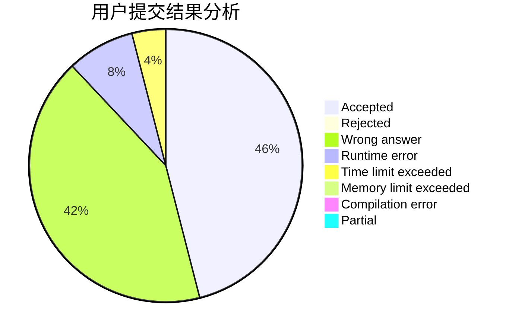
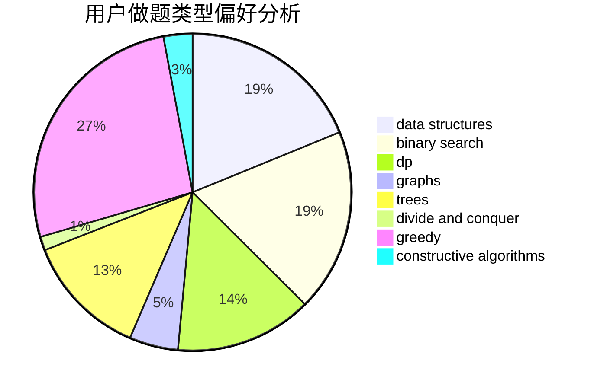

# HLF_rr

<!-- tabs:start -->

#### **用户提交结果分析**

#### **用户做题类型偏好分析**

#### **用户错题知识点分析**

<!-- tabs:end -->
# 推荐题目
[238A](https://codeforces.com/contest/238/problem/A)		constructive algorithms,
                        math		  
[598B](https://codeforces.com/contest/598/problem/B)		implementation,
                        strings		  
[1285E](https://codeforces.com/contest/1285/problem/E)		brute force,
                        constructive algorithms,
                        data structures,
                        dp,
                        graphs,
                        sortings,
                        trees,
                        two pointers		  
[1060B](https://codeforces.com/contest/1060/problem/B)		greedy		  
[757E](https://codeforces.com/contest/757/problem/E)		brute force,
                        combinatorics,
                        dp,
                        number theory		  
[840C](https://codeforces.com/contest/840/problem/C)		combinatorics,
                        dp		  
[1070B](https://codeforces.com/contest/1070/problem/B)		data structures,
                        greedy		  
[616B](https://codeforces.com/contest/616/problem/B)		games,
                        greedy		  
[580A](https://codeforces.com/contest/580/problem/A)		brute force,
                        dp,
                        implementation		  
[29C](https://codeforces.com/contest/29/problem/C)		data structures,
                        dfs and similar,
                        graphs,
                        implementation		  
