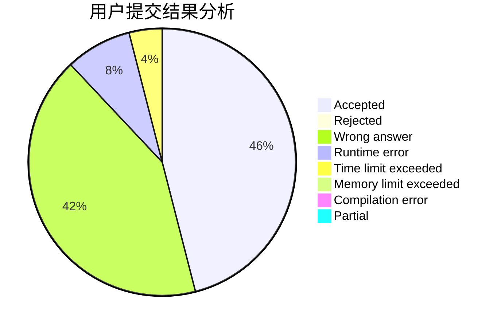
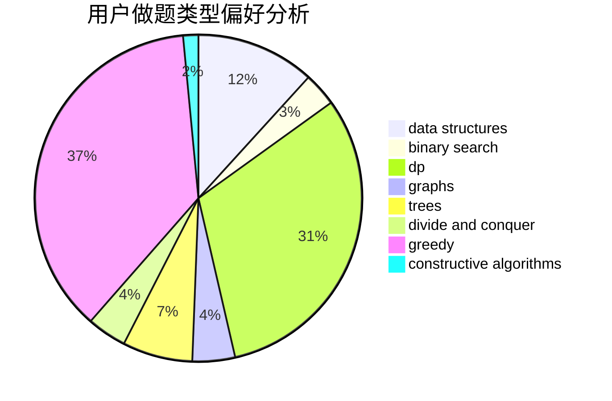

# HLF_rr

<!-- tabs:start -->

#### **用户提交结果分析**

#### **用户做题类型偏好分析**

#### **用户错题知识点分析**

<!-- tabs:end -->
# 推荐题目
[25D](https://codeforces.com/contest/25/problem/D)		dsu,
                        graphs,
                        trees		  
[616A](https://codeforces.com/contest/616/problem/A)		implementation,
                        strings		  
[1292F](https://codeforces.com/contest/1292/problem/F)		bitmasks,
                        combinatorics,
                        dp		  
[1060E](https://codeforces.com/contest/1060/problem/E)		dfs and similar,
                        dp,
                        trees		  
[776D](https://codeforces.com/contest/776/problem/D)		2-sat,
                        dfs and similar,
                        dsu,
                        graphs		  
[85A](https://codeforces.com/contest/85/problem/A)		constructive algorithms,
                        implementation		  
[1070E](https://codeforces.com/contest/1070/problem/E)		binary search,
                        data structures		  
[633G](https://codeforces.com/contest/633/problem/G)		bitmasks,
                        data structures,
                        dfs and similar,
                        math,
                        number theory		  
[600C](https://codeforces.com/contest/600/problem/C)		constructive algorithms,
                        greedy,
                        strings		  
[317B](https://codeforces.com/contest/317/problem/B)		brute force,
                        implementation		  
