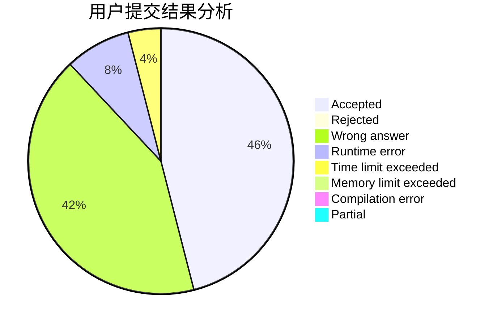
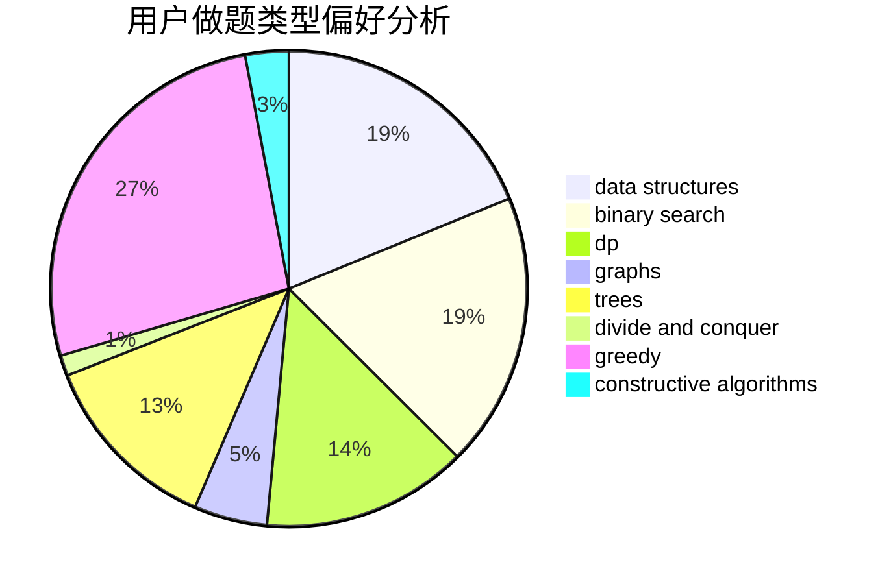

# HLF_rr
<!-- tabs:start -->
#### **用户提交结果分析**

#### **用户做题类型偏好分析**

#### **用户错题知识点分析**

<!-- tabs:end -->
# 推荐题目
[Delete a Segment](http://codeforces.com/problemset/problem/1285/E)		brute force,
                        constructive algorithms,
                        data structures,
                        dp,
                        graphs,
                        sortings,
                        trees,
                        two pointers		  
[Bash Plays with Functions](http://codeforces.com/problemset/problem/757/E)		brute force,
                        combinatorics,
                        dp,
                        number theory		  
[Make Palindrome](http://codeforces.com/problemset/problem/600/C)		constructive algorithms,
                        greedy,
                        strings		  
[Island Puzzle](http://codeforces.com/problemset/problem/634/A)		constructive algorithms,
                        implementation		  
[Set of Strings](http://codeforces.com/problemset/problem/544/A)		implementation,
                        strings		  
[Dinner with Emma](http://codeforces.com/problemset/problem/616/B)		games,
                        greedy		  
[Jeremy Bearimy](https://codeforces.com/contest/1281/problem/E)		dfs and similar,
                        graphs,
                        greedy,
                        trees		  
[Rounding](http://codeforces.com/problemset/problem/898/A)		implementation,
                        math		  
[Not Wool Sequences](http://codeforces.com/problemset/problem/238/A)		constructive algorithms,
                        math		  
[Berkomnadzor](http://codeforces.com/problemset/problem/1070/B)		data structures,
                        greedy		  
<!-- tabs:start -->
#### **data structures**
[Delete a Segment](http://codeforces.com/problemset/problem/1285/E)		brute force,
                        constructive algorithms,
                        data structures,
                        dp,
                        graphs,
                        sortings,
                        trees,
                        two pointers		  
[Berkomnadzor](http://codeforces.com/problemset/problem/1070/B)		data structures,
                        greedy		  
[Mail Stamps](http://codeforces.com/problemset/problem/29/C)		data structures,
                        dfs and similar,
                        graphs,
                        implementation		  
[Duff in the Army](http://codeforces.com/problemset/problem/587/C)		data structures,
                        trees		  
[Summer Oenothera Exhibition](http://codeforces.com/problemset/problem/1039/E)		data structures		  
[k-Amazing Numbers](http://codeforces.com/problemset/problem/1416/A)		binary search,
                        data structures,
                        implementation,
                        two pointers		  
[Karen and Cards](http://codeforces.com/problemset/problem/815/D)		binary search,
                        combinatorics,
                        data structures,
                        geometry		  
[Lunar New Year and a Wander](http://codeforces.com/problemset/problem/1106/D)		data structures,
                        dfs and similar,
                        graphs,
                        greedy,
                        shortest paths		  
[Carrots for Rabbits](http://codeforces.com/problemset/problem/1428/E)		binary search,
                        data structures,
                        greedy,
                        math,
                        sortings		  
[Maximum width](http://codeforces.com/problemset/problem/1492/C)		binary search,
                        data structures,
                        dp,
                        greedy,
                        two pointers		  
#### **binary search**
[Prime Divisors Selection](http://codeforces.com/problemset/problem/1468/L)		binary search,
                        greedy,
                        math,
                        number theory		  
[Packmen](http://codeforces.com/problemset/problem/847/E)		binary search,
                        dp		  
[k-Amazing Numbers](http://codeforces.com/problemset/problem/1416/A)		binary search,
                        data structures,
                        implementation,
                        two pointers		  
[Karen and Cards](http://codeforces.com/problemset/problem/815/D)		binary search,
                        combinatorics,
                        data structures,
                        geometry		  
[Two chandeliers](http://codeforces.com/problemset/problem/1500/B)		binary search,
                        brute force,
                        chinese remainder theorem,
                        math,
                        number theory		  
[Carrots for Rabbits](http://codeforces.com/problemset/problem/1428/E)		binary search,
                        data structures,
                        greedy,
                        math,
                        sortings		  
[Maximum width](http://codeforces.com/problemset/problem/1492/C)		binary search,
                        data structures,
                        dp,
                        greedy,
                        two pointers		  
[Pairs](http://codeforces.com/problemset/problem/1463/D)		binary search,
                        constructive algorithms,
                        greedy,
                        two pointers		  
[Old Floppy Drive](http://codeforces.com/problemset/problem/1490/G)		binary search,
                        data structures,
                        math		  
[Odd Mineral Resource](http://codeforces.com/problemset/problem/1479/D)		binary search,
                        bitmasks,
                        brute force,
                        data structures,
                        probabilities,
                        trees		  
#### **dp**
[Delete a Segment](http://codeforces.com/problemset/problem/1285/E)		brute force,
                        constructive algorithms,
                        data structures,
                        dp,
                        graphs,
                        sortings,
                        trees,
                        two pointers		  
[Bash Plays with Functions](http://codeforces.com/problemset/problem/757/E)		brute force,
                        combinatorics,
                        dp,
                        number theory		  
[On the Bench](http://codeforces.com/problemset/problem/840/C)		combinatorics,
                        dp		  
[Kefa and First Steps](http://codeforces.com/problemset/problem/580/A)		brute force,
                        dp,
                        implementation		  
[Packmen](http://codeforces.com/problemset/problem/847/E)		binary search,
                        dp		  
[Tree Painting](http://codeforces.com/problemset/problem/1187/E)		dfs and similar,
                        dp,
                        trees		  
[Bitwise Magic](http://codeforces.com/problemset/problem/1408/I)		dp,
                        math		  
[Maximum width](http://codeforces.com/problemset/problem/1492/C)		binary search,
                        data structures,
                        dp,
                        greedy,
                        two pointers		  
[Bouncing Ball](https://codeforces.com/contest/1457/problem/C)		brute force,
                        dp,
                        implementation		  
[Pekora and Trampoline](http://codeforces.com/problemset/problem/1491/C)		brute force,
                        data structures,
                        dp,
                        greedy,
                        implementation		  
#### **graph**
[Delete a Segment](http://codeforces.com/problemset/problem/1285/E)		brute force,
                        constructive algorithms,
                        data structures,
                        dp,
                        graphs,
                        sortings,
                        trees,
                        two pointers		  
[Jeremy Bearimy](https://codeforces.com/contest/1281/problem/E)		dfs and similar,
                        graphs,
                        greedy,
                        trees		  
[Mail Stamps](http://codeforces.com/problemset/problem/29/C)		data structures,
                        dfs and similar,
                        graphs,
                        implementation		  
[Lunar New Year and a Wander](http://codeforces.com/problemset/problem/1106/D)		data structures,
                        dfs and similar,
                        graphs,
                        greedy,
                        shortest paths		  
[Spanning Tree with One Fixed Degree](http://codeforces.com/problemset/problem/1133/F2)		constructive algorithms,
                        dfs and similar,
                        dsu,
                        graphs,
                        greedy		  
[Minimum Ties](http://codeforces.com/problemset/problem/1487/C)		brute force,
                        constructive algorithms,
                        dfs and similar,
                        graphs,
                        greedy,
                        implementation,
                        math		  
[Chef Monocarp](http://codeforces.com/problemset/problem/1437/C)		dp,
                        flows,
                        graph matchings,
                        greedy,
                        math,
                        sortings		  
[Strange Housing](http://codeforces.com/problemset/problem/1470/D)		constructive algorithms,
                        dfs and similar,
                        graph matchings,
                        graphs,
                        greedy		  
[Longest Simple Cycle](http://codeforces.com/problemset/problem/1476/C)		dp,
                        graphs,
                        greedy		  
[Shortest and Longest LIS](http://codeforces.com/problemset/problem/1304/D)		constructive algorithms,
                        graphs,
                        greedy,
                        two pointers		  
#### **trees**
[Delete a Segment](http://codeforces.com/problemset/problem/1285/E)		brute force,
                        constructive algorithms,
                        data structures,
                        dp,
                        graphs,
                        sortings,
                        trees,
                        two pointers		  
[Jeremy Bearimy](https://codeforces.com/contest/1281/problem/E)		dfs and similar,
                        graphs,
                        greedy,
                        trees		  
[Duff in the Army](http://codeforces.com/problemset/problem/587/C)		data structures,
                        trees		  
[Regular Forestation](http://codeforces.com/problemset/problem/1252/F)		hashing,
                        trees		  
[Tree Painting](http://codeforces.com/problemset/problem/1187/E)		dfs and similar,
                        dp,
                        trees		  
[Odd Mineral Resource](http://codeforces.com/problemset/problem/1479/D)		binary search,
                        bitmasks,
                        brute force,
                        data structures,
                        probabilities,
                        trees		  
[Yet Another Card Deck](http://codeforces.com/problemset/problem/1511/C)		brute force,
                        data structures,
                        implementation,
                        trees		  
[Diameter Cuts](http://codeforces.com/problemset/problem/1499/F)		combinatorics,
                        dfs and similar,
                        dp,
                        trees		  
[Fib-tree](http://codeforces.com/problemset/problem/1491/E)		brute force,
                        dfs and similar,
                        divide and conquer,
                        number theory,
                        trees		  
[13th Labour of Heracles](http://codeforces.com/problemset/problem/1466/D)		data structures,
                        greedy,
                        sortings,
                        trees		  
#### **divide and conquer**
[Divide and Summarize](http://codeforces.com/problemset/problem/1461/D)		binary search,
                        brute force,
                        data structures,
                        divide and conquer,
                        implementation,
                        sortings		  
[Song of the Sirens](http://codeforces.com/problemset/problem/1466/G)		combinatorics,
                        divide and conquer,
                        hashing,
                        math,
                        string suffix structures,
                        strings		  
[Permutation Transformation](http://codeforces.com/problemset/problem/1490/D)		dfs and similar,
                        divide and conquer,
                        implementation		  
[Skyline Photo](https://codeforces.com/contest/1483/problem/C)		data structures,
                        divide and conquer,
                        dp		  
[Fib-tree](http://codeforces.com/problemset/problem/1491/E)		brute force,
                        dfs and similar,
                        divide and conquer,
                        number theory,
                        trees		  
[Sum of Prefix Sums](http://codeforces.com/problemset/problem/1303/G)		data structures,
                        divide and conquer,
                        geometry,
                        trees		  
[Dogeforces](http://codeforces.com/problemset/problem/1494/D)		constructive algorithms,
                        data structures,
                        dfs and similar,
                        divide and conquer,
                        dsu,
                        greedy,
                        sortings,
                        trees		  
[Logistical Questions](http://codeforces.com/problemset/problem/566/C)		dfs and similar,
                        divide and conquer,
                        trees		  
[Fruit Sequences](http://codeforces.com/problemset/problem/1428/F)		binary search,
                        data structures,
                        divide and conquer,
                        dp,
                        two pointers		  
[Dr. Evil Underscores](http://codeforces.com/problemset/problem/1285/D)		bitmasks,
                        brute force,
                        dfs and similar,
                        divide and conquer,
                        dp,
                        greedy,
                        strings,
                        trees		  
#### **greedy**
[Make Palindrome](http://codeforces.com/problemset/problem/600/C)		constructive algorithms,
                        greedy,
                        strings		  
[Dinner with Emma](http://codeforces.com/problemset/problem/616/B)		games,
                        greedy		  
[Jeremy Bearimy](https://codeforces.com/contest/1281/problem/E)		dfs and similar,
                        graphs,
                        greedy,
                        trees		  
[Berkomnadzor](http://codeforces.com/problemset/problem/1070/B)		data structures,
                        greedy		  
[Prime Divisors Selection](http://codeforces.com/problemset/problem/1468/L)		binary search,
                        greedy,
                        math,
                        number theory		  
[Maximum Sum of Digits](http://codeforces.com/problemset/problem/1060/B)		greedy		  
[Reach Median](http://codeforces.com/problemset/problem/1037/B)		greedy		  
[Anton and currency you all know](http://codeforces.com/problemset/problem/508/B)		greedy,
                        math,
                        strings		  
[Complete the Word](http://codeforces.com/problemset/problem/716/B)		greedy,
                        two pointers		  
[Lunar New Year and a Wander](http://codeforces.com/problemset/problem/1106/D)		data structures,
                        dfs and similar,
                        graphs,
                        greedy,
                        shortest paths		  
#### **constructive algorithms**
[Delete a Segment](http://codeforces.com/problemset/problem/1285/E)		brute force,
                        constructive algorithms,
                        data structures,
                        dp,
                        graphs,
                        sortings,
                        trees,
                        two pointers		  
[Make Palindrome](http://codeforces.com/problemset/problem/600/C)		constructive algorithms,
                        greedy,
                        strings		  
[Island Puzzle](http://codeforces.com/problemset/problem/634/A)		constructive algorithms,
                        implementation		  
[Not Wool Sequences](http://codeforces.com/problemset/problem/238/A)		constructive algorithms,
                        math		  
[Maxim Buys an Apartment](http://codeforces.com/problemset/problem/854/B)		constructive algorithms,
                        math		  
[Spanning Tree with One Fixed Degree](http://codeforces.com/problemset/problem/1133/F2)		constructive algorithms,
                        dfs and similar,
                        dsu,
                        graphs,
                        greedy		  
[Orac and Medians](http://codeforces.com/problemset/problem/1349/B)		constructive algorithms,
                        greedy,
                        math		  
[Anti-knapsack](http://codeforces.com/problemset/problem/1493/A)		constructive algorithms,
                        greedy		  
[Pairs](http://codeforces.com/problemset/problem/1463/D)		binary search,
                        constructive algorithms,
                        greedy,
                        two pointers		  
[XOR-gun](https://codeforces.com/contest/1456/problem/B)		bitmasks,
                        brute force,
                        constructive algorithms		  
#### **sortings**
[Delete a Segment](http://codeforces.com/problemset/problem/1285/E)		brute force,
                        constructive algorithms,
                        data structures,
                        dp,
                        graphs,
                        sortings,
                        trees,
                        two pointers		  
[Carrots for Rabbits](http://codeforces.com/problemset/problem/1428/E)		binary search,
                        data structures,
                        greedy,
                        math,
                        sortings		  
[Diamond Miner](https://codeforces.com/contest/1496/problem/C)		geometry,
                        greedy,
                        math,
                        sortings		  
[Meximization](http://codeforces.com/problemset/problem/1497/A)		brute force,
                        data structures,
                        greedy,
                        sortings		  
[Avoiding Zero](http://codeforces.com/problemset/problem/1427/A)		math,
                        sortings		  
[Divide and Summarize](http://codeforces.com/problemset/problem/1461/D)		binary search,
                        brute force,
                        data structures,
                        divide and conquer,
                        implementation,
                        sortings		  
[Chef Monocarp](http://codeforces.com/problemset/problem/1437/C)		dp,
                        flows,
                        graph matchings,
                        greedy,
                        math,
                        sortings		  
[Replacing Elements](http://codeforces.com/problemset/problem/1473/A)		greedy,
                        implementation,
                        math,
                        sortings		  
[Eastern Exhibition](http://codeforces.com/problemset/problem/1486/B)		binary search,
                        geometry,
                        shortest paths,
                        sortings		  
[The Great Hero](http://codeforces.com/problemset/problem/1480/B)		greedy,
                        implementation,
                        sortings		  
<!-- tabs:end -->
