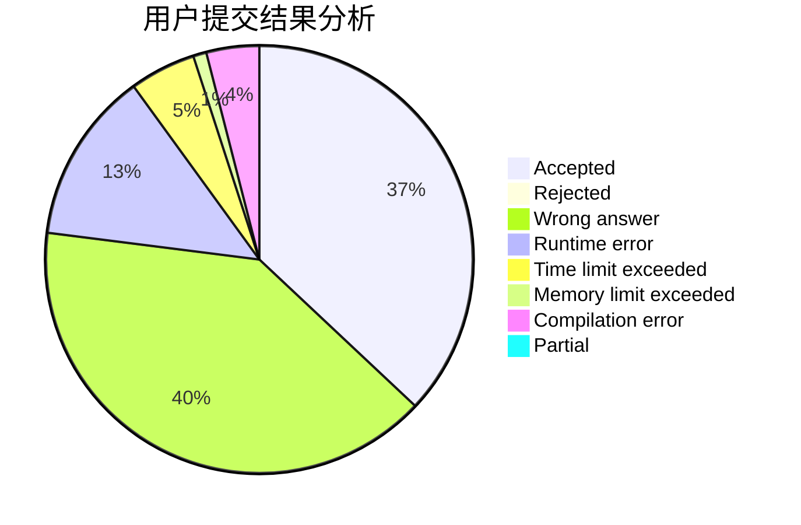
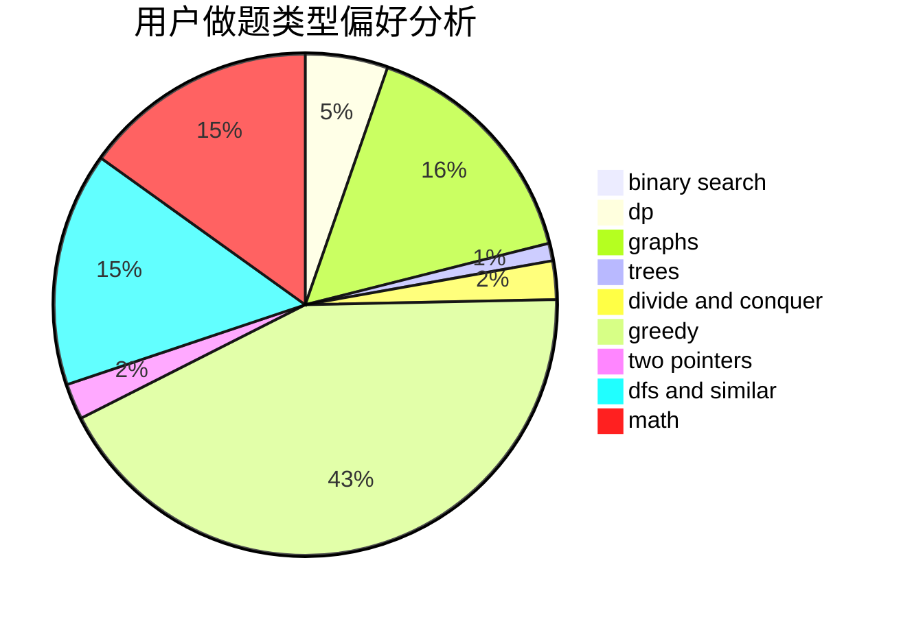

# HMAXS

<!-- tabs:start -->

#### **用户提交结果分析**

#### **用户做题类型偏好分析**

<!-- tabs:end -->
# 推荐题目
[1464A](https://codeforces.com/contest/1464/problem/A)
[55D](https://codeforces.com/contest/55/problem/D)
[652C](https://codeforces.com/contest/652/problem/C)
[1180A](https://codeforces.com/contest/1180/problem/A)
[662A](https://codeforces.com/contest/662/problem/A)
[70A](https://codeforces.com/contest/70/problem/A)
[1025F](https://codeforces.com/contest/1025/problem/F)
[1025E](https://codeforces.com/contest/1025/problem/E)
[861B](https://codeforces.com/contest/861/problem/B)
[871A](https://codeforces.com/contest/871/problem/A)
