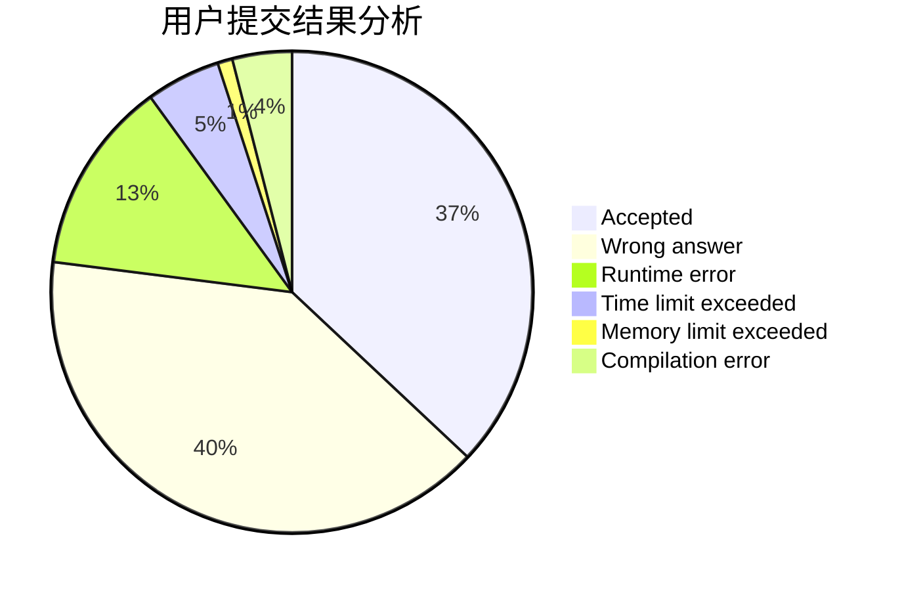
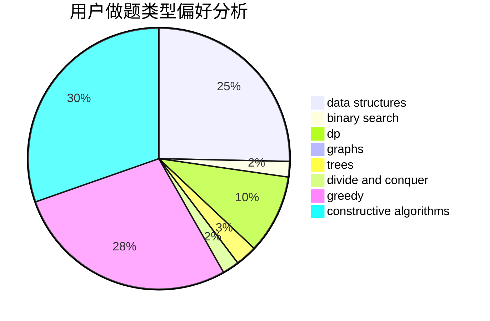
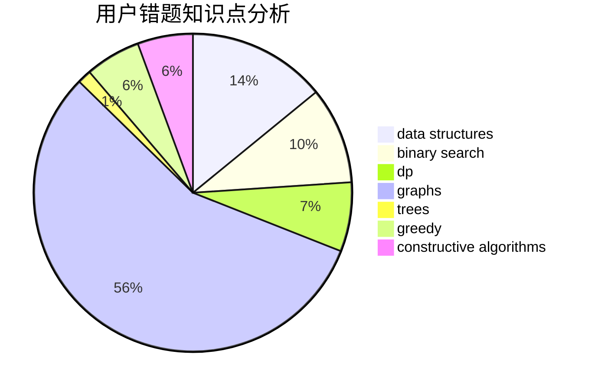

# HMAXS
<!-- tabs:start -->
#### **用户提交结果分析**

#### **用户做题类型偏好分析**

#### **用户错题知识点分析**

<!-- tabs:end -->
# 推荐题目
[Number into Sequence](http://codeforces.com/problemset/problem/1454/D)		constructive algorithms,
                        math,
                        number theory		  
[Swedish Heroes](http://codeforces.com/problemset/problem/1421/E)		brute force,
                        dp,
                        implementation		  
[War of the Corporations](http://codeforces.com/problemset/problem/625/B)		constructive algorithms,
                        greedy,
                        strings		  
[Soldier and Traveling](http://codeforces.com/problemset/problem/546/E)		flows,
                        graphs,
                        math		  
[Camels](http://codeforces.com/problemset/problem/14/E)		dp		  
[Spyke Chatting](http://codeforces.com/problemset/problem/413/B)		implementation		  
[Make k Equal](http://codeforces.com/problemset/problem/1328/F)		greedy		  
[Red-Blue Graph](http://codeforces.com/problemset/problem/1266/H)		dp,
                        graphs,
                        math,
                        matrices,
                        meet-in-the-middle		  
[Interview](http://codeforces.com/problemset/problem/631/A)		brute force,
                        implementation		  
[Sliding Doors](http://codeforces.com/problemset/problem/1170/E)		*special problem,
                        binary search		  
<!-- tabs:start -->
#### **data structures**
[Subarray Sorting](http://codeforces.com/problemset/problem/1187/D)		data structures,
                        sortings		  
[Cannon](http://codeforces.com/problemset/problem/47/E)		data structures,
                        geometry,
                        sortings		  
[Array Partition](http://codeforces.com/problemset/problem/1454/F)		binary search,
                        data structures,
                        greedy,
                        two pointers		  
[Maximum width](http://codeforces.com/problemset/problem/1492/C)		binary search,
                        data structures,
                        dp,
                        greedy,
                        two pointers		  
[Old Floppy Drive](http://codeforces.com/problemset/problem/1490/G)		binary search,
                        data structures,
                        math		  
[Odd Mineral Resource](http://codeforces.com/problemset/problem/1479/D)		binary search,
                        bitmasks,
                        brute force,
                        data structures,
                        probabilities,
                        trees		  
[Meximization](http://codeforces.com/problemset/problem/1497/A)		brute force,
                        data structures,
                        greedy,
                        sortings		  
[Pekora and Trampoline](http://codeforces.com/problemset/problem/1491/C)		brute force,
                        data structures,
                        dp,
                        greedy,
                        implementation		  
[Card Deck](http://codeforces.com/problemset/problem/1492/B)		data structures,
                        greedy,
                        math		  
[Complicated Computations](http://codeforces.com/problemset/problem/1436/E)		binary search,
                        data structures,
                        two pointers		  
#### **binary search**
[Sliding Doors](http://codeforces.com/problemset/problem/1170/E)		*special problem,
                        binary search		  
[Array Partition](http://codeforces.com/problemset/problem/1454/F)		binary search,
                        data structures,
                        greedy,
                        two pointers		  
[Sanatorium](http://codeforces.com/problemset/problem/732/C)		binary search,
                        constructive algorithms,
                        greedy,
                        implementation,
                        math		  
[Maximum width](http://codeforces.com/problemset/problem/1492/C)		binary search,
                        data structures,
                        dp,
                        greedy,
                        two pointers		  
[Pairs](http://codeforces.com/problemset/problem/1463/D)		binary search,
                        constructive algorithms,
                        greedy,
                        two pointers		  
[Old Floppy Drive](http://codeforces.com/problemset/problem/1490/G)		binary search,
                        data structures,
                        math		  
[Odd Mineral Resource](http://codeforces.com/problemset/problem/1479/D)		binary search,
                        bitmasks,
                        brute force,
                        data structures,
                        probabilities,
                        trees		  
[Complicated Computations](http://codeforces.com/problemset/problem/1436/E)		binary search,
                        data structures,
                        two pointers		  
[Divide and Summarize](http://codeforces.com/problemset/problem/1461/D)		binary search,
                        brute force,
                        data structures,
                        divide and conquer,
                        implementation,
                        sortings		  
[K-beautiful Strings](http://codeforces.com/problemset/problem/1493/C)		binary search,
                        brute force,
                        constructive algorithms,
                        greedy,
                        strings		  
#### **dp**
[Swedish Heroes](http://codeforces.com/problemset/problem/1421/E)		brute force,
                        dp,
                        implementation		  
[Camels](http://codeforces.com/problemset/problem/14/E)		dp		  
[Red-Blue Graph](http://codeforces.com/problemset/problem/1266/H)		dp,
                        graphs,
                        math,
                        matrices,
                        meet-in-the-middle		  
[Sereja and Intervals](http://codeforces.com/problemset/problem/367/E)		combinatorics,
                        dp		  
[Table Compression](http://codeforces.com/problemset/problem/650/C)		dfs and similar,
                        dp,
                        dsu,
                        graphs,
                        greedy		  
[WOW Factor](http://codeforces.com/problemset/problem/1178/B)		dp,
                        strings		  
[Jeff and Furik](http://codeforces.com/problemset/problem/351/B)		combinatorics,
                        dp,
                        probabilities		  
[Maximum width](http://codeforces.com/problemset/problem/1492/C)		binary search,
                        data structures,
                        dp,
                        greedy,
                        two pointers		  
[Bouncing Ball](https://codeforces.com/contest/1457/problem/C)		brute force,
                        dp,
                        implementation		  
[Pekora and Trampoline](http://codeforces.com/problemset/problem/1491/C)		brute force,
                        data structures,
                        dp,
                        greedy,
                        implementation		  
#### **graph**
[Soldier and Traveling](http://codeforces.com/problemset/problem/546/E)		flows,
                        graphs,
                        math		  
[Red-Blue Graph](http://codeforces.com/problemset/problem/1266/H)		dp,
                        graphs,
                        math,
                        matrices,
                        meet-in-the-middle		  
[Dating](http://codeforces.com/problemset/problem/852/I)		brute force,
                        dfs and similar,
                        graphs,
                        trees		  
[Mother of Dragons](http://codeforces.com/problemset/problem/839/E)		brute force,
                        graphs,
                        math,
                        meet-in-the-middle		  
[Table Compression](http://codeforces.com/problemset/problem/650/C)		dfs and similar,
                        dp,
                        dsu,
                        graphs,
                        greedy		  
[Mike and Shortcuts](http://codeforces.com/problemset/problem/689/B)		dfs and similar,
                        graphs,
                        greedy,
                        shortest paths		  
[Berland Army](http://codeforces.com/problemset/problem/883/B)		constructive algorithms,
                        graphs,
                        greedy		  
[Ilya And The Tree](http://codeforces.com/problemset/problem/842/C)		dfs and similar,
                        graphs,
                        math,
                        number theory,
                        trees		  
[Minimum Ties](http://codeforces.com/problemset/problem/1487/C)		brute force,
                        constructive algorithms,
                        dfs and similar,
                        graphs,
                        greedy,
                        implementation,
                        math		  
[Chef Monocarp](http://codeforces.com/problemset/problem/1437/C)		dp,
                        flows,
                        graph matchings,
                        greedy,
                        math,
                        sortings		  
#### **trees**
[Dating](http://codeforces.com/problemset/problem/852/I)		brute force,
                        dfs and similar,
                        graphs,
                        trees		  
[Ilya And The Tree](http://codeforces.com/problemset/problem/842/C)		dfs and similar,
                        graphs,
                        math,
                        number theory,
                        trees		  
[Digit Tree](http://codeforces.com/problemset/problem/715/C)		dfs and similar,
                        divide and conquer,
                        dsu,
                        trees		  
[Odd Mineral Resource](http://codeforces.com/problemset/problem/1479/D)		binary search,
                        bitmasks,
                        brute force,
                        data structures,
                        probabilities,
                        trees		  
[Yet Another Card Deck](http://codeforces.com/problemset/problem/1511/C)		brute force,
                        data structures,
                        implementation,
                        trees		  
[Diameter Cuts](http://codeforces.com/problemset/problem/1499/F)		combinatorics,
                        dfs and similar,
                        dp,
                        trees		  
[Fib-tree](http://codeforces.com/problemset/problem/1491/E)		brute force,
                        dfs and similar,
                        divide and conquer,
                        number theory,
                        trees		  
[13th Labour of Heracles](http://codeforces.com/problemset/problem/1466/D)		data structures,
                        greedy,
                        sortings,
                        trees		  
[BFS Trees](http://codeforces.com/problemset/problem/1495/D)		combinatorics,
                        dfs and similar,
                        graphs,
                        math,
                        shortest paths,
                        trees		  
[Sum of Prefix Sums](http://codeforces.com/problemset/problem/1303/G)		data structures,
                        divide and conquer,
                        geometry,
                        trees		  
#### **divide and conquer**
[Digit Tree](http://codeforces.com/problemset/problem/715/C)		dfs and similar,
                        divide and conquer,
                        dsu,
                        trees		  
[Divide and Summarize](http://codeforces.com/problemset/problem/1461/D)		binary search,
                        brute force,
                        data structures,
                        divide and conquer,
                        implementation,
                        sortings		  
[Song of the Sirens](http://codeforces.com/problemset/problem/1466/G)		combinatorics,
                        divide and conquer,
                        hashing,
                        math,
                        string suffix structures,
                        strings		  
[Permutation Transformation](http://codeforces.com/problemset/problem/1490/D)		dfs and similar,
                        divide and conquer,
                        implementation		  
[Skyline Photo](https://codeforces.com/contest/1483/problem/C)		data structures,
                        divide and conquer,
                        dp		  
[Fib-tree](http://codeforces.com/problemset/problem/1491/E)		brute force,
                        dfs and similar,
                        divide and conquer,
                        number theory,
                        trees		  
[Sum of Prefix Sums](http://codeforces.com/problemset/problem/1303/G)		data structures,
                        divide and conquer,
                        geometry,
                        trees		  
[Dogeforces](http://codeforces.com/problemset/problem/1494/D)		constructive algorithms,
                        data structures,
                        dfs and similar,
                        divide and conquer,
                        dsu,
                        greedy,
                        sortings,
                        trees		  
[Logistical Questions](http://codeforces.com/problemset/problem/566/C)		dfs and similar,
                        divide and conquer,
                        trees		  
[Fruit Sequences](http://codeforces.com/problemset/problem/1428/F)		binary search,
                        data structures,
                        divide and conquer,
                        dp,
                        two pointers		  
#### **greedy**
[War of the Corporations](http://codeforces.com/problemset/problem/625/B)		constructive algorithms,
                        greedy,
                        strings		  
[Make k Equal](http://codeforces.com/problemset/problem/1328/F)		greedy		  
[Weakened Common Divisor](http://codeforces.com/problemset/problem/1025/B)		brute force,
                        greedy,
                        number theory		  
[Table Compression](http://codeforces.com/problemset/problem/650/C)		dfs and similar,
                        dp,
                        dsu,
                        graphs,
                        greedy		  
[Average Score](http://codeforces.com/problemset/problem/81/C)		greedy,
                        math,
                        sortings		  
[Mike and Shortcuts](http://codeforces.com/problemset/problem/689/B)		dfs and similar,
                        graphs,
                        greedy,
                        shortest paths		  
[Berland Army](http://codeforces.com/problemset/problem/883/B)		constructive algorithms,
                        graphs,
                        greedy		  
[Eating Soup](http://codeforces.com/problemset/problem/1163/A)		greedy,
                        math		  
[Bear and Different Names](https://codeforces.com/contest/791/problem/C)		constructive algorithms,
                        greedy		  
[Array Partition](http://codeforces.com/problemset/problem/1454/F)		binary search,
                        data structures,
                        greedy,
                        two pointers		  
#### **constructive algorithms**
[Number into Sequence](http://codeforces.com/problemset/problem/1454/D)		constructive algorithms,
                        math,
                        number theory		  
[War of the Corporations](http://codeforces.com/problemset/problem/625/B)		constructive algorithms,
                        greedy,
                        strings		  
[Berland Army](http://codeforces.com/problemset/problem/883/B)		constructive algorithms,
                        graphs,
                        greedy		  
[Ralph And His Magic Field](http://codeforces.com/problemset/problem/894/B)		combinatorics,
                        constructive algorithms,
                        math,
                        number theory		  
[Bear and Different Names](https://codeforces.com/contest/791/problem/C)		constructive algorithms,
                        greedy		  
[Sanatorium](http://codeforces.com/problemset/problem/732/C)		binary search,
                        constructive algorithms,
                        greedy,
                        implementation,
                        math		  
[Vus the Cossack and Numbers](http://codeforces.com/problemset/problem/1186/D)		constructive algorithms,
                        greedy,
                        math		  
[Plasticine zebra](http://codeforces.com/problemset/problem/1025/C)		constructive algorithms,
                        implementation		  
[Anti-knapsack](http://codeforces.com/problemset/problem/1493/A)		constructive algorithms,
                        greedy		  
[Pairs](http://codeforces.com/problemset/problem/1463/D)		binary search,
                        constructive algorithms,
                        greedy,
                        two pointers		  
#### **sortings**
[Subarray Sorting](http://codeforces.com/problemset/problem/1187/D)		data structures,
                        sortings		  
[Average Score](http://codeforces.com/problemset/problem/81/C)		greedy,
                        math,
                        sortings		  
[Cannon](http://codeforces.com/problemset/problem/47/E)		data structures,
                        geometry,
                        sortings		  
[Diamond Miner](https://codeforces.com/contest/1496/problem/C)		geometry,
                        greedy,
                        math,
                        sortings		  
[Meximization](http://codeforces.com/problemset/problem/1497/A)		brute force,
                        data structures,
                        greedy,
                        sortings		  
[Avoiding Zero](http://codeforces.com/problemset/problem/1427/A)		math,
                        sortings		  
[Divide and Summarize](http://codeforces.com/problemset/problem/1461/D)		binary search,
                        brute force,
                        data structures,
                        divide and conquer,
                        implementation,
                        sortings		  
[Chef Monocarp](http://codeforces.com/problemset/problem/1437/C)		dp,
                        flows,
                        graph matchings,
                        greedy,
                        math,
                        sortings		  
[Replacing Elements](http://codeforces.com/problemset/problem/1473/A)		greedy,
                        implementation,
                        math,
                        sortings		  
[Eastern Exhibition](http://codeforces.com/problemset/problem/1486/B)		binary search,
                        geometry,
                        shortest paths,
                        sortings		  
<!-- tabs:end -->
