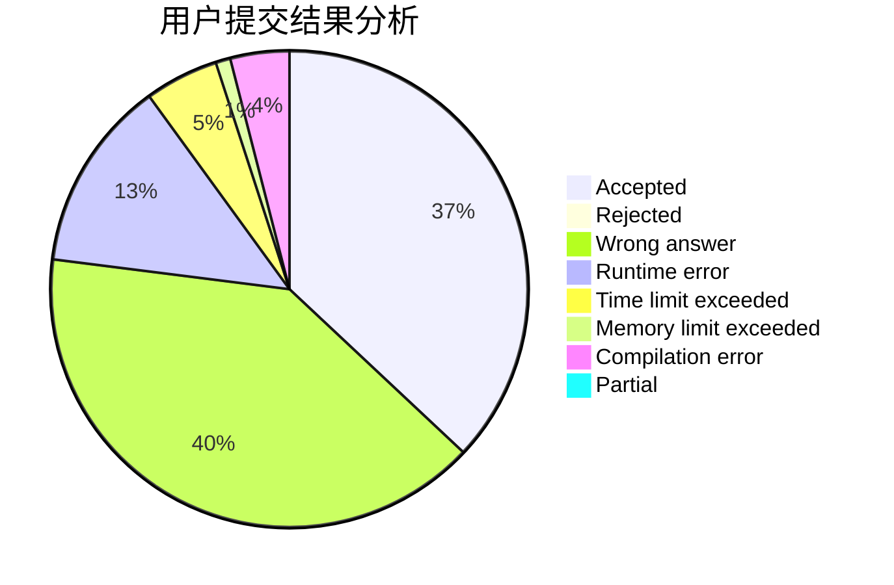
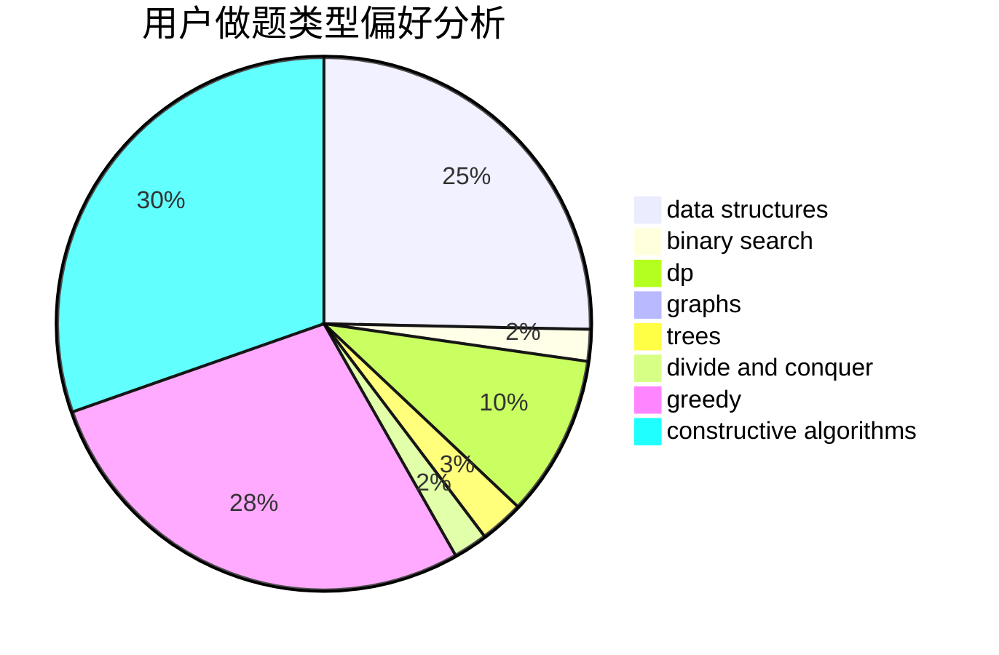
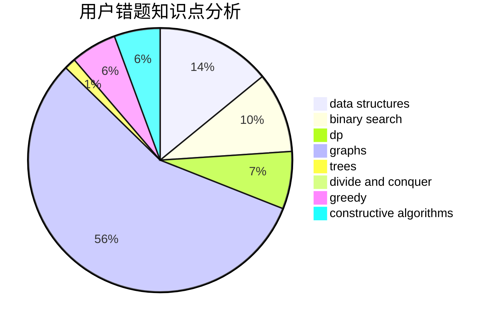

# HMAXS

<!-- tabs:start -->

#### **用户提交结果分析**

#### **用户做题类型偏好分析**

#### **用户错题知识点分析**

<!-- tabs:end -->
# 推荐题目
[1454D](https://codeforces.com/contest/1454/problem/D)		constructive algorithms,
                        math,
                        number theory		  
[53A](https://codeforces.com/contest/53/problem/A)		implementation		  
[625B](https://codeforces.com/contest/625/problem/B)		constructive algorithms,
                        greedy,
                        strings		  
[1178B](https://codeforces.com/contest/1178/problem/B)		dp,
                        strings		  
[631A](https://codeforces.com/contest/631/problem/A)		brute force,
                        implementation		  
[689B](https://codeforces.com/contest/689/problem/B)		dfs and similar,
                        graphs,
                        greedy,
                        shortest paths		  
[1025C](https://codeforces.com/contest/1025/problem/C)		constructive algorithms,
                        implementation		  
[1025B](https://codeforces.com/contest/1025/problem/B)		brute force,
                        greedy,
                        number theory		  
[842C](https://codeforces.com/contest/842/problem/C)		dfs and similar,
                        graphs,
                        math,
                        number theory,
                        trees		  
[852I](https://codeforces.com/contest/852/problem/I)		brute force,
                        dfs and similar,
                        graphs,
                        trees		  
