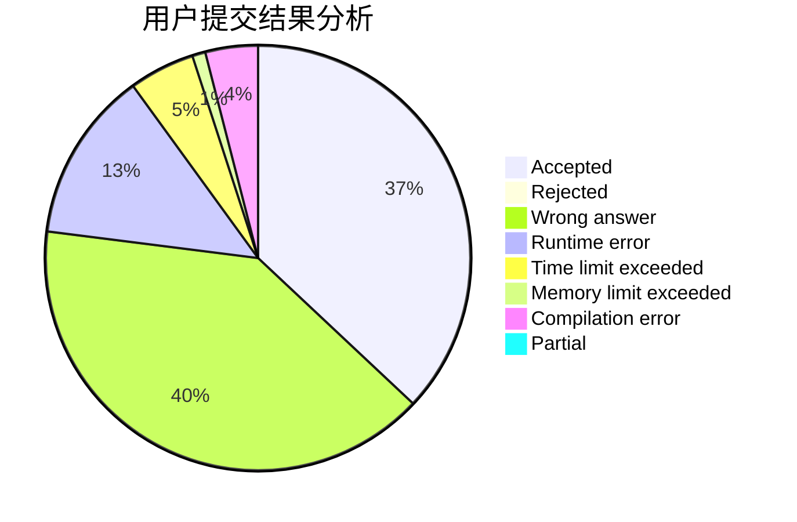
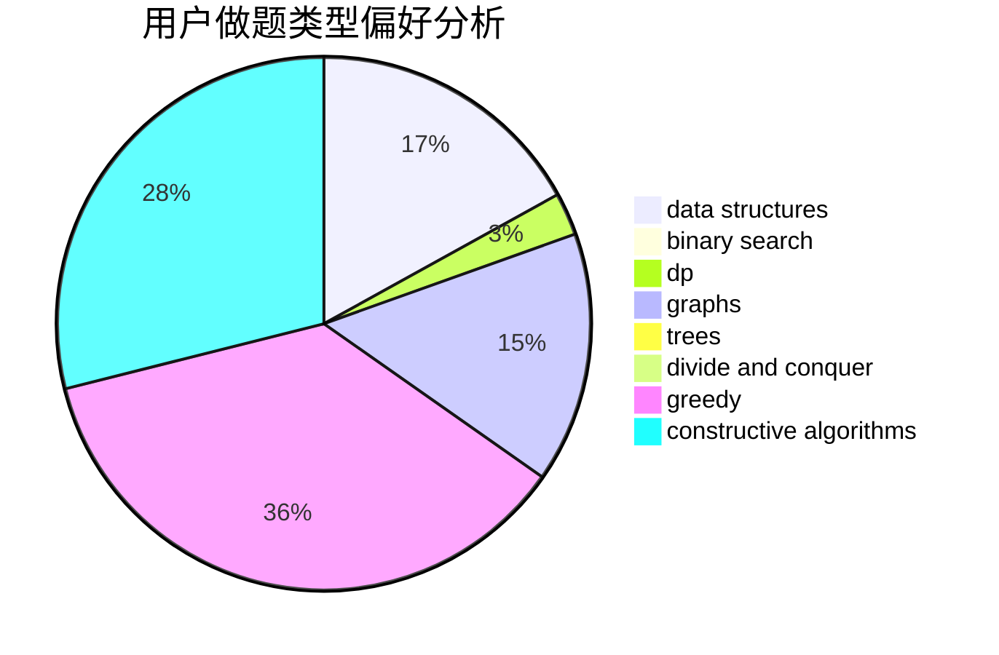
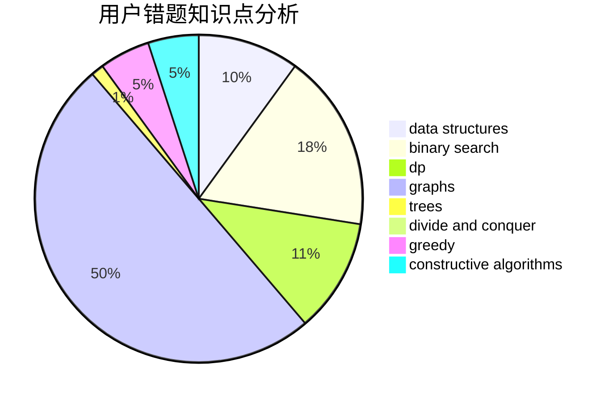

# HMAXS

<!-- tabs:start -->

#### **用户提交结果分析**

#### **用户做题类型偏好分析**

#### **用户错题知识点分析**

<!-- tabs:end -->
# 推荐题目
[1464A](https://codeforces.com/contest/1464/problem/A)		dsu,graphs,sortings,trees		  
[55D](https://codeforces.com/contest/55/problem/D)		dp,
                        number theory		  
[652C](https://codeforces.com/contest/652/problem/C)		combinatorics,
                        sortings,
                        two pointers		  
[1180A](https://codeforces.com/contest/1180/problem/A)		dp,
                        implementation,
                        math		  
[662A](https://codeforces.com/contest/662/problem/A)		bitmasks,
                        math,
                        matrices,
                        probabilities		  
[70A](https://codeforces.com/contest/70/problem/A)		math		  
[1025F](https://codeforces.com/contest/1025/problem/F)		geometry		  
[1025E](https://codeforces.com/contest/1025/problem/E)		constructive algorithms,
                        implementation,
                        matrices		  
[861B](https://codeforces.com/contest/861/problem/B)		dsu,graphs,sortings,trees		  
[871A](https://codeforces.com/contest/871/problem/A)		dsu,graphs,sortings,trees		  
