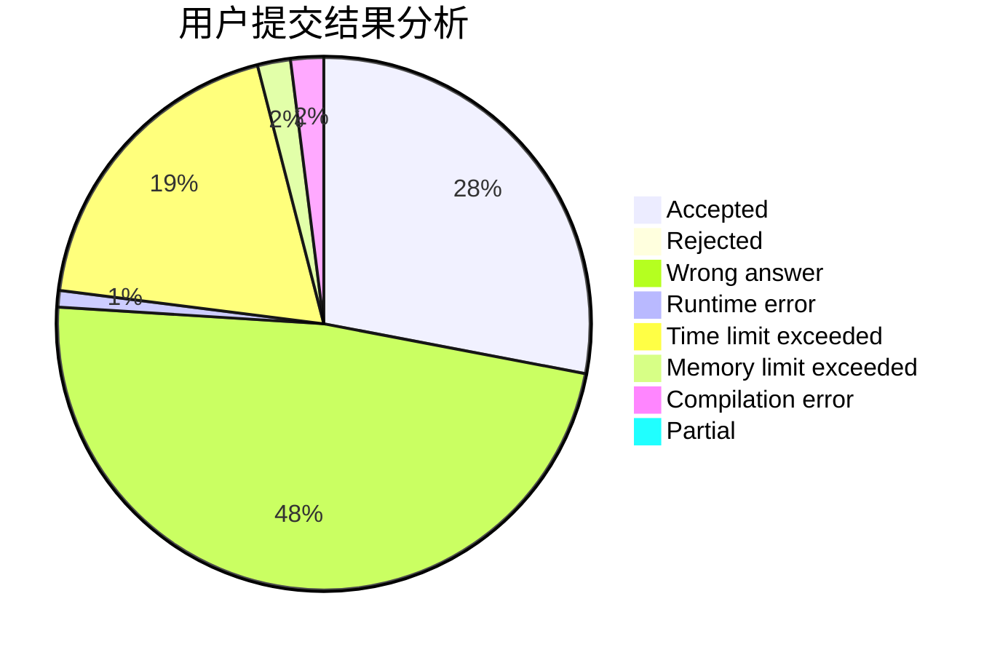
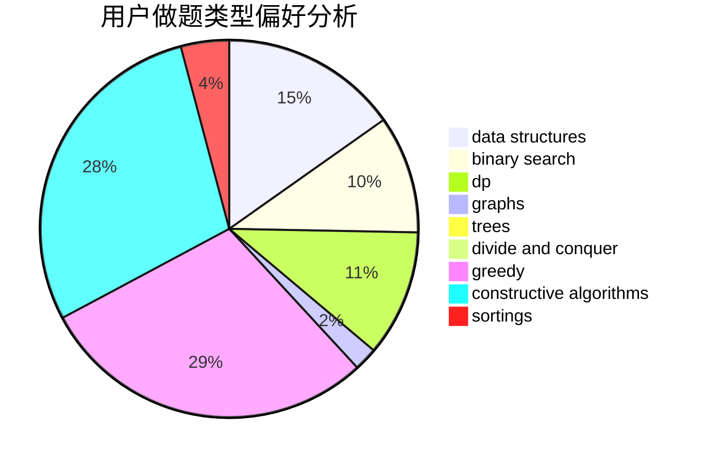
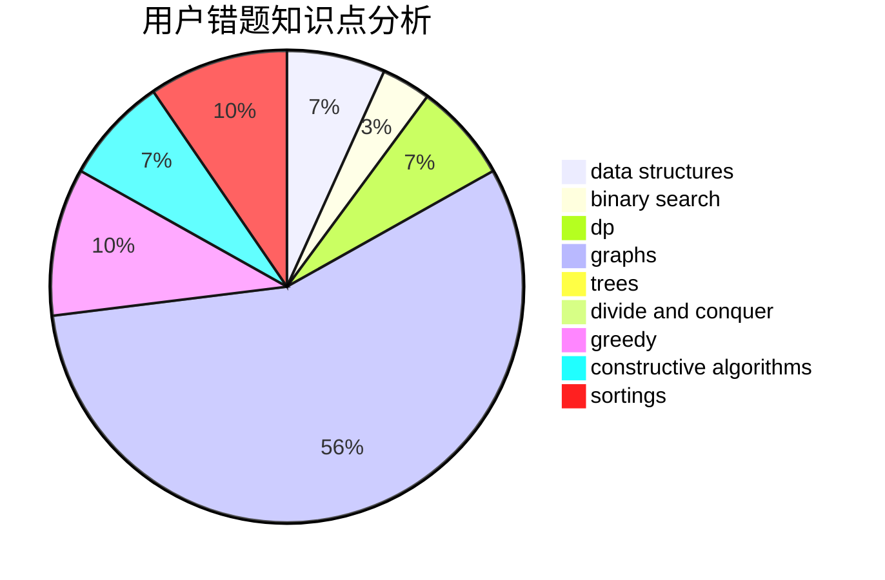

# HNUST-z3475
<!-- tabs:start -->
#### **用户提交结果分析**

#### **用户做题类型偏好分析**

#### **用户错题知识点分析**

<!-- tabs:end -->
# 推荐题目
[1136C](http://codeforces.com/problemset/problem/1136/C)		constructive algorithms,
                        sortings		  
[1428G1](http://codeforces.com/problemset/problem/1428/G1)		dp,
                        greedy		  
[1316B](http://codeforces.com/problemset/problem/1316/B)		brute force,
                        constructive algorithms,
                        implementation,
                        sortings,
                        strings		  
[898D](http://codeforces.com/problemset/problem/898/D)		greedy		  
[767E](http://codeforces.com/problemset/problem/767/E)		greedy		  
[392B](http://codeforces.com/problemset/problem/392/B)		dp		  
[774C](http://codeforces.com/problemset/problem/774/C)		*special problem,
                        constructive algorithms,
                        greedy,
                        implementation		  
[1227D1](http://codeforces.com/problemset/problem/1227/D1)		data structures,
                        greedy		  
[1220F](http://codeforces.com/problemset/problem/1220/F)		binary search,
                        data structures		  
[574C](https://codeforces.com/contest/574/problem/C)		implementation,
                        math,
                        number theory		  
<!-- tabs:start -->
#### **data structures**
[1227D1](http://codeforces.com/problemset/problem/1227/D1)		data structures,
                        greedy		  
[1220F](http://codeforces.com/problemset/problem/1220/F)		binary search,
                        data structures		  
[484E](http://codeforces.com/problemset/problem/484/E)		binary search,
                        constructive algorithms,
                        data structures		  
[1209H](http://codeforces.com/problemset/problem/1209/H)		data structures,
                        greedy,
                        math		  
[1494E](http://codeforces.com/problemset/problem/1494/E)		constructive algorithms,
                        data structures,
                        graphs,
                        hashing		  
[1504F](https://codeforces.com/contest/1504/problem/F)		2-sat,
                        constructive algorithms,
                        data structures,
                        greedy,
                        sortings,
                        two pointers		  
[1492C](http://codeforces.com/problemset/problem/1492/C)		binary search,
                        data structures,
                        dp,
                        greedy,
                        two pointers		  
[1490G](http://codeforces.com/problemset/problem/1490/G)		binary search,
                        data structures,
                        math		  
[1479D](http://codeforces.com/problemset/problem/1479/D)		binary search,
                        bitmasks,
                        brute force,
                        data structures,
                        probabilities,
                        trees		  
[1497A](http://codeforces.com/problemset/problem/1497/A)		brute force,
                        data structures,
                        greedy,
                        sortings		  
#### **binary search**
[1220F](http://codeforces.com/problemset/problem/1220/F)		binary search,
                        data structures		  
[205C](https://codeforces.com/contest/205/problem/C)		binary search,
                        combinatorics,
                        dp		  
[484E](http://codeforces.com/problemset/problem/484/E)		binary search,
                        constructive algorithms,
                        data structures		  
[468C](http://codeforces.com/problemset/problem/468/C)		binary search,
                        constructive algorithms,
                        math		  
[1492C](http://codeforces.com/problemset/problem/1492/C)		binary search,
                        data structures,
                        dp,
                        greedy,
                        two pointers		  
[1463D](http://codeforces.com/problemset/problem/1463/D)		binary search,
                        constructive algorithms,
                        greedy,
                        two pointers		  
[1490G](http://codeforces.com/problemset/problem/1490/G)		binary search,
                        data structures,
                        math		  
[1479D](http://codeforces.com/problemset/problem/1479/D)		binary search,
                        bitmasks,
                        brute force,
                        data structures,
                        probabilities,
                        trees		  
[1436E](http://codeforces.com/problemset/problem/1436/E)		binary search,
                        data structures,
                        two pointers		  
[1461D](http://codeforces.com/problemset/problem/1461/D)		binary search,
                        brute force,
                        data structures,
                        divide and conquer,
                        implementation,
                        sortings		  
#### **dp**
[1428G1](http://codeforces.com/problemset/problem/1428/G1)		dp,
                        greedy		  
[392B](http://codeforces.com/problemset/problem/392/B)		dp		  
[205C](https://codeforces.com/contest/205/problem/C)		binary search,
                        combinatorics,
                        dp		  
[1261D1](https://codeforces.com/contest/1261/problem/D1)		dp		  
[687C](http://codeforces.com/problemset/problem/687/C)		dp		  
[316D2](http://codeforces.com/problemset/problem/316/D2)		dp		  
[1418C](http://codeforces.com/problemset/problem/1418/C)		dp,
                        graphs,
                        greedy,
                        shortest paths		  
[1492C](http://codeforces.com/problemset/problem/1492/C)		binary search,
                        data structures,
                        dp,
                        greedy,
                        two pointers		  
[1457C](https://codeforces.com/contest/1457/problem/C)		brute force,
                        dp,
                        implementation		  
[1491C](http://codeforces.com/problemset/problem/1491/C)		brute force,
                        data structures,
                        dp,
                        greedy,
                        implementation		  
#### **graph**
[574B](http://codeforces.com/problemset/problem/574/B)		brute force,
                        dfs and similar,
                        graphs,
                        hashing		  
[369C](http://codeforces.com/problemset/problem/369/C)		dfs and similar,
                        graphs,
                        trees		  
[41E](http://codeforces.com/problemset/problem/41/E)		constructive algorithms,
                        graphs,
                        greedy		  
[1494E](http://codeforces.com/problemset/problem/1494/E)		constructive algorithms,
                        data structures,
                        graphs,
                        hashing		  
[1418C](http://codeforces.com/problemset/problem/1418/C)		dp,
                        graphs,
                        greedy,
                        shortest paths		  
[1487C](http://codeforces.com/problemset/problem/1487/C)		brute force,
                        constructive algorithms,
                        dfs and similar,
                        graphs,
                        greedy,
                        implementation,
                        math		  
[1437C](http://codeforces.com/problemset/problem/1437/C)		dp,
                        flows,
                        graph matchings,
                        greedy,
                        math,
                        sortings		  
[1470D](http://codeforces.com/problemset/problem/1470/D)		constructive algorithms,
                        dfs and similar,
                        graph matchings,
                        graphs,
                        greedy		  
[1476C](http://codeforces.com/problemset/problem/1476/C)		dp,
                        graphs,
                        greedy		  
[1304D](http://codeforces.com/problemset/problem/1304/D)		constructive algorithms,
                        graphs,
                        greedy,
                        two pointers		  
#### **trees**
[369C](http://codeforces.com/problemset/problem/369/C)		dfs and similar,
                        graphs,
                        trees		  
[1479D](http://codeforces.com/problemset/problem/1479/D)		binary search,
                        bitmasks,
                        brute force,
                        data structures,
                        probabilities,
                        trees		  
[1511C](http://codeforces.com/problemset/problem/1511/C)		brute force,
                        data structures,
                        implementation,
                        trees		  
[1499F](http://codeforces.com/problemset/problem/1499/F)		combinatorics,
                        dfs and similar,
                        dp,
                        trees		  
[1491E](http://codeforces.com/problemset/problem/1491/E)		brute force,
                        dfs and similar,
                        divide and conquer,
                        number theory,
                        trees		  
[1466D](http://codeforces.com/problemset/problem/1466/D)		data structures,
                        greedy,
                        sortings,
                        trees		  
[1495D](http://codeforces.com/problemset/problem/1495/D)		combinatorics,
                        dfs and similar,
                        graphs,
                        math,
                        shortest paths,
                        trees		  
[1303G](http://codeforces.com/problemset/problem/1303/G)		data structures,
                        divide and conquer,
                        geometry,
                        trees		  
[1454E](http://codeforces.com/problemset/problem/1454/E)		combinatorics,
                        dfs and similar,
                        graphs,
                        trees		  
[1494D](http://codeforces.com/problemset/problem/1494/D)		constructive algorithms,
                        data structures,
                        dfs and similar,
                        divide and conquer,
                        dsu,
                        greedy,
                        sortings,
                        trees		  
#### **divide and conquer**
[788D](http://codeforces.com/problemset/problem/788/D)		constructive algorithms,
                        divide and conquer,
                        interactive		  
[1461D](http://codeforces.com/problemset/problem/1461/D)		binary search,
                        brute force,
                        data structures,
                        divide and conquer,
                        implementation,
                        sortings		  
[1466G](http://codeforces.com/problemset/problem/1466/G)		combinatorics,
                        divide and conquer,
                        hashing,
                        math,
                        string suffix structures,
                        strings		  
[1490D](http://codeforces.com/problemset/problem/1490/D)		dfs and similar,
                        divide and conquer,
                        implementation		  
[1483C](https://codeforces.com/contest/1483/problem/C)		data structures,
                        divide and conquer,
                        dp		  
[1491E](http://codeforces.com/problemset/problem/1491/E)		brute force,
                        dfs and similar,
                        divide and conquer,
                        number theory,
                        trees		  
[1303G](http://codeforces.com/problemset/problem/1303/G)		data structures,
                        divide and conquer,
                        geometry,
                        trees		  
[1494D](http://codeforces.com/problemset/problem/1494/D)		constructive algorithms,
                        data structures,
                        dfs and similar,
                        divide and conquer,
                        dsu,
                        greedy,
                        sortings,
                        trees		  
[1482E](http://codeforces.com/problemset/problem/1482/E)		data structures,
                        divide and conquer,
                        dp		  
[566C](http://codeforces.com/problemset/problem/566/C)		dfs and similar,
                        divide and conquer,
                        trees		  
#### **greedy**
[1428G1](http://codeforces.com/problemset/problem/1428/G1)		dp,
                        greedy		  
[898D](http://codeforces.com/problemset/problem/898/D)		greedy		  
[767E](http://codeforces.com/problemset/problem/767/E)		greedy		  
[774C](http://codeforces.com/problemset/problem/774/C)		*special problem,
                        constructive algorithms,
                        greedy,
                        implementation		  
[1227D1](http://codeforces.com/problemset/problem/1227/D1)		data structures,
                        greedy		  
[1215D](http://codeforces.com/problemset/problem/1215/D)		games,
                        greedy,
                        math		  
[723C](http://codeforces.com/problemset/problem/723/C)		greedy		  
[746D](http://codeforces.com/problemset/problem/746/D)		constructive algorithms,
                        greedy,
                        math		  
[708B](http://codeforces.com/problemset/problem/708/B)		constructive algorithms,
                        greedy,
                        implementation,
                        math		  
[1190C](http://codeforces.com/problemset/problem/1190/C)		brute force,
                        games,
                        greedy		  
#### **constructive algorithms**
[1136C](http://codeforces.com/problemset/problem/1136/C)		constructive algorithms,
                        sortings		  
[1316B](http://codeforces.com/problemset/problem/1316/B)		brute force,
                        constructive algorithms,
                        implementation,
                        sortings,
                        strings		  
[774C](http://codeforces.com/problemset/problem/774/C)		*special problem,
                        constructive algorithms,
                        greedy,
                        implementation		  
[746D](http://codeforces.com/problemset/problem/746/D)		constructive algorithms,
                        greedy,
                        math		  
[708B](http://codeforces.com/problemset/problem/708/B)		constructive algorithms,
                        greedy,
                        implementation,
                        math		  
[788D](http://codeforces.com/problemset/problem/788/D)		constructive algorithms,
                        divide and conquer,
                        interactive		  
[484E](http://codeforces.com/problemset/problem/484/E)		binary search,
                        constructive algorithms,
                        data structures		  
[41E](http://codeforces.com/problemset/problem/41/E)		constructive algorithms,
                        graphs,
                        greedy		  
[1494E](http://codeforces.com/problemset/problem/1494/E)		constructive algorithms,
                        data structures,
                        graphs,
                        hashing		  
[1504F](https://codeforces.com/contest/1504/problem/F)		2-sat,
                        constructive algorithms,
                        data structures,
                        greedy,
                        sortings,
                        two pointers		  
#### **sortings**
[1136C](http://codeforces.com/problemset/problem/1136/C)		constructive algorithms,
                        sortings		  
[1316B](http://codeforces.com/problemset/problem/1316/B)		brute force,
                        constructive algorithms,
                        implementation,
                        sortings,
                        strings		  
[339A](http://codeforces.com/problemset/problem/339/A)		greedy,
                        implementation,
                        sortings,
                        strings		  
[437D](http://codeforces.com/problemset/problem/437/D)		dsu,
                        sortings		  
[1504F](https://codeforces.com/contest/1504/problem/F)		2-sat,
                        constructive algorithms,
                        data structures,
                        greedy,
                        sortings,
                        two pointers		  
[1185C1](http://codeforces.com/problemset/problem/1185/C1)		greedy,
                        sortings		  
[1093B](http://codeforces.com/problemset/problem/1093/B)		constructive algorithms,
                        greedy,
                        sortings,
                        strings		  
[1496C](https://codeforces.com/contest/1496/problem/C)		geometry,
                        greedy,
                        math,
                        sortings		  
[1495A](http://codeforces.com/problemset/problem/1495/A)		geometry,
                        greedy,
                        math,
                        sortings		  
[1497A](http://codeforces.com/problemset/problem/1497/A)		brute force,
                        data structures,
                        greedy,
                        sortings		  
<!-- tabs:end -->
