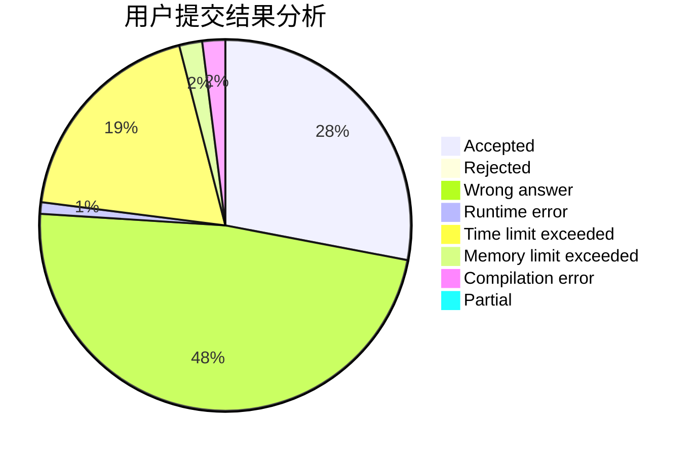
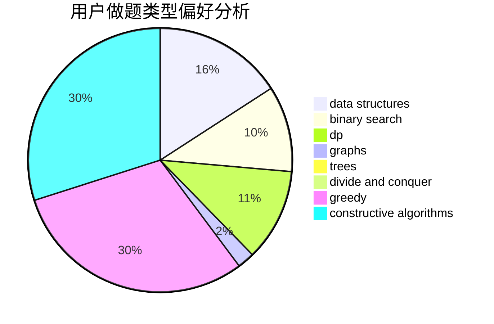
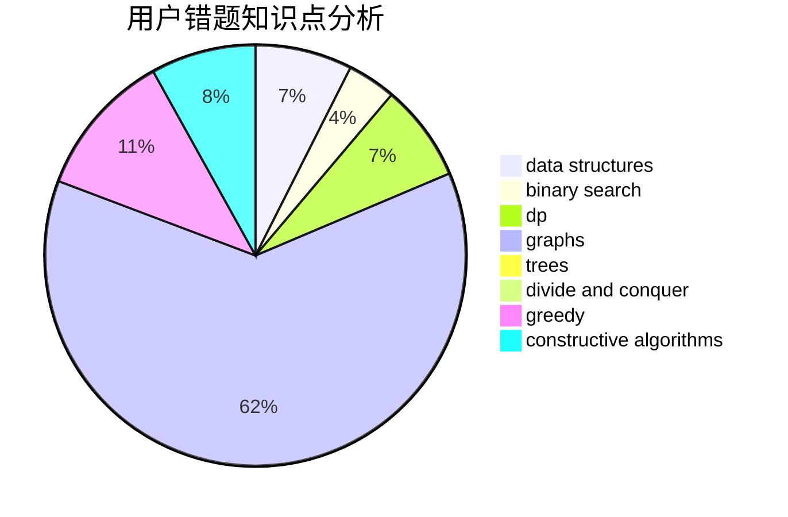

# HNUST-z3475

<!-- tabs:start -->

#### **用户提交结果分析**

#### **用户做题类型偏好分析**

#### **用户错题知识点分析**

<!-- tabs:end -->
# 推荐题目
[1428G1](https://codeforces.com/contest/1428G/problem/1)		dp,
                        greedy		  
[898D](https://codeforces.com/contest/898/problem/D)		greedy		  
[767E](https://codeforces.com/contest/767/problem/E)		greedy		  
[723C](https://codeforces.com/contest/723/problem/C)		greedy		  
[369C](https://codeforces.com/contest/369/problem/C)		dfs and similar,
                        graphs,
                        trees		  
[484E](https://codeforces.com/contest/484/problem/E)		binary search,
                        constructive algorithms,
                        data structures		  
[392B](https://codeforces.com/contest/392/problem/B)		dp		  
[774C](https://codeforces.com/contest/774/problem/C)		*special problem,
                        constructive algorithms,
                        greedy,
                        implementation		  
[1136C](https://codeforces.com/contest/1136/problem/C)		constructive algorithms,
                        sortings		  
[545B](https://codeforces.com/contest/545/problem/B)		greedy		  
