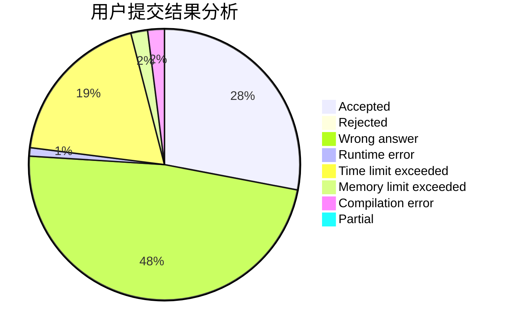
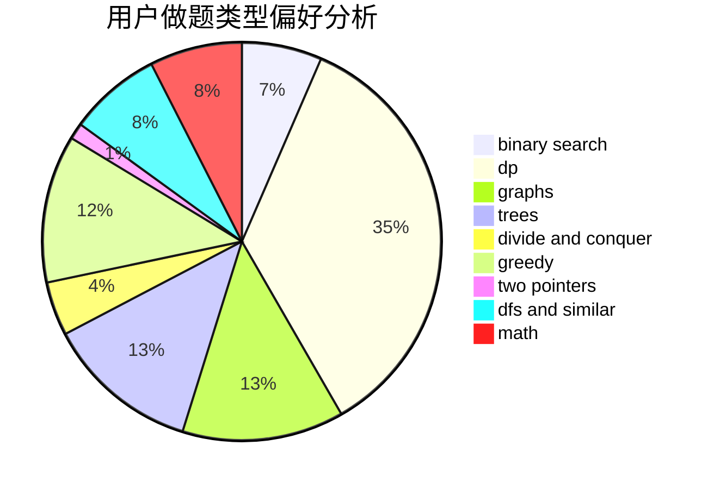

# HNUST-z3475

<!-- tabs:start -->

#### **用户提交结果分析**

#### **用户做题类型偏好分析**

<!-- tabs:end -->
# 推荐题目
[1437G](https://codeforces.com/contest/1437/problem/G)
[914F](https://codeforces.com/contest/914/problem/F)
[787B](https://codeforces.com/contest/787/problem/B)
[740D](https://codeforces.com/contest/740/problem/D)
[39E](https://codeforces.com/contest/39/problem/E)
[506A](https://codeforces.com/contest/506/problem/A)
[421A](https://codeforces.com/contest/421/problem/A)
[793D](https://codeforces.com/contest/793/problem/D)
[1138E](https://codeforces.com/contest/1138/problem/E)
[56B](https://codeforces.com/contest/56/problem/B)
