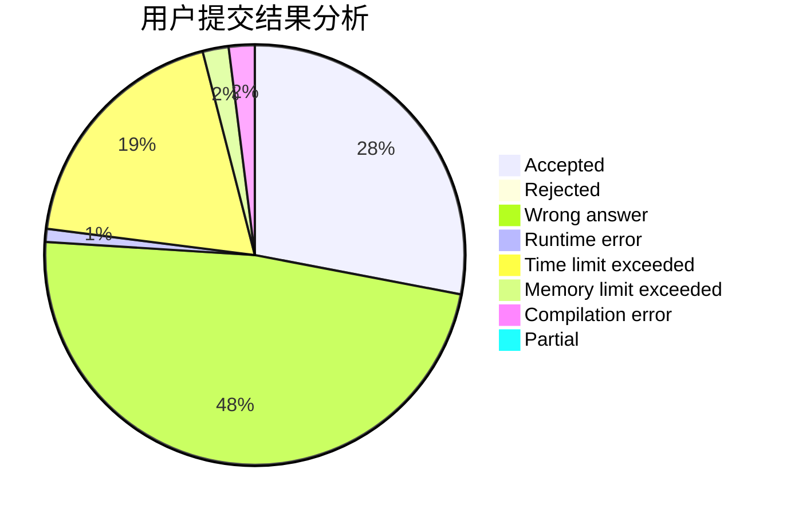
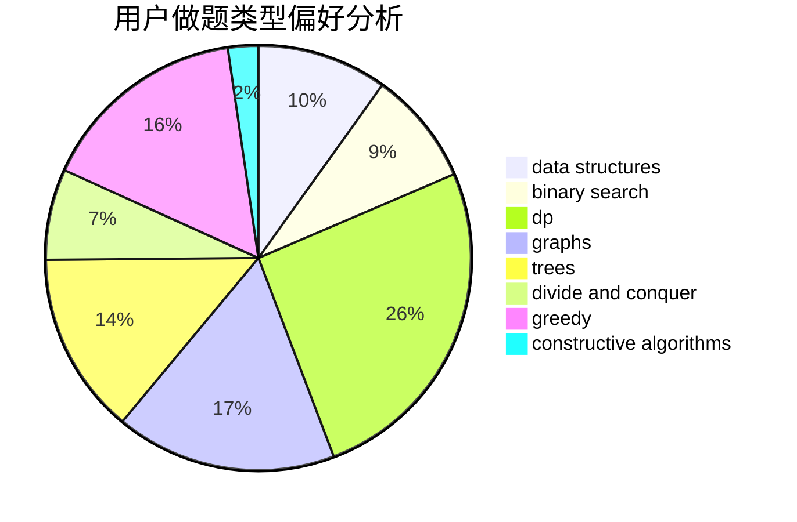
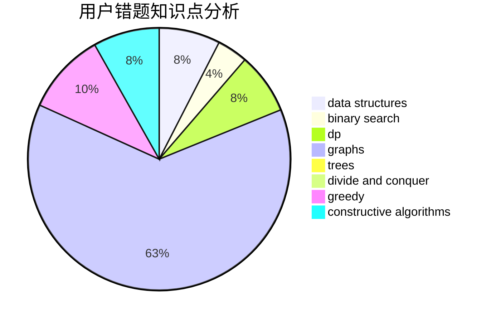

# HNUST-z3475

<!-- tabs:start -->

#### **用户提交结果分析**

#### **用户做题类型偏好分析**

#### **用户错题知识点分析**

<!-- tabs:end -->
# 推荐题目
[1437G](https://codeforces.com/contest/1437/problem/G)		data structures,
                        string suffix structures,
                        strings,
                        trees		  
[914F](https://codeforces.com/contest/914/problem/F)		bitmasks,
                        brute force,
                        data structures,
                        string suffix structures,
                        strings		  
[787B](https://codeforces.com/contest/787/problem/B)		greedy,
                        implementation,
                        math		  
[740D](https://codeforces.com/contest/740/problem/D)		dsu,graphs,sortings,trees		  
[39E](https://codeforces.com/contest/39/problem/E)		dp,
                        games		  
[506A](https://codeforces.com/contest/506/problem/A)		dsu,graphs,sortings,trees		  
[421A](https://codeforces.com/contest/421/problem/A)		constructive algorithms,
                        implementation		  
[793D](https://codeforces.com/contest/793/problem/D)		dp,
                        graphs,
                        shortest paths		  
[1138E](https://codeforces.com/contest/1138/problem/E)		dsu,graphs,sortings,trees		  
[56B](https://codeforces.com/contest/56/problem/B)		implementation		  
