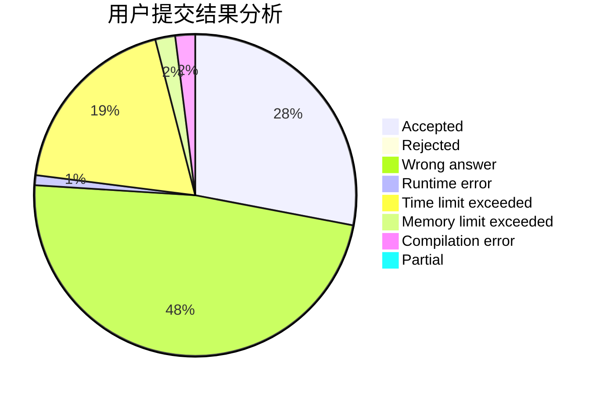
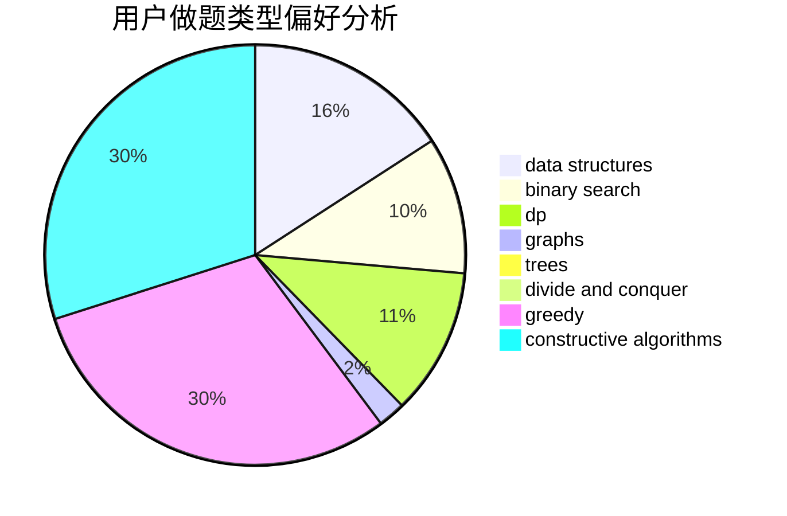
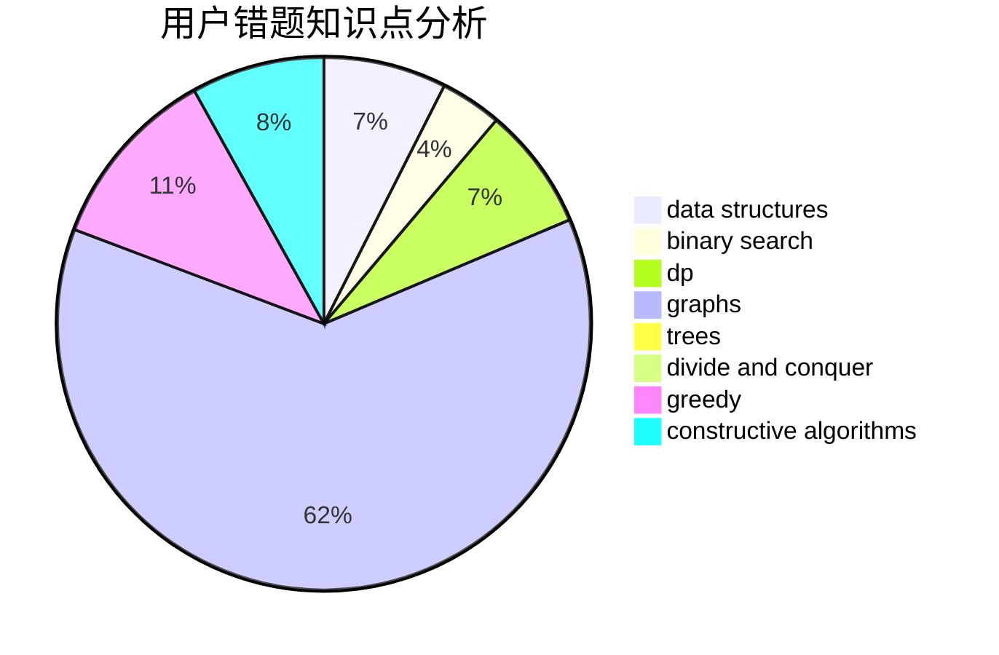

# HNUST-z3475
<!-- tabs:start -->
#### **用户提交结果分析**

#### **用户做题类型偏好分析**

#### **用户错题知识点分析**

<!-- tabs:end -->
# 推荐题目
[Nastya Is Transposing Matrices](http://codeforces.com/problemset/problem/1136/C)		constructive algorithms,
                        sortings		  
[Lucky Numbers (Easy Version)](http://codeforces.com/problemset/problem/1428/G1)		dp,
                        greedy		  
[String Modification](http://codeforces.com/problemset/problem/1316/B)		brute force,
                        constructive algorithms,
                        implementation,
                        sortings,
                        strings		  
[Alarm Clock](http://codeforces.com/problemset/problem/898/D)		greedy		  
[Change-free](http://codeforces.com/problemset/problem/767/E)		greedy		  
[Tower of Hanoi](http://codeforces.com/problemset/problem/392/B)		dp		  
[Maximum Number](http://codeforces.com/problemset/problem/774/C)		*special problem,
                        constructive algorithms,
                        greedy,
                        implementation		  
[Optimal Subsequences (Easy Version)](http://codeforces.com/problemset/problem/1227/D1)		data structures,
                        greedy		  
[Gardener Alex](http://codeforces.com/problemset/problem/1220/F)		binary search,
                        data structures		  
[Bear and Poker](https://codeforces.com/contest/574/problem/C)		implementation,
                        math,
                        number theory		  
<!-- tabs:start -->
#### **data structures**
[Optimal Subsequences (Easy Version)](http://codeforces.com/problemset/problem/1227/D1)		data structures,
                        greedy		  
[Gardener Alex](http://codeforces.com/problemset/problem/1220/F)		binary search,
                        data structures		  
[Sign on Fence](http://codeforces.com/problemset/problem/484/E)		binary search,
                        constructive algorithms,
                        data structures		  
[Moving Walkways](http://codeforces.com/problemset/problem/1209/H)		data structures,
                        greedy,
                        math		  
[A-Z Graph](http://codeforces.com/problemset/problem/1494/E)		constructive algorithms,
                        data structures,
                        graphs,
                        hashing		  
[Flip the Cards](https://codeforces.com/contest/1504/problem/F)		2-sat,
                        constructive algorithms,
                        data structures,
                        greedy,
                        sortings,
                        two pointers		  
[Maximum width](http://codeforces.com/problemset/problem/1492/C)		binary search,
                        data structures,
                        dp,
                        greedy,
                        two pointers		  
[Old Floppy Drive](http://codeforces.com/problemset/problem/1490/G)		binary search,
                        data structures,
                        math		  
[Odd Mineral Resource](http://codeforces.com/problemset/problem/1479/D)		binary search,
                        bitmasks,
                        brute force,
                        data structures,
                        probabilities,
                        trees		  
[Meximization](http://codeforces.com/problemset/problem/1497/A)		brute force,
                        data structures,
                        greedy,
                        sortings		  
#### **binary search**
[Gardener Alex](http://codeforces.com/problemset/problem/1220/F)		binary search,
                        data structures		  
[Little Elephant and Interval](https://codeforces.com/contest/205/problem/C)		binary search,
                        combinatorics,
                        dp		  
[Sign on Fence](http://codeforces.com/problemset/problem/484/E)		binary search,
                        constructive algorithms,
                        data structures		  
[Hack it!](http://codeforces.com/problemset/problem/468/C)		binary search,
                        constructive algorithms,
                        math		  
[Maximum width](http://codeforces.com/problemset/problem/1492/C)		binary search,
                        data structures,
                        dp,
                        greedy,
                        two pointers		  
[Pairs](http://codeforces.com/problemset/problem/1463/D)		binary search,
                        constructive algorithms,
                        greedy,
                        two pointers		  
[Old Floppy Drive](http://codeforces.com/problemset/problem/1490/G)		binary search,
                        data structures,
                        math		  
[Odd Mineral Resource](http://codeforces.com/problemset/problem/1479/D)		binary search,
                        bitmasks,
                        brute force,
                        data structures,
                        probabilities,
                        trees		  
[Complicated Computations](http://codeforces.com/problemset/problem/1436/E)		binary search,
                        data structures,
                        two pointers		  
[Divide and Summarize](http://codeforces.com/problemset/problem/1461/D)		binary search,
                        brute force,
                        data structures,
                        divide and conquer,
                        implementation,
                        sortings		  
#### **dp**
[Lucky Numbers (Easy Version)](http://codeforces.com/problemset/problem/1428/G1)		dp,
                        greedy		  
[Tower of Hanoi](http://codeforces.com/problemset/problem/392/B)		dp		  
[Little Elephant and Interval](https://codeforces.com/contest/205/problem/C)		binary search,
                        combinatorics,
                        dp		  
[Wrong Answer on test 233 (Easy Version)](https://codeforces.com/contest/1261/problem/D1)		dp		  
[The Values You Can Make](http://codeforces.com/problemset/problem/687/C)		dp		  
[PE Lesson](http://codeforces.com/problemset/problem/316/D2)		dp		  
[Mortal Kombat Tower](http://codeforces.com/problemset/problem/1418/C)		dp,
                        graphs,
                        greedy,
                        shortest paths		  
[Maximum width](http://codeforces.com/problemset/problem/1492/C)		binary search,
                        data structures,
                        dp,
                        greedy,
                        two pointers		  
[Bouncing Ball](https://codeforces.com/contest/1457/problem/C)		brute force,
                        dp,
                        implementation		  
[Pekora and Trampoline](http://codeforces.com/problemset/problem/1491/C)		brute force,
                        data structures,
                        dp,
                        greedy,
                        implementation		  
#### **graph**
[Bear and Three Musketeers](http://codeforces.com/problemset/problem/574/B)		brute force,
                        dfs and similar,
                        graphs,
                        hashing		  
[Valera and Elections](http://codeforces.com/problemset/problem/369/C)		dfs and similar,
                        graphs,
                        trees		  
[3-cycles](http://codeforces.com/problemset/problem/41/E)		constructive algorithms,
                        graphs,
                        greedy		  
[A-Z Graph](http://codeforces.com/problemset/problem/1494/E)		constructive algorithms,
                        data structures,
                        graphs,
                        hashing		  
[Mortal Kombat Tower](http://codeforces.com/problemset/problem/1418/C)		dp,
                        graphs,
                        greedy,
                        shortest paths		  
[Minimum Ties](http://codeforces.com/problemset/problem/1487/C)		brute force,
                        constructive algorithms,
                        dfs and similar,
                        graphs,
                        greedy,
                        implementation,
                        math		  
[Chef Monocarp](http://codeforces.com/problemset/problem/1437/C)		dp,
                        flows,
                        graph matchings,
                        greedy,
                        math,
                        sortings		  
[Strange Housing](http://codeforces.com/problemset/problem/1470/D)		constructive algorithms,
                        dfs and similar,
                        graph matchings,
                        graphs,
                        greedy		  
[Longest Simple Cycle](http://codeforces.com/problemset/problem/1476/C)		dp,
                        graphs,
                        greedy		  
[Shortest and Longest LIS](http://codeforces.com/problemset/problem/1304/D)		constructive algorithms,
                        graphs,
                        greedy,
                        two pointers		  
#### **trees**
[Valera and Elections](http://codeforces.com/problemset/problem/369/C)		dfs and similar,
                        graphs,
                        trees		  
[Odd Mineral Resource](http://codeforces.com/problemset/problem/1479/D)		binary search,
                        bitmasks,
                        brute force,
                        data structures,
                        probabilities,
                        trees		  
[Yet Another Card Deck](http://codeforces.com/problemset/problem/1511/C)		brute force,
                        data structures,
                        implementation,
                        trees		  
[Diameter Cuts](http://codeforces.com/problemset/problem/1499/F)		combinatorics,
                        dfs and similar,
                        dp,
                        trees		  
[Fib-tree](http://codeforces.com/problemset/problem/1491/E)		brute force,
                        dfs and similar,
                        divide and conquer,
                        number theory,
                        trees		  
[13th Labour of Heracles](http://codeforces.com/problemset/problem/1466/D)		data structures,
                        greedy,
                        sortings,
                        trees		  
[BFS Trees](http://codeforces.com/problemset/problem/1495/D)		combinatorics,
                        dfs and similar,
                        graphs,
                        math,
                        shortest paths,
                        trees		  
[Sum of Prefix Sums](http://codeforces.com/problemset/problem/1303/G)		data structures,
                        divide and conquer,
                        geometry,
                        trees		  
[Number of Simple Paths](http://codeforces.com/problemset/problem/1454/E)		combinatorics,
                        dfs and similar,
                        graphs,
                        trees		  
[Dogeforces](http://codeforces.com/problemset/problem/1494/D)		constructive algorithms,
                        data structures,
                        dfs and similar,
                        divide and conquer,
                        dsu,
                        greedy,
                        sortings,
                        trees		  
#### **divide and conquer**
[Finding lines](http://codeforces.com/problemset/problem/788/D)		constructive algorithms,
                        divide and conquer,
                        interactive		  
[Divide and Summarize](http://codeforces.com/problemset/problem/1461/D)		binary search,
                        brute force,
                        data structures,
                        divide and conquer,
                        implementation,
                        sortings		  
[Song of the Sirens](http://codeforces.com/problemset/problem/1466/G)		combinatorics,
                        divide and conquer,
                        hashing,
                        math,
                        string suffix structures,
                        strings		  
[Permutation Transformation](http://codeforces.com/problemset/problem/1490/D)		dfs and similar,
                        divide and conquer,
                        implementation		  
[Skyline Photo](https://codeforces.com/contest/1483/problem/C)		data structures,
                        divide and conquer,
                        dp		  
[Fib-tree](http://codeforces.com/problemset/problem/1491/E)		brute force,
                        dfs and similar,
                        divide and conquer,
                        number theory,
                        trees		  
[Sum of Prefix Sums](http://codeforces.com/problemset/problem/1303/G)		data structures,
                        divide and conquer,
                        geometry,
                        trees		  
[Dogeforces](http://codeforces.com/problemset/problem/1494/D)		constructive algorithms,
                        data structures,
                        dfs and similar,
                        divide and conquer,
                        dsu,
                        greedy,
                        sortings,
                        trees		  
[Logistical Questions](http://codeforces.com/problemset/problem/566/C)		dfs and similar,
                        divide and conquer,
                        trees		  
[Fruit Sequences](http://codeforces.com/problemset/problem/1428/F)		binary search,
                        data structures,
                        divide and conquer,
                        dp,
                        two pointers		  
#### **greedy**
[Lucky Numbers (Easy Version)](http://codeforces.com/problemset/problem/1428/G1)		dp,
                        greedy		  
[Alarm Clock](http://codeforces.com/problemset/problem/898/D)		greedy		  
[Change-free](http://codeforces.com/problemset/problem/767/E)		greedy		  
[Maximum Number](http://codeforces.com/problemset/problem/774/C)		*special problem,
                        constructive algorithms,
                        greedy,
                        implementation		  
[Optimal Subsequences (Easy Version)](http://codeforces.com/problemset/problem/1227/D1)		data structures,
                        greedy		  
[Ticket Game](http://codeforces.com/problemset/problem/1215/D)		games,
                        greedy,
                        math		  
[Polycarp at the Radio](http://codeforces.com/problemset/problem/723/C)		greedy		  
[Green and Black Tea](http://codeforces.com/problemset/problem/746/D)		constructive algorithms,
                        greedy,
                        math		  
[Recover the String](http://codeforces.com/problemset/problem/708/B)		constructive algorithms,
                        greedy,
                        implementation,
                        math		  
[Tokitsukaze and Duel](http://codeforces.com/problemset/problem/1190/C)		brute force,
                        games,
                        greedy		  
#### **constructive algorithms**
[Nastya Is Transposing Matrices](http://codeforces.com/problemset/problem/1136/C)		constructive algorithms,
                        sortings		  
[String Modification](http://codeforces.com/problemset/problem/1316/B)		brute force,
                        constructive algorithms,
                        implementation,
                        sortings,
                        strings		  
[Maximum Number](http://codeforces.com/problemset/problem/774/C)		*special problem,
                        constructive algorithms,
                        greedy,
                        implementation		  
[Green and Black Tea](http://codeforces.com/problemset/problem/746/D)		constructive algorithms,
                        greedy,
                        math		  
[Recover the String](http://codeforces.com/problemset/problem/708/B)		constructive algorithms,
                        greedy,
                        implementation,
                        math		  
[Finding lines](http://codeforces.com/problemset/problem/788/D)		constructive algorithms,
                        divide and conquer,
                        interactive		  
[Sign on Fence](http://codeforces.com/problemset/problem/484/E)		binary search,
                        constructive algorithms,
                        data structures		  
[3-cycles](http://codeforces.com/problemset/problem/41/E)		constructive algorithms,
                        graphs,
                        greedy		  
[A-Z Graph](http://codeforces.com/problemset/problem/1494/E)		constructive algorithms,
                        data structures,
                        graphs,
                        hashing		  
[Flip the Cards](https://codeforces.com/contest/1504/problem/F)		2-sat,
                        constructive algorithms,
                        data structures,
                        greedy,
                        sortings,
                        two pointers		  
#### **sortings**
[Nastya Is Transposing Matrices](http://codeforces.com/problemset/problem/1136/C)		constructive algorithms,
                        sortings		  
[String Modification](http://codeforces.com/problemset/problem/1316/B)		brute force,
                        constructive algorithms,
                        implementation,
                        sortings,
                        strings		  
[Helpful Maths](http://codeforces.com/problemset/problem/339/A)		greedy,
                        implementation,
                        sortings,
                        strings		  
[The Child and Zoo](http://codeforces.com/problemset/problem/437/D)		dsu,
                        sortings		  
[Flip the Cards](https://codeforces.com/contest/1504/problem/F)		2-sat,
                        constructive algorithms,
                        data structures,
                        greedy,
                        sortings,
                        two pointers		  
[Exam in BerSU (easy version)](http://codeforces.com/problemset/problem/1185/C1)		greedy,
                        sortings		  
[Letters Rearranging](http://codeforces.com/problemset/problem/1093/B)		constructive algorithms,
                        greedy,
                        sortings,
                        strings		  
[Diamond Miner](https://codeforces.com/contest/1496/problem/C)		geometry,
                        greedy,
                        math,
                        sortings		  
[Meximization](http://codeforces.com/problemset/problem/1497/A)		brute force,
                        data structures,
                        greedy,
                        sortings		  
[Avoiding Zero](http://codeforces.com/problemset/problem/1427/A)		math,
                        sortings		  
<!-- tabs:end -->
