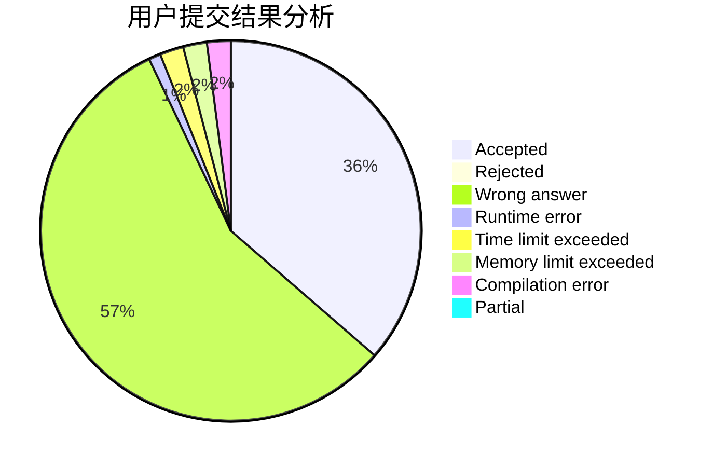
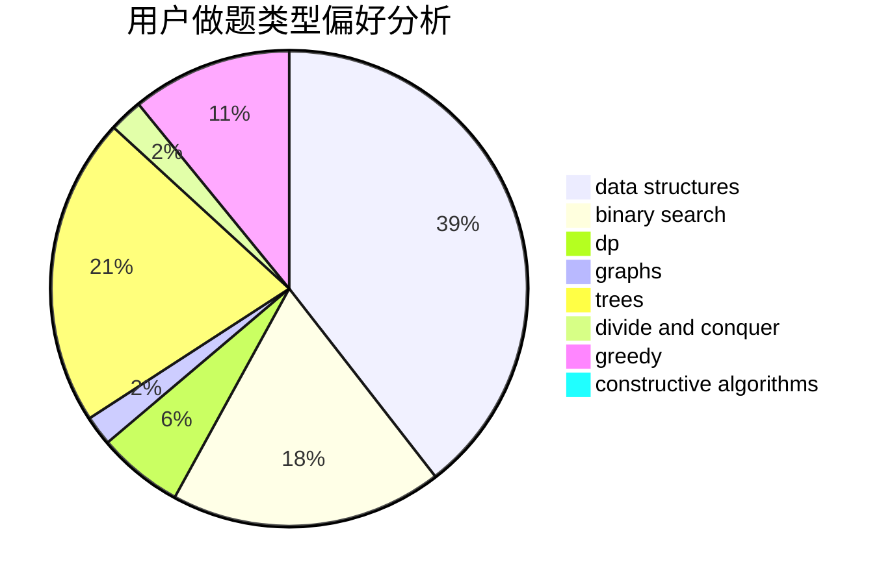
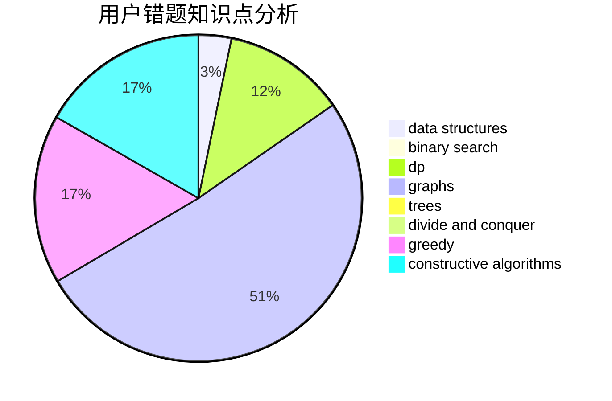

# HOW_ALL_HAPPY

<!-- tabs:start -->

#### **用户提交结果分析**

#### **用户做题类型偏好分析**

#### **用户错题知识点分析**

<!-- tabs:end -->
# 推荐题目
[612A](https://codeforces.com/contest/612/problem/A)		brute force,
                        implementation,
                        strings		  
[1191F](https://codeforces.com/contest/1191/problem/F)		dsu,graphs,sortings,trees		  
[1391E](https://codeforces.com/contest/1391/problem/E)		constructive algorithms,
                        dfs and similar,
                        graphs,
                        greedy,
                        trees		  
[660C](https://codeforces.com/contest/660/problem/C)		binary search,
                        dp,
                        two pointers		  
[306B](https://codeforces.com/contest/306/problem/B)		data structures,
                        greedy,
                        sortings		  
[798A](https://codeforces.com/contest/798/problem/A)		brute force,
                        constructive algorithms,
                        strings		  
[1149A](https://codeforces.com/contest/1149/problem/A)		constructive algorithms,
                        greedy,
                        math,
                        number theory		  
[1221E](https://codeforces.com/contest/1221/problem/E)		games		  
[1451B](https://codeforces.com/contest/1451/problem/B)		dp,
                        greedy,
                        implementation,
                        strings		  
[226E](https://codeforces.com/contest/226/problem/E)		data structures,
                        trees		  
