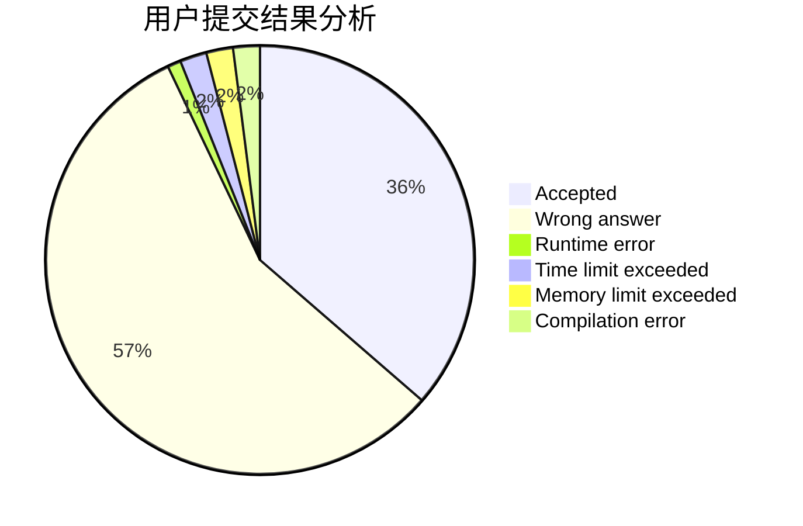
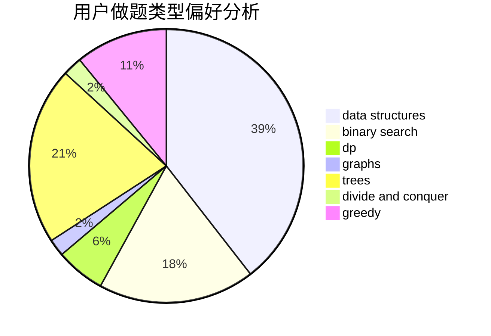
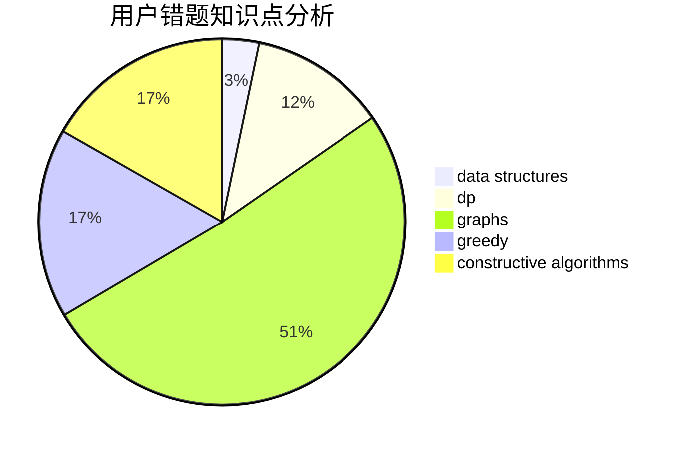

# HOW_ALL_HAPPY
<!-- tabs:start -->
#### **用户提交结果分析**

#### **用户做题类型偏好分析**

#### **用户错题知识点分析**

<!-- tabs:end -->
# 推荐题目
[The Text Splitting](http://codeforces.com/problemset/problem/612/A)		brute force,
                        implementation,
                        strings		  
[Tokitsukaze and Strange Rectangle](https://codeforces.com/contest/1191/problem/F)		data structures,
                        divide and conquer,
                        sortings,
                        two pointers		  
[Hard Process](http://codeforces.com/problemset/problem/660/C)		binary search,
                        dp,
                        two pointers		  
[Noble Knight's Path](http://codeforces.com/problemset/problem/226/E)		data structures,
                        trees		  
[Square?](https://codeforces.com/contest/1347/problem/B)		brute force,
                        implementation,
                        math		  
[Strange Shuffle](http://codeforces.com/problemset/problem/1470/C)		binary search,
                        brute force,
                        constructive algorithms,
                        interactive		  
[Coins](http://codeforces.com/problemset/problem/58/B)		greedy		  
[Optimizer](http://codeforces.com/problemset/problem/306/B)		data structures,
                        greedy,
                        sortings		  
[Game With String](http://codeforces.com/problemset/problem/1221/E)		games		  
[Mike and palindrome](http://codeforces.com/problemset/problem/798/A)		brute force,
                        constructive algorithms,
                        strings		  
<!-- tabs:start -->
#### **data structures**
[Tokitsukaze and Strange Rectangle](https://codeforces.com/contest/1191/problem/F)		data structures,
                        divide and conquer,
                        sortings,
                        two pointers		  
[Noble Knight's Path](http://codeforces.com/problemset/problem/226/E)		data structures,
                        trees		  
[Optimizer](http://codeforces.com/problemset/problem/306/B)		data structures,
                        greedy,
                        sortings		  
[Exam](https://codeforces.com/contest/1483/problem/F)		data structures,
                        string suffix structures,
                        trees		  
[Card Deck](http://codeforces.com/problemset/problem/1492/B)		data structures,
                        greedy,
                        math		  
[Maximum width](http://codeforces.com/problemset/problem/1492/C)		binary search,
                        data structures,
                        dp,
                        greedy,
                        two pointers		  
[Old Floppy Drive](http://codeforces.com/problemset/problem/1490/G)		binary search,
                        data structures,
                        math		  
[Odd Mineral Resource](http://codeforces.com/problemset/problem/1479/D)		binary search,
                        bitmasks,
                        brute force,
                        data structures,
                        probabilities,
                        trees		  
[Meximization](http://codeforces.com/problemset/problem/1497/A)		brute force,
                        data structures,
                        greedy,
                        sortings		  
[Pekora and Trampoline](http://codeforces.com/problemset/problem/1491/C)		brute force,
                        data structures,
                        dp,
                        greedy,
                        implementation		  
#### **binary search**
[Hard Process](http://codeforces.com/problemset/problem/660/C)		binary search,
                        dp,
                        two pointers		  
[Strange Shuffle](http://codeforces.com/problemset/problem/1470/C)		binary search,
                        brute force,
                        constructive algorithms,
                        interactive		  
[Maximum width](http://codeforces.com/problemset/problem/1492/C)		binary search,
                        data structures,
                        dp,
                        greedy,
                        two pointers		  
[Pairs](http://codeforces.com/problemset/problem/1463/D)		binary search,
                        constructive algorithms,
                        greedy,
                        two pointers		  
[Old Floppy Drive](http://codeforces.com/problemset/problem/1490/G)		binary search,
                        data structures,
                        math		  
[Odd Mineral Resource](http://codeforces.com/problemset/problem/1479/D)		binary search,
                        bitmasks,
                        brute force,
                        data structures,
                        probabilities,
                        trees		  
[Complicated Computations](http://codeforces.com/problemset/problem/1436/E)		binary search,
                        data structures,
                        two pointers		  
[Divide and Summarize](http://codeforces.com/problemset/problem/1461/D)		binary search,
                        brute force,
                        data structures,
                        divide and conquer,
                        implementation,
                        sortings		  
[K-beautiful Strings](http://codeforces.com/problemset/problem/1493/C)		binary search,
                        brute force,
                        constructive algorithms,
                        greedy,
                        strings		  
[Pythagorean Triples](http://codeforces.com/problemset/problem/1487/D)		binary search,
                        brute force,
                        math,
                        number theory		  
#### **dp**
[Hard Process](http://codeforces.com/problemset/problem/660/C)		binary search,
                        dp,
                        two pointers		  
[Non-Substring Subsequence](http://codeforces.com/problemset/problem/1451/B)		dp,
                        greedy,
                        implementation,
                        strings		  
[Add One](http://codeforces.com/problemset/problem/1513/C)		dp,
                        matrices		  
[New Year's Puzzle](http://codeforces.com/problemset/problem/1472/F)		brute force,
                        dp,
                        graph matchings,
                        greedy,
                        sortings		  
[Maximum width](http://codeforces.com/problemset/problem/1492/C)		binary search,
                        data structures,
                        dp,
                        greedy,
                        two pointers		  
[Bouncing Ball](https://codeforces.com/contest/1457/problem/C)		brute force,
                        dp,
                        implementation		  
[Pekora and Trampoline](http://codeforces.com/problemset/problem/1491/C)		brute force,
                        data structures,
                        dp,
                        greedy,
                        implementation		  
[Chef Monocarp](http://codeforces.com/problemset/problem/1437/C)		dp,
                        flows,
                        graph matchings,
                        greedy,
                        math,
                        sortings		  
[Binary Removals](http://codeforces.com/problemset/problem/1499/B)		brute force,
                        dp,
                        greedy,
                        implementation		  
[Zookeeper and The Infinite Zoo](http://codeforces.com/problemset/problem/1491/D)		bitmasks,
                        constructive algorithms,
                        dp,
                        greedy,
                        math		  
#### **graph**
[Machine Programming](http://codeforces.com/problemset/problem/164/C)		flows,
                        graphs		  
[Pairs of Pairs](http://codeforces.com/problemset/problem/1391/E)		constructive algorithms,
                        dfs and similar,
                        graphs,
                        greedy,
                        trees		  
[Tree](http://codeforces.com/problemset/problem/1010/F)		fft,
                        graphs,
                        trees		  
[New Year's Puzzle](http://codeforces.com/problemset/problem/1472/F)		brute force,
                        dp,
                        graph matchings,
                        greedy,
                        sortings		  
[Capitalism](http://codeforces.com/problemset/problem/1450/E)		constructive algorithms,
                        dfs and similar,
                        graphs,
                        shortest paths		  
[Minimum Ties](http://codeforces.com/problemset/problem/1487/C)		brute force,
                        constructive algorithms,
                        dfs and similar,
                        graphs,
                        greedy,
                        implementation,
                        math		  
[Chef Monocarp](http://codeforces.com/problemset/problem/1437/C)		dp,
                        flows,
                        graph matchings,
                        greedy,
                        math,
                        sortings		  
[Strange Housing](http://codeforces.com/problemset/problem/1470/D)		constructive algorithms,
                        dfs and similar,
                        graph matchings,
                        graphs,
                        greedy		  
[Longest Simple Cycle](http://codeforces.com/problemset/problem/1476/C)		dp,
                        graphs,
                        greedy		  
[Shortest and Longest LIS](http://codeforces.com/problemset/problem/1304/D)		constructive algorithms,
                        graphs,
                        greedy,
                        two pointers		  
#### **trees**
[Noble Knight's Path](http://codeforces.com/problemset/problem/226/E)		data structures,
                        trees		  
[Pairs of Pairs](http://codeforces.com/problemset/problem/1391/E)		constructive algorithms,
                        dfs and similar,
                        graphs,
                        greedy,
                        trees		  
[Exam](https://codeforces.com/contest/1483/problem/F)		data structures,
                        string suffix structures,
                        trees		  
[Tree](http://codeforces.com/problemset/problem/1010/F)		fft,
                        graphs,
                        trees		  
[Odd Mineral Resource](http://codeforces.com/problemset/problem/1479/D)		binary search,
                        bitmasks,
                        brute force,
                        data structures,
                        probabilities,
                        trees		  
[Yet Another Card Deck](http://codeforces.com/problemset/problem/1511/C)		brute force,
                        data structures,
                        implementation,
                        trees		  
[Diameter Cuts](http://codeforces.com/problemset/problem/1499/F)		combinatorics,
                        dfs and similar,
                        dp,
                        trees		  
[Fib-tree](http://codeforces.com/problemset/problem/1491/E)		brute force,
                        dfs and similar,
                        divide and conquer,
                        number theory,
                        trees		  
[13th Labour of Heracles](http://codeforces.com/problemset/problem/1466/D)		data structures,
                        greedy,
                        sortings,
                        trees		  
[BFS Trees](http://codeforces.com/problemset/problem/1495/D)		combinatorics,
                        dfs and similar,
                        graphs,
                        math,
                        shortest paths,
                        trees		  
#### **divide and conquer**
[Tokitsukaze and Strange Rectangle](https://codeforces.com/contest/1191/problem/F)		data structures,
                        divide and conquer,
                        sortings,
                        two pointers		  
[Divide and Summarize](http://codeforces.com/problemset/problem/1461/D)		binary search,
                        brute force,
                        data structures,
                        divide and conquer,
                        implementation,
                        sortings		  
[Song of the Sirens](http://codeforces.com/problemset/problem/1466/G)		combinatorics,
                        divide and conquer,
                        hashing,
                        math,
                        string suffix structures,
                        strings		  
[Permutation Transformation](http://codeforces.com/problemset/problem/1490/D)		dfs and similar,
                        divide and conquer,
                        implementation		  
[Skyline Photo](https://codeforces.com/contest/1483/problem/C)		data structures,
                        divide and conquer,
                        dp		  
[Fib-tree](http://codeforces.com/problemset/problem/1491/E)		brute force,
                        dfs and similar,
                        divide and conquer,
                        number theory,
                        trees		  
[Sum of Prefix Sums](http://codeforces.com/problemset/problem/1303/G)		data structures,
                        divide and conquer,
                        geometry,
                        trees		  
[Dogeforces](http://codeforces.com/problemset/problem/1494/D)		constructive algorithms,
                        data structures,
                        dfs and similar,
                        divide and conquer,
                        dsu,
                        greedy,
                        sortings,
                        trees		  
[Logistical Questions](http://codeforces.com/problemset/problem/566/C)		dfs and similar,
                        divide and conquer,
                        trees		  
[Fruit Sequences](http://codeforces.com/problemset/problem/1428/F)		binary search,
                        data structures,
                        divide and conquer,
                        dp,
                        two pointers		  
#### **greedy**
[Coins](http://codeforces.com/problemset/problem/58/B)		greedy		  
[Optimizer](http://codeforces.com/problemset/problem/306/B)		data structures,
                        greedy,
                        sortings		  
[Pairs of Pairs](http://codeforces.com/problemset/problem/1391/E)		constructive algorithms,
                        dfs and similar,
                        graphs,
                        greedy,
                        trees		  
[Help General](http://codeforces.com/problemset/problem/142/B)		constructive algorithms,
                        greedy,
                        implementation		  
[Non-Substring Subsequence](http://codeforces.com/problemset/problem/1451/B)		dp,
                        greedy,
                        implementation,
                        strings		  
[Burglar and Matches](http://codeforces.com/problemset/problem/16/B)		greedy,
                        implementation,
                        sortings		  
[Nice Garland](http://codeforces.com/problemset/problem/1108/C)		brute force,
                        greedy,
                        math		  
[Prefix Sum Primes](http://codeforces.com/problemset/problem/1149/A)		constructive algorithms,
                        greedy,
                        math,
                        number theory		  
[New Year's Puzzle](http://codeforces.com/problemset/problem/1472/F)		brute force,
                        dp,
                        graph matchings,
                        greedy,
                        sortings		  
[Card Deck](http://codeforces.com/problemset/problem/1492/B)		data structures,
                        greedy,
                        math		  
#### **constructive algorithms**
[Strange Shuffle](http://codeforces.com/problemset/problem/1470/C)		binary search,
                        brute force,
                        constructive algorithms,
                        interactive		  
[Mike and palindrome](http://codeforces.com/problemset/problem/798/A)		brute force,
                        constructive algorithms,
                        strings		  
[Pairs of Pairs](http://codeforces.com/problemset/problem/1391/E)		constructive algorithms,
                        dfs and similar,
                        graphs,
                        greedy,
                        trees		  
[Help General](http://codeforces.com/problemset/problem/142/B)		constructive algorithms,
                        greedy,
                        implementation		  
[Prefix Sum Primes](http://codeforces.com/problemset/problem/1149/A)		constructive algorithms,
                        greedy,
                        math,
                        number theory		  
[Capitalism](http://codeforces.com/problemset/problem/1450/E)		constructive algorithms,
                        dfs and similar,
                        graphs,
                        shortest paths		  
[Anti-knapsack](http://codeforces.com/problemset/problem/1493/A)		constructive algorithms,
                        greedy		  
[Pairs](http://codeforces.com/problemset/problem/1463/D)		binary search,
                        constructive algorithms,
                        greedy,
                        two pointers		  
[XOR-gun](https://codeforces.com/contest/1456/problem/B)		bitmasks,
                        brute force,
                        constructive algorithms		  
[Genius's Gambit](http://codeforces.com/problemset/problem/1492/D)		bitmasks,
                        constructive algorithms,
                        greedy,
                        math		  
#### **sortings**
[Tokitsukaze and Strange Rectangle](https://codeforces.com/contest/1191/problem/F)		data structures,
                        divide and conquer,
                        sortings,
                        two pointers		  
[Optimizer](http://codeforces.com/problemset/problem/306/B)		data structures,
                        greedy,
                        sortings		  
[Burglar and Matches](http://codeforces.com/problemset/problem/16/B)		greedy,
                        implementation,
                        sortings		  
[New Year's Puzzle](http://codeforces.com/problemset/problem/1472/F)		brute force,
                        dp,
                        graph matchings,
                        greedy,
                        sortings		  
[Diamond Miner](https://codeforces.com/contest/1496/problem/C)		geometry,
                        greedy,
                        math,
                        sortings		  
[Meximization](http://codeforces.com/problemset/problem/1497/A)		brute force,
                        data structures,
                        greedy,
                        sortings		  
[Avoiding Zero](http://codeforces.com/problemset/problem/1427/A)		math,
                        sortings		  
[Divide and Summarize](http://codeforces.com/problemset/problem/1461/D)		binary search,
                        brute force,
                        data structures,
                        divide and conquer,
                        implementation,
                        sortings		  
[Chef Monocarp](http://codeforces.com/problemset/problem/1437/C)		dp,
                        flows,
                        graph matchings,
                        greedy,
                        math,
                        sortings		  
[Replacing Elements](http://codeforces.com/problemset/problem/1473/A)		greedy,
                        implementation,
                        math,
                        sortings		  
<!-- tabs:end -->
