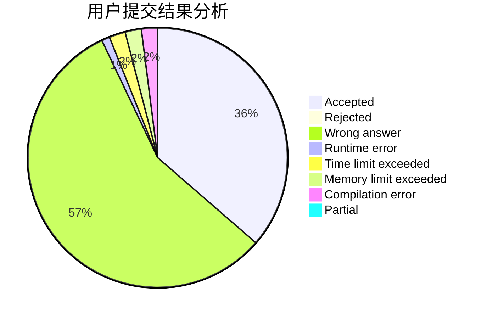
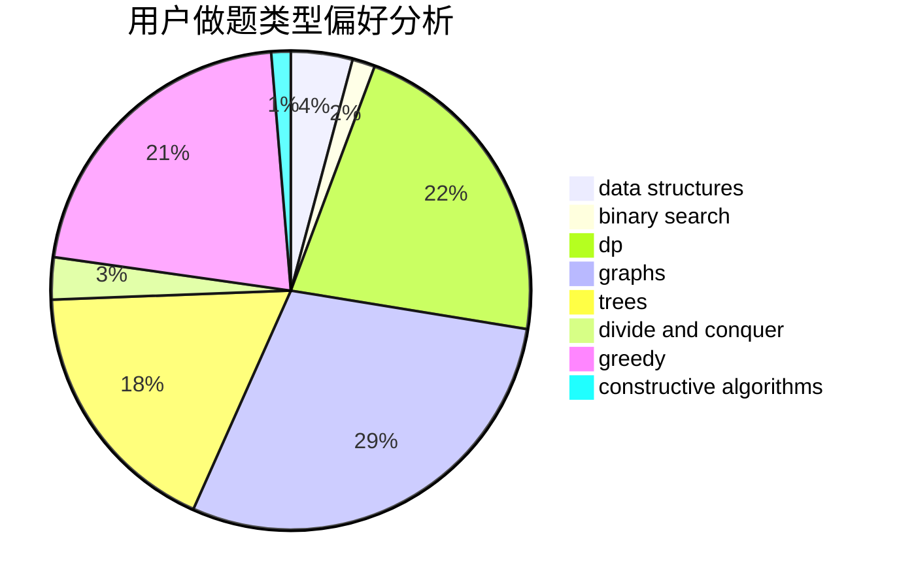
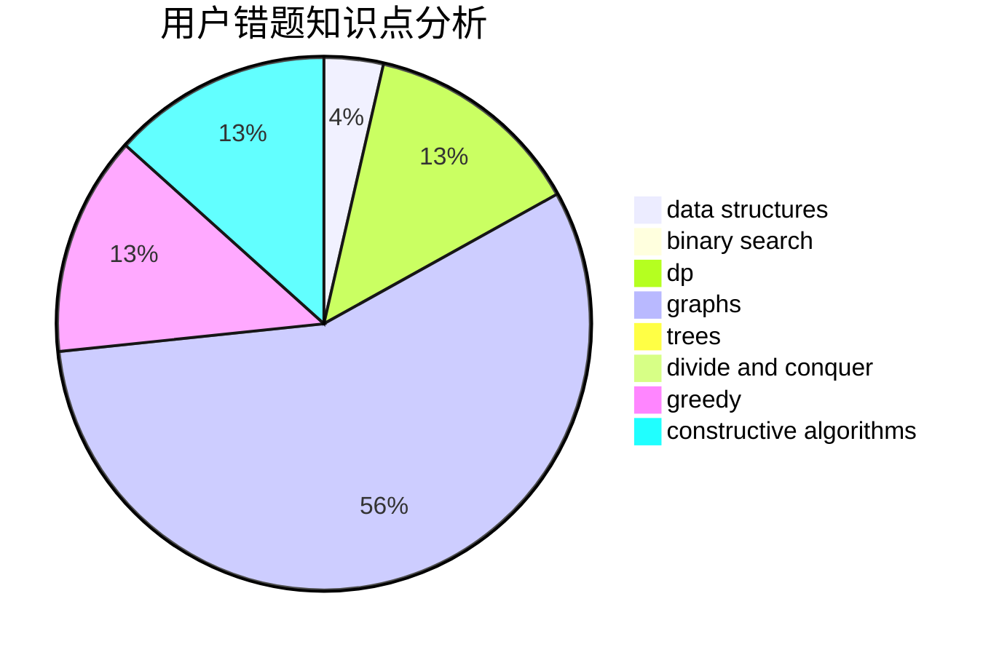

# HOW_ALL_HAPPY

<!-- tabs:start -->

#### **用户提交结果分析**

#### **用户做题类型偏好分析**

#### **用户错题知识点分析**

<!-- tabs:end -->
# 推荐题目
[631B](https://codeforces.com/contest/631/problem/B)		constructive algorithms,
                        implementation		  
[1197E](https://codeforces.com/contest/1197/problem/E)		binary search,
                        combinatorics,
                        data structures,
                        dp,
                        shortest paths,
                        sortings		  
[13B](https://codeforces.com/contest/13/problem/B)		geometry,
                        implementation		  
[681A](https://codeforces.com/contest/681/problem/A)		implementation		  
[327D](https://codeforces.com/contest/327/problem/D)		constructive algorithms,
                        dfs and similar,
                        graphs		  
[812A](https://codeforces.com/contest/812/problem/A)		implementation		  
[1150D](https://codeforces.com/contest/1150/problem/D)		dsu,graphs,sortings,trees		  
[122A](https://codeforces.com/contest/122/problem/A)		brute force,
                        number theory		  
[145B](https://codeforces.com/contest/145/problem/B)		constructive algorithms		  
[246A](https://codeforces.com/contest/246/problem/A)		constructive algorithms,
                        greedy,
                        sortings		  
