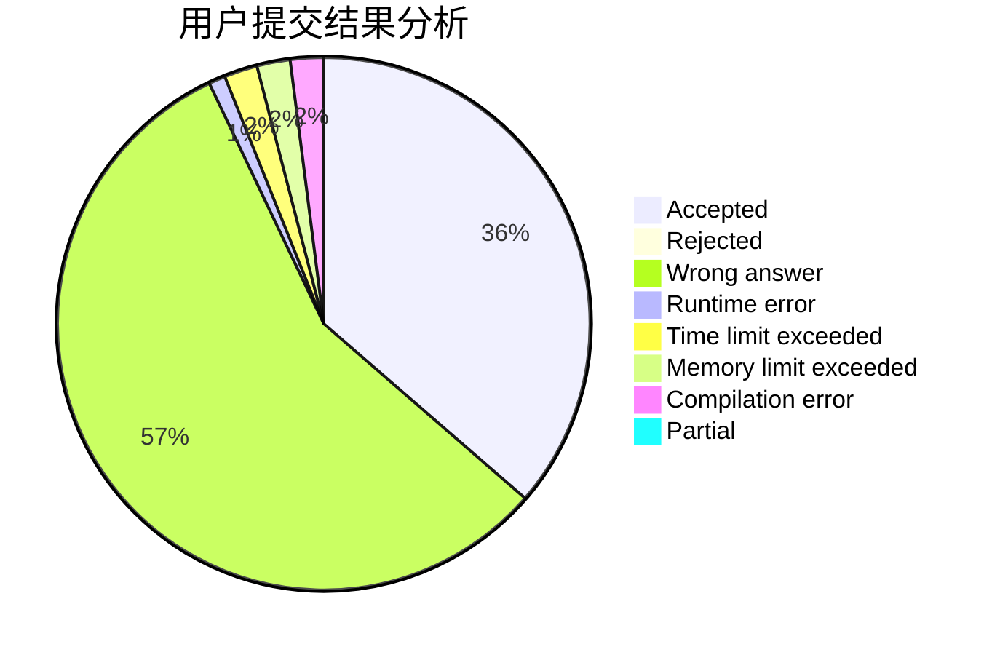
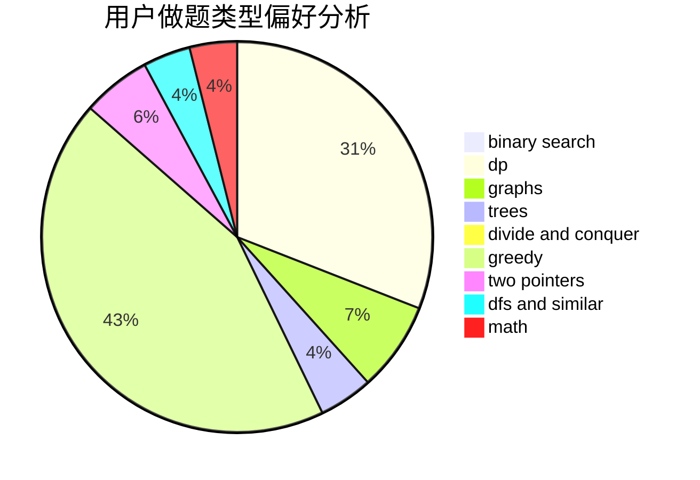

# HOW_ALL_HAPPY

<!-- tabs:start -->

#### **用户提交结果分析**

#### **用户做题类型偏好分析**

<!-- tabs:end -->
# 推荐题目
[631B](https://codeforces.com/contest/631/problem/B)
[1197E](https://codeforces.com/contest/1197/problem/E)
[13B](https://codeforces.com/contest/13/problem/B)
[681A](https://codeforces.com/contest/681/problem/A)
[327D](https://codeforces.com/contest/327/problem/D)
[812A](https://codeforces.com/contest/812/problem/A)
[1150D](https://codeforces.com/contest/1150/problem/D)
[122A](https://codeforces.com/contest/122/problem/A)
[145B](https://codeforces.com/contest/145/problem/B)
[246A](https://codeforces.com/contest/246/problem/A)
