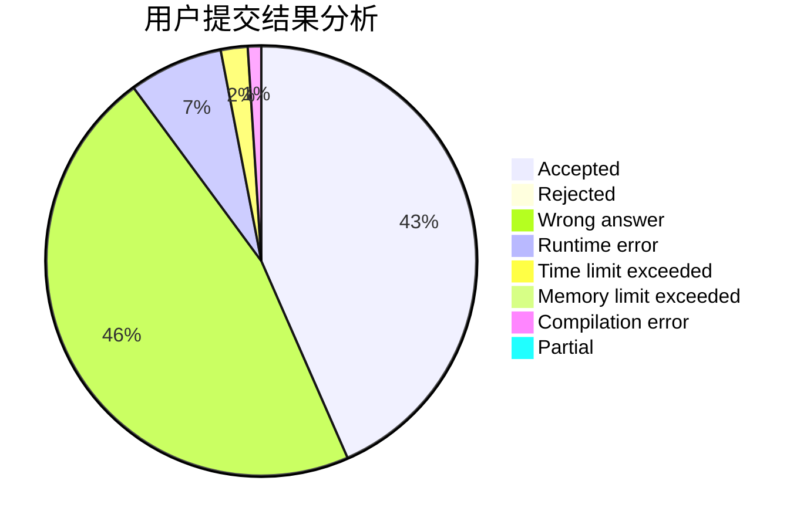
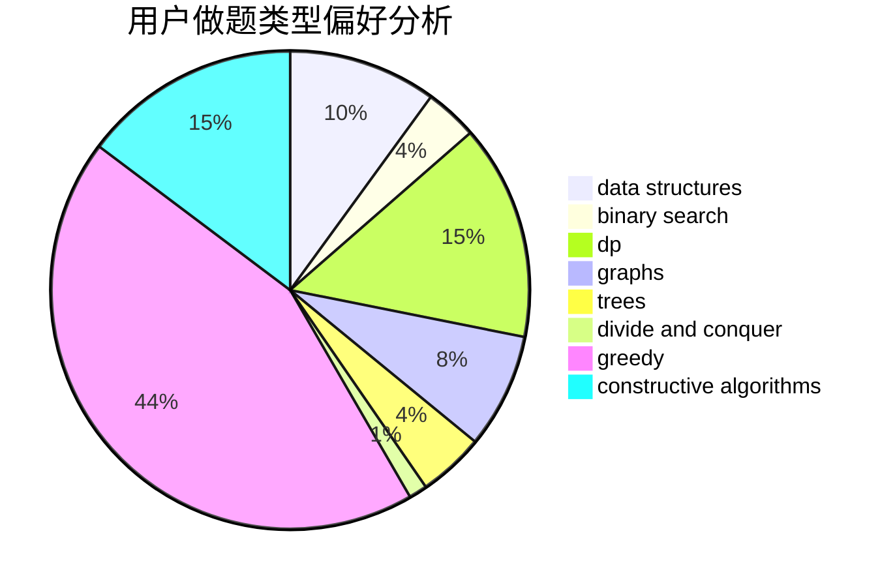
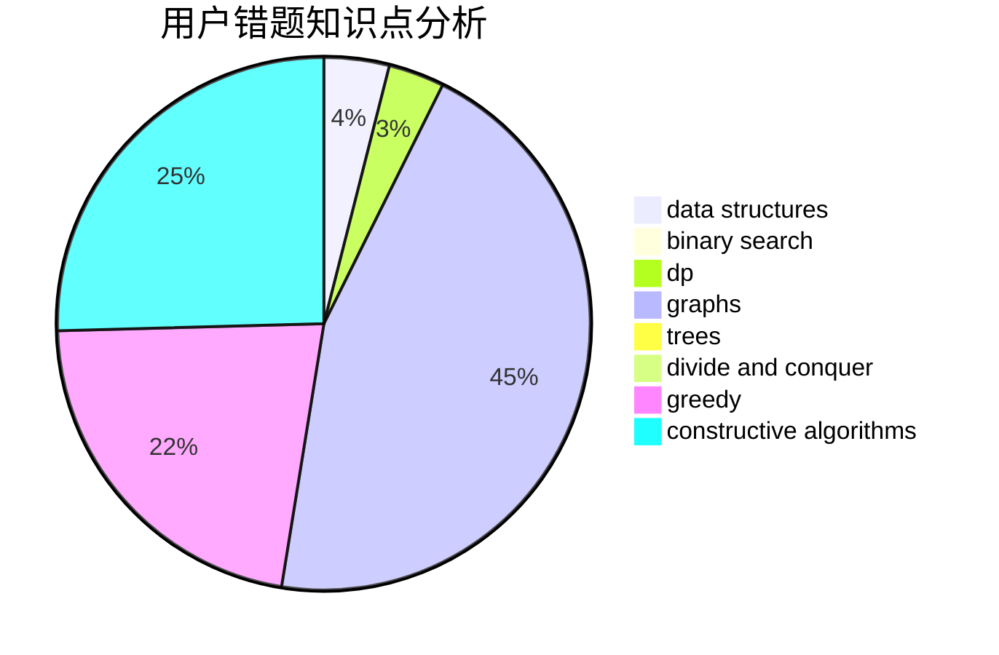

# 2114992323

<!-- tabs:start -->

#### **用户提交结果分析**

#### **用户做题类型偏好分析**

#### **用户错题知识点分析**

<!-- tabs:end -->
# 推荐题目
[11A](https://codeforces.com/contest/11/problem/A)		constructive algorithms,
                        implementation,
                        math		  
[1015D](https://codeforces.com/contest/1015/problem/D)		constructive algorithms,
                        greedy		  
[12C](https://codeforces.com/contest/12/problem/C)		greedy,
                        implementation,
                        sortings		  
[1304C](https://codeforces.com/contest/1304/problem/C)		dp,
                        greedy,
                        implementation,
                        sortings,
                        two pointers		  
[1304F2](https://codeforces.com/contest/1304F/problem/2)		data structures,
                        dp,
                        greedy		  
[1240C](https://codeforces.com/contest/1240/problem/C)		dsu,graphs,sortings,trees		  
[1301A](https://codeforces.com/contest/1301/problem/A)		implementation,
                        strings		  
[1302F](https://codeforces.com/contest/1302/problem/F)		bitmasks,
                        brute force,
                        expression parsing		  
[1190B](https://codeforces.com/contest/1190/problem/B)		games		  
[118E](https://codeforces.com/contest/118/problem/E)		dfs and similar,
                        graphs		  
