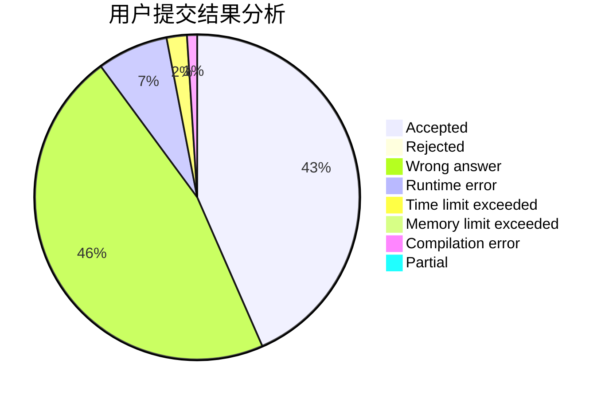
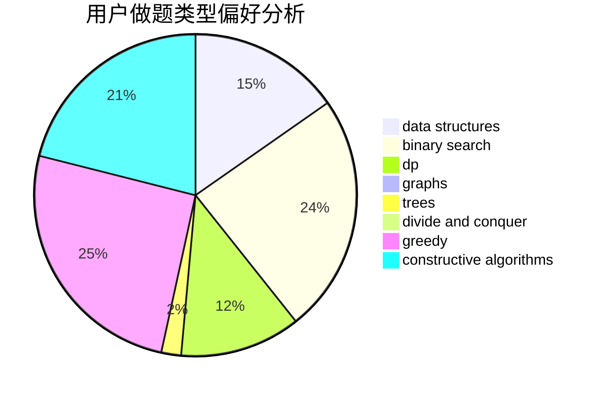
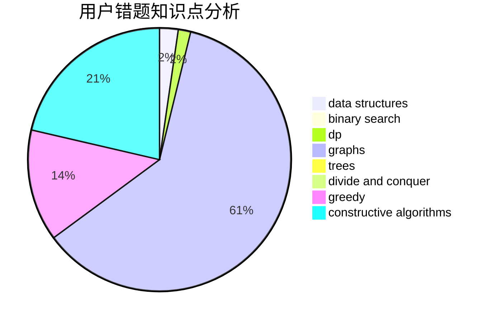

# 2114992323

<!-- tabs:start -->

#### **用户提交结果分析**

#### **用户做题类型偏好分析**

#### **用户错题知识点分析**

<!-- tabs:end -->
# 推荐题目
[12041](https://codeforces.com/contest/1204/problem/1)		dsu,graphs,sortings,trees		  
[1015F](https://codeforces.com/contest/1015/problem/F)		dp,
                        strings		  
[1307D](https://codeforces.com/contest/1307/problem/D)		binary search,
                        data structures,
                        dfs and similar,
                        graphs,
                        greedy,
                        shortest paths,
                        sortings		  
[13131](https://codeforces.com/contest/1313/problem/1)		dsu,graphs,sortings,trees		  
[1313D](https://codeforces.com/contest/1313/problem/D)		bitmasks,
                        dp,
                        implementation		  
[1245F](https://codeforces.com/contest/1245/problem/F)		bitmasks,
                        brute force,
                        combinatorics,
                        dp		  
[1310D](https://codeforces.com/contest/1310/problem/D)		dp,
                        graphs,
                        probabilities		  
[1311D](https://codeforces.com/contest/1311/problem/D)		brute force,
                        math		  
[11962](https://codeforces.com/contest/1196/problem/2)		dsu,graphs,sortings,trees		  
[1195F](https://codeforces.com/contest/1195/problem/F)		data structures,
                        geometry,
                        math,
                        sortings		  
