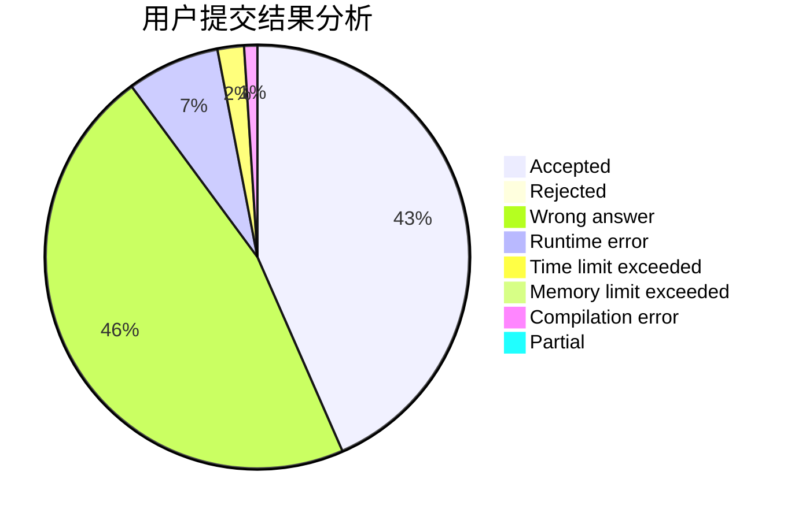
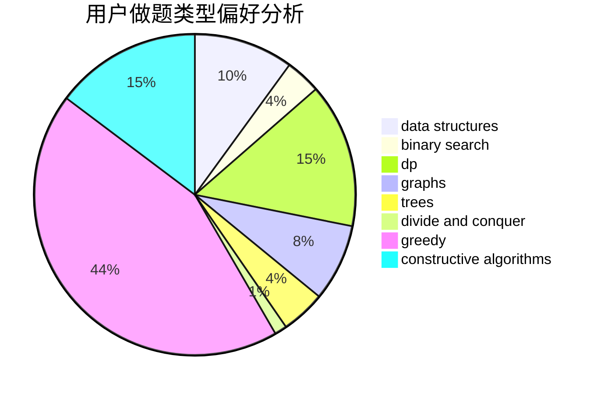
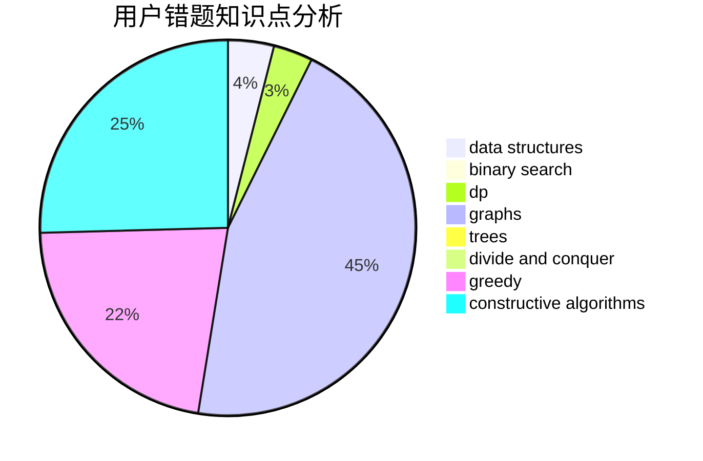

# 2114992323
<!-- tabs:start -->
#### **用户提交结果分析**

#### **用户做题类型偏好分析**

#### **用户错题知识点分析**

<!-- tabs:end -->
# 推荐题目
[Perfect Keyboard](http://codeforces.com/problemset/problem/1303/C)		dfs and similar,
                        greedy,
                        implementation		  
[Non-zero](http://codeforces.com/problemset/problem/1300/A)		implementation,
                        math		  
[Three Strings](http://codeforces.com/problemset/problem/1301/A)		implementation,
                        strings		  
[Tokitsukaze, CSL and Stone Game](http://codeforces.com/problemset/problem/1190/B)		games		  
[Keep talking and nobody explodes -- easy](http://codeforces.com/problemset/problem/1302/F)		bitmasks,
                        brute force,
                        expression parsing		  
[Shortest and Longest LIS](http://codeforces.com/problemset/problem/1304/D)		constructive algorithms,
                        graphs,
                        greedy,
                        two pointers		  
[Sum of Prefix Sums](http://codeforces.com/problemset/problem/1303/G)		data structures,
                        divide and conquer,
                        geometry,
                        trees		  
[Tourism](http://codeforces.com/problemset/problem/1310/D)		dp,
                        graphs,
                        probabilities		  
[So Mean](http://codeforces.com/problemset/problem/1299/E)		interactive,
                        math		  
[Sasha and a Bit of Relax](https://codeforces.com/contest/1113/problem/C)		dp,
                        implementation		  
<!-- tabs:start -->
#### **data structures**
[Perfect Keyboard](http://codeforces.com/problemset/problem/1303/G)		data structures,
                        divide and conquer,
                        geometry,
                        trees		  
[Non-zero](http://codeforces.com/problemset/problem/1304/F2)		data structures,
                        dp,
                        greedy		  
[Three Strings](http://codeforces.com/problemset/problem/12/D)		data structures,
                        sortings		  
[Tokitsukaze, CSL and Stone Game](http://codeforces.com/problemset/problem/1093/E)		data structures		  
[Keep talking and nobody explodes -- easy](http://codeforces.com/problemset/problem/1301/E)		binary search,
                        data structures,
                        dp,
                        implementation		  
[Shortest and Longest LIS](https://codeforces.com/contest/1300/problem/E)		data structures,
                        geometry,
                        greedy		  
[Sum of Prefix Sums](http://codeforces.com/problemset/problem/1304/E)		data structures,
                        dfs and similar,
                        shortest paths,
                        trees		  
[Tourism](http://codeforces.com/problemset/problem/1307/D)		binary search,
                        data structures,
                        dfs and similar,
                        graphs,
                        greedy,
                        shortest paths,
                        sortings		  
[So Mean](http://codeforces.com/problemset/problem/1299/C)		data structures,
                        geometry,
                        greedy		  
[Sasha and a Bit of Relax](http://codeforces.com/problemset/problem/1310/A)		data structures,
                        greedy,
                        sortings		  
#### **binary search**
[Perfect Keyboard](http://codeforces.com/problemset/problem/1310/C)		binary search,
                        dp,
                        strings		  
[Non-zero](http://codeforces.com/problemset/problem/1301/E)		binary search,
                        data structures,
                        dp,
                        implementation		  
[Three Strings](http://codeforces.com/problemset/problem/1305/H)		binary search,
                        greedy		  
[Tokitsukaze, CSL and Stone Game](http://codeforces.com/problemset/problem/1119/D)		binary search,
                        sortings		  
[Keep talking and nobody explodes -- easy](http://codeforces.com/problemset/problem/1307/D)		binary search,
                        data structures,
                        dfs and similar,
                        graphs,
                        greedy,
                        shortest paths,
                        sortings		  
[Shortest and Longest LIS](http://codeforces.com/problemset/problem/1307/E)		binary search,
                        combinatorics,
                        dp,
                        greedy,
                        implementation,
                        math		  
[Sum of Prefix Sums](http://codeforces.com/problemset/problem/1301/B)		binary search,
                        greedy,
                        ternary search		  
[Tourism](http://codeforces.com/problemset/problem/1301/C)		binary search,
                        combinatorics,
                        greedy,
                        math,
                        strings		  
[So Mean](http://codeforces.com/problemset/problem/1492/C)		binary search,
                        data structures,
                        dp,
                        greedy,
                        two pointers		  
[Sasha and a Bit of Relax](http://codeforces.com/problemset/problem/1463/D)		binary search,
                        constructive algorithms,
                        greedy,
                        two pointers		  
#### **dp**
[Perfect Keyboard](http://codeforces.com/problemset/problem/1310/D)		dp,
                        graphs,
                        probabilities		  
[Non-zero](https://codeforces.com/contest/1113/problem/C)		dp,
                        implementation		  
[Three Strings](http://codeforces.com/problemset/problem/1304/F2)		data structures,
                        dp,
                        greedy		  
[Tokitsukaze, CSL and Stone Game](http://codeforces.com/problemset/problem/1310/C)		binary search,
                        dp,
                        strings		  
[Keep talking and nobody explodes -- easy](http://codeforces.com/problemset/problem/1185/G2)		combinatorics,
                        dp		  
[Shortest and Longest LIS](http://codeforces.com/problemset/problem/1113/A)		dp,
                        greedy,
                        math		  
[Sum of Prefix Sums](http://codeforces.com/problemset/problem/1301/E)		binary search,
                        data structures,
                        dp,
                        implementation		  
[Tourism](http://codeforces.com/problemset/problem/1299/D)		bitmasks,
                        combinatorics,
                        dfs and similar,
                        dp,
                        graphs,
                        graphs,
                        math,
                        trees		  
[So Mean](https://codeforces.com/contest/1240/problem/C)		brute force,
                        constructive algorithms,
                        dp,
                        graphs,
                        implementation,
                        trees		  
[Sasha and a Bit of Relax](http://codeforces.com/problemset/problem/1307/C)		brute force,
                        dp,
                        math,
                        strings		  
#### **graph**
[Perfect Keyboard](http://codeforces.com/problemset/problem/1304/D)		constructive algorithms,
                        graphs,
                        greedy,
                        two pointers		  
[Non-zero](http://codeforces.com/problemset/problem/1310/D)		dp,
                        graphs,
                        probabilities		  
[Three Strings](https://codeforces.com/contest/1071/problem/D)		brute force,
                        graphs,
                        math		  
[Tokitsukaze, CSL and Stone Game](http://codeforces.com/problemset/problem/1299/D)		bitmasks,
                        combinatorics,
                        dfs and similar,
                        dp,
                        graphs,
                        graphs,
                        math,
                        trees		  
[Keep talking and nobody explodes -- easy](https://codeforces.com/contest/1240/problem/C)		brute force,
                        constructive algorithms,
                        dp,
                        graphs,
                        implementation,
                        trees		  
[Shortest and Longest LIS](http://codeforces.com/problemset/problem/1301/F)		dfs and similar,
                        graphs,
                        implementation,
                        shortest paths		  
[Sum of Prefix Sums](http://codeforces.com/problemset/problem/1301/D)		constructive algorithms,
                        graphs,
                        implementation		  
[Tourism](http://codeforces.com/problemset/problem/1305/G)		bitmasks,
                        brute force,
                        dp,
                        dsu,
                        graphs		  
[So Mean](http://codeforces.com/problemset/problem/1307/D)		binary search,
                        data structures,
                        dfs and similar,
                        graphs,
                        greedy,
                        shortest paths,
                        sortings		  
[Sasha and a Bit of Relax](http://codeforces.com/problemset/problem/118/E)		dfs and similar,
                        graphs		  
#### **trees**
[Perfect Keyboard](http://codeforces.com/problemset/problem/1303/G)		data structures,
                        divide and conquer,
                        geometry,
                        trees		  
[Non-zero](http://codeforces.com/problemset/problem/1307/F)		dfs and similar,
                        dsu,
                        trees		  
[Three Strings](http://codeforces.com/problemset/problem/1299/D)		bitmasks,
                        combinatorics,
                        dfs and similar,
                        dp,
                        graphs,
                        graphs,
                        math,
                        trees		  
[Tokitsukaze, CSL and Stone Game](https://codeforces.com/contest/1240/problem/C)		brute force,
                        constructive algorithms,
                        dp,
                        graphs,
                        implementation,
                        trees		  
[Keep talking and nobody explodes -- easy](https://codeforces.com/contest/1247/problem/F)		constructive algorithms,
                        greedy,
                        trees		  
[Shortest and Longest LIS](http://codeforces.com/problemset/problem/1304/E)		data structures,
                        dfs and similar,
                        shortest paths,
                        trees		  
[Sum of Prefix Sums](http://codeforces.com/problemset/problem/1305/D)		constructive algorithms,
                        dfs and similar,
                        interactive,
                        trees		  
[Tourism](http://codeforces.com/problemset/problem/1110/G)		constructive algorithms,
                        games,
                        trees		  
[So Mean](http://codeforces.com/problemset/problem/1479/D)		binary search,
                        bitmasks,
                        brute force,
                        data structures,
                        probabilities,
                        trees		  
[Sasha and a Bit of Relax](http://codeforces.com/problemset/problem/1511/C)		brute force,
                        data structures,
                        implementation,
                        trees		  
#### **divide and conquer**
[Perfect Keyboard](http://codeforces.com/problemset/problem/1303/G)		data structures,
                        divide and conquer,
                        geometry,
                        trees		  
[Non-zero](http://codeforces.com/problemset/problem/1461/D)		binary search,
                        brute force,
                        data structures,
                        divide and conquer,
                        implementation,
                        sortings		  
[Three Strings](http://codeforces.com/problemset/problem/1466/G)		combinatorics,
                        divide and conquer,
                        hashing,
                        math,
                        string suffix structures,
                        strings		  
[Tokitsukaze, CSL and Stone Game](http://codeforces.com/problemset/problem/1490/D)		dfs and similar,
                        divide and conquer,
                        implementation		  
[Keep talking and nobody explodes -- easy](https://codeforces.com/contest/1483/problem/C)		data structures,
                        divide and conquer,
                        dp		  
[Shortest and Longest LIS](http://codeforces.com/problemset/problem/1491/E)		brute force,
                        dfs and similar,
                        divide and conquer,
                        number theory,
                        trees		  
[Sum of Prefix Sums](http://codeforces.com/problemset/problem/1303/G)		data structures,
                        divide and conquer,
                        geometry,
                        trees		  
[Tourism](http://codeforces.com/problemset/problem/1494/D)		constructive algorithms,
                        data structures,
                        dfs and similar,
                        divide and conquer,
                        dsu,
                        greedy,
                        sortings,
                        trees		  
[So Mean](http://codeforces.com/problemset/problem/1482/E)		data structures,
                        divide and conquer,
                        dp		  
[Sasha and a Bit of Relax](http://codeforces.com/problemset/problem/566/C)		dfs and similar,
                        divide and conquer,
                        trees		  
#### **greedy**
[Perfect Keyboard](http://codeforces.com/problemset/problem/1303/C)		dfs and similar,
                        greedy,
                        implementation		  
[Non-zero](http://codeforces.com/problemset/problem/1304/D)		constructive algorithms,
                        graphs,
                        greedy,
                        two pointers		  
[Three Strings](http://codeforces.com/problemset/problem/1304/F2)		data structures,
                        dp,
                        greedy		  
[Tokitsukaze, CSL and Stone Game](http://codeforces.com/problemset/problem/12/C)		greedy,
                        implementation,
                        sortings		  
[Keep talking and nobody explodes -- easy](http://codeforces.com/problemset/problem/1307/B)		geometry,
                        greedy,
                        math		  
[Shortest and Longest LIS](http://codeforces.com/problemset/problem/1113/A)		dp,
                        greedy,
                        math		  
[Sum of Prefix Sums](http://codeforces.com/problemset/problem/1305/H)		binary search,
                        greedy		  
[Tourism](https://codeforces.com/contest/1300/problem/E)		data structures,
                        geometry,
                        greedy		  
[So Mean](https://codeforces.com/contest/1247/problem/F)		constructive algorithms,
                        greedy,
                        trees		  
[Sasha and a Bit of Relax](http://codeforces.com/problemset/problem/1304/C)		dp,
                        greedy,
                        implementation,
                        sortings,
                        two pointers		  
#### **constructive algorithms**
[Perfect Keyboard](http://codeforces.com/problemset/problem/1304/D)		constructive algorithms,
                        graphs,
                        greedy,
                        two pointers		  
[Non-zero](https://codeforces.com/contest/1240/problem/C)		brute force,
                        constructive algorithms,
                        dp,
                        graphs,
                        implementation,
                        trees		  
[Three Strings](http://codeforces.com/problemset/problem/1301/D)		constructive algorithms,
                        graphs,
                        implementation		  
[Tokitsukaze, CSL and Stone Game](https://codeforces.com/contest/1247/problem/F)		constructive algorithms,
                        greedy,
                        trees		  
[Keep talking and nobody explodes -- easy](http://codeforces.com/problemset/problem/11/A)		constructive algorithms,
                        implementation,
                        math		  
[Shortest and Longest LIS](http://codeforces.com/problemset/problem/1015/D)		constructive algorithms,
                        greedy		  
[Sum of Prefix Sums](http://codeforces.com/problemset/problem/1305/B)		constructive algorithms,
                        greedy,
                        strings,
                        two pointers		  
[Tourism](http://codeforces.com/problemset/problem/1305/A)		brute force,
                        constructive algorithms,
                        greedy,
                        sortings		  
[So Mean](http://codeforces.com/problemset/problem/1305/E)		constructive algorithms,
                        greedy,
                        implementation,
                        math		  
[Sasha and a Bit of Relax](http://codeforces.com/problemset/problem/1305/D)		constructive algorithms,
                        dfs and similar,
                        interactive,
                        trees		  
#### **sortings**
[Perfect Keyboard](http://codeforces.com/problemset/problem/12/D)		data structures,
                        sortings		  
[Non-zero](http://codeforces.com/problemset/problem/12/B)		implementation,
                        sortings		  
[Three Strings](http://codeforces.com/problemset/problem/12/C)		greedy,
                        implementation,
                        sortings		  
[Tokitsukaze, CSL and Stone Game](http://codeforces.com/problemset/problem/1119/D)		binary search,
                        sortings		  
[Keep talking and nobody explodes -- easy](http://codeforces.com/problemset/problem/1304/C)		dp,
                        greedy,
                        implementation,
                        sortings,
                        two pointers		  
[Shortest and Longest LIS](http://codeforces.com/problemset/problem/1307/D)		binary search,
                        data structures,
                        dfs and similar,
                        graphs,
                        greedy,
                        shortest paths,
                        sortings		  
[Sum of Prefix Sums](http://codeforces.com/problemset/problem/1305/A)		brute force,
                        constructive algorithms,
                        greedy,
                        sortings		  
[Tourism](http://codeforces.com/problemset/problem/1300/B)		greedy,
                        implementation,
                        sortings		  
[So Mean](http://codeforces.com/problemset/problem/1310/A)		data structures,
                        greedy,
                        sortings		  
[Sasha and a Bit of Relax](https://codeforces.com/contest/1496/problem/C)		geometry,
                        greedy,
                        math,
                        sortings		  
<!-- tabs:end -->
