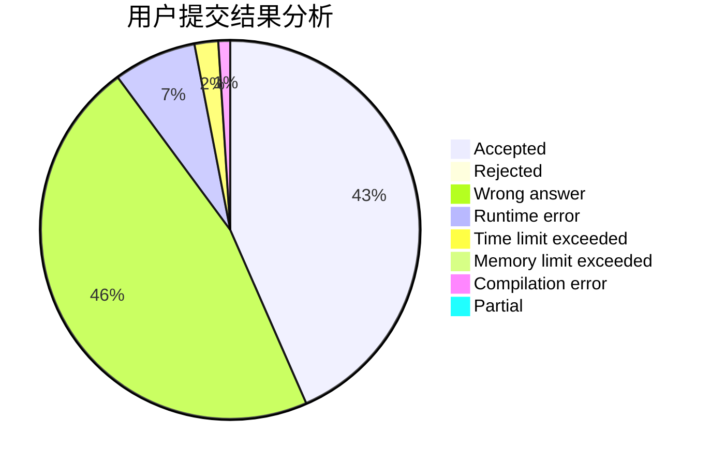
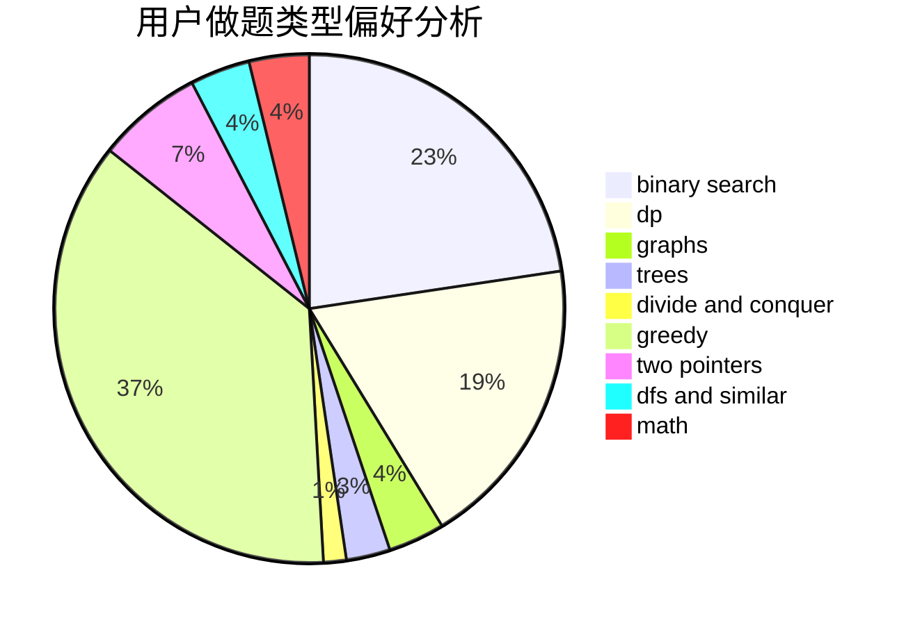

# 2114992323

<!-- tabs:start -->

#### **用户提交结果分析**

#### **用户做题类型偏好分析**

<!-- tabs:end -->
# 推荐题目
[12041](https://codeforces.com/contest/1204/problem/1)
[1015F](https://codeforces.com/contest/1015/problem/F)
[1307D](https://codeforces.com/contest/1307/problem/D)
[13131](https://codeforces.com/contest/1313/problem/1)
[1313D](https://codeforces.com/contest/1313/problem/D)
[1245F](https://codeforces.com/contest/1245/problem/F)
[1310D](https://codeforces.com/contest/1310/problem/D)
[1311D](https://codeforces.com/contest/1311/problem/D)
[11962](https://codeforces.com/contest/1196/problem/2)
[1195F](https://codeforces.com/contest/1195/problem/F)
