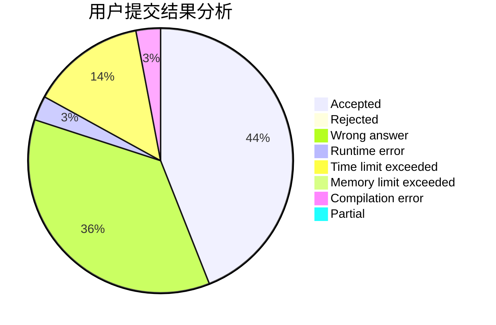
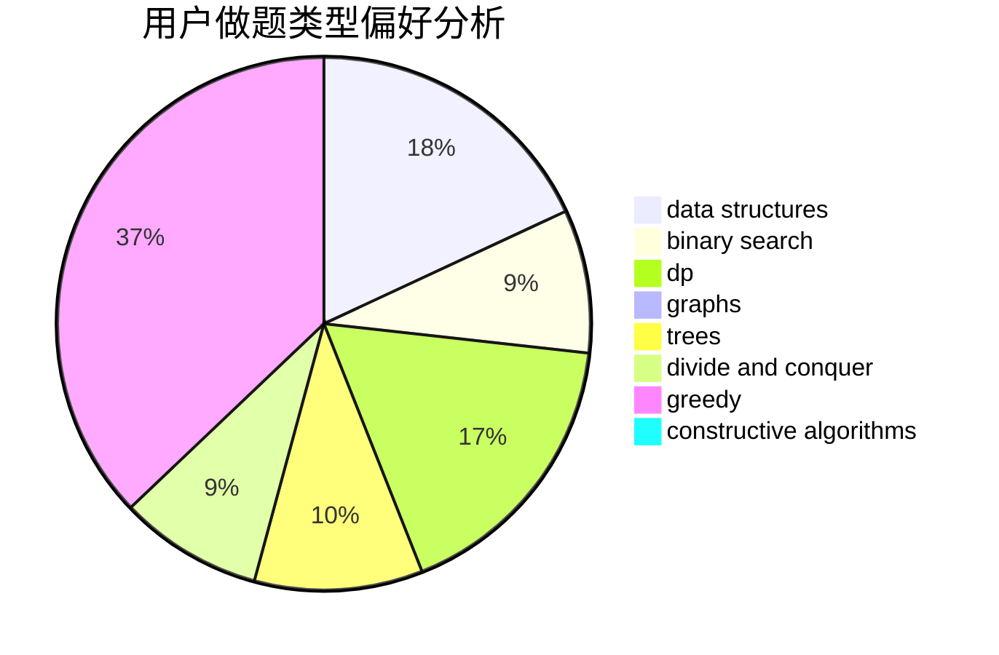

# HSJHSJ

<!-- tabs:start -->

#### **用户提交结果分析**

#### **用户做题类型偏好分析**

#### **用户错题知识点分析**

<!-- tabs:end -->
# 推荐题目
[1388D](https://codeforces.com/contest/1388/problem/D)		data structures,
                        dfs and similar,
                        graphs,
                        greedy,
                        implementation,
                        trees		  
[1202E](https://codeforces.com/contest/1202/problem/E)		brute force,
                        string suffix structures,
                        strings		  
[758D](https://codeforces.com/contest/758/problem/D)		constructive algorithms,
                        dp,
                        greedy,
                        math,
                        strings		  
[567A](https://codeforces.com/contest/567/problem/A)		greedy,
                        implementation		  
[720C](https://codeforces.com/contest/720/problem/C)		constructive algorithms		  
[914H](https://codeforces.com/contest/914/problem/H)		combinatorics,
                        dp,
                        games,
                        trees		  
[627C](https://codeforces.com/contest/627/problem/C)		data structures,
                        divide and conquer,
                        greedy		  
[730E](https://codeforces.com/contest/730/problem/E)		greedy,
                        implementation		  
[1103B](https://codeforces.com/contest/1103/problem/B)		binary search,
                        constructive algorithms,
                        interactive		  
[897B](https://codeforces.com/contest/897/problem/B)		brute force		  
