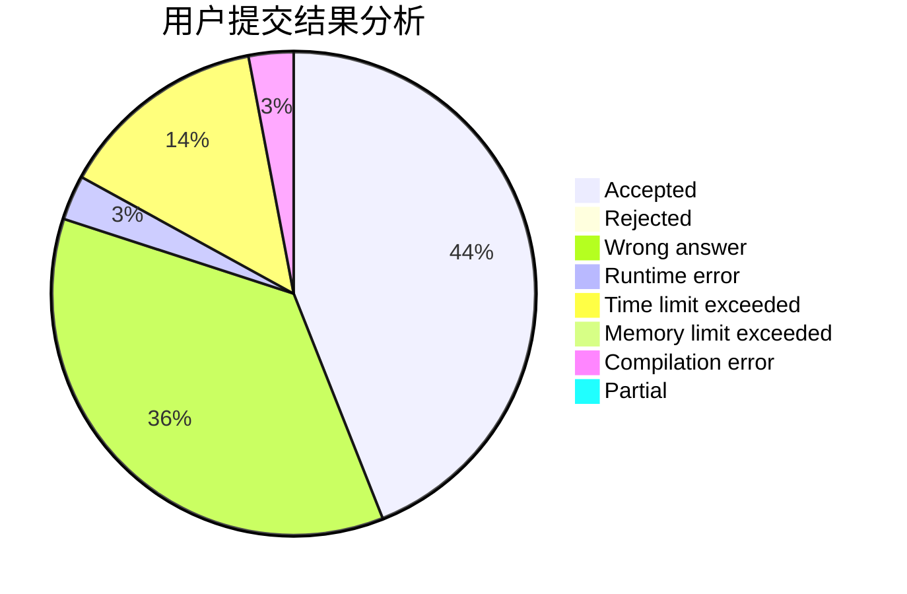
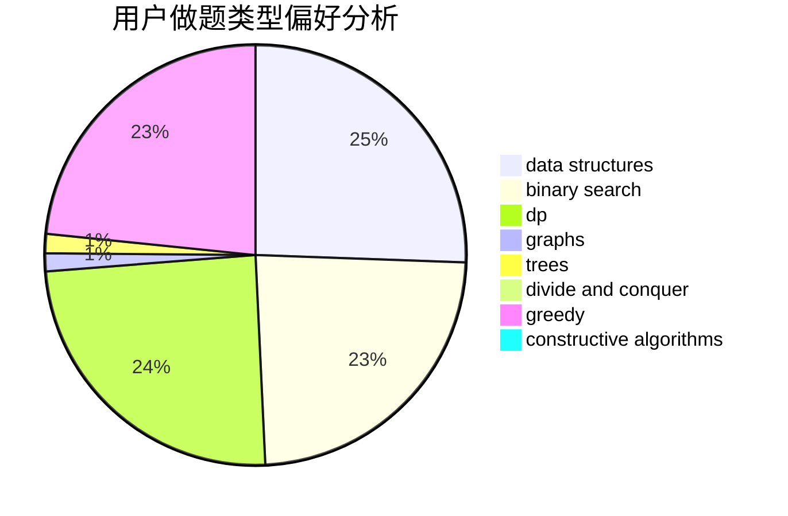

# HSJHSJ
<!-- tabs:start -->
#### **用户提交结果分析**

#### **用户做题类型偏好分析**

#### **用户错题知识点分析**

<!-- tabs:end -->
# 推荐题目
[Complete Tripartite](http://codeforces.com/problemset/problem/1228/D)		brute force,
                        constructive algorithms,
                        graphs,
                        hashing,
                        implementation		  
[Voltage Keepsake](https://codeforces.com/contest/801/problem/C)		binary search,
                        math		  
[Store](http://codeforces.com/problemset/problem/1010/E)		data structures		  
[Chess Championship](http://codeforces.com/problemset/problem/736/E)		constructive algorithms,
                        flows,
                        greedy,
                        math		  
[DZY Loves Planting](http://codeforces.com/problemset/problem/444/E)		binary search,
                        dsu,
                        trees		  
[Break Up](https://codeforces.com/contest/701/problem/F)		dfs and similar,
                        graphs		  
[2018 Integers (2 points)](https://codeforces.com/contest/1164/problem/K)		nan		  
[Splitting in Teams](http://codeforces.com/problemset/problem/899/A)		constructive algorithms,
                        greedy,
                        math		  
[High Cry](https://codeforces.com/contest/876/problem/F)		binary search,
                        bitmasks,
                        combinatorics,
                        data structures,
                        divide and conquer		  
[Restoring the Expression](http://codeforces.com/problemset/problem/898/F)		brute force,
                        hashing,
                        math		  
<!-- tabs:start -->
#### **data structures**
[Complete Tripartite](http://codeforces.com/problemset/problem/1010/E)		data structures		  
[Voltage Keepsake](https://codeforces.com/contest/876/problem/F)		binary search,
                        bitmasks,
                        combinatorics,
                        data structures,
                        divide and conquer		  
[Store](http://codeforces.com/problemset/problem/1408/H)		binary search,
                        data structures,
                        flows,
                        greedy		  
[Chess Championship](http://codeforces.com/problemset/problem/1379/D)		binary search,
                        brute force,
                        data structures,
                        sortings,
                        two pointers		  
[DZY Loves Planting](http://codeforces.com/problemset/problem/1348/B)		constructive algorithms,
                        data structures,
                        greedy,
                        sortings		  
[Break Up](http://codeforces.com/problemset/problem/1506/G)		brute force,
                        data structures,
                        dp,
                        greedy,
                        strings		  
[2018 Integers (2 points)](http://codeforces.com/problemset/problem/1492/C)		binary search,
                        data structures,
                        dp,
                        greedy,
                        two pointers		  
[Splitting in Teams](http://codeforces.com/problemset/problem/1490/G)		binary search,
                        data structures,
                        math		  
[High Cry](http://codeforces.com/problemset/problem/1479/D)		binary search,
                        bitmasks,
                        brute force,
                        data structures,
                        probabilities,
                        trees		  
[Restoring the Expression](http://codeforces.com/problemset/problem/1497/A)		brute force,
                        data structures,
                        greedy,
                        sortings		  
#### **binary search**
[Complete Tripartite](https://codeforces.com/contest/801/problem/C)		binary search,
                        math		  
[Voltage Keepsake](http://codeforces.com/problemset/problem/444/E)		binary search,
                        dsu,
                        trees		  
[Store](https://codeforces.com/contest/876/problem/F)		binary search,
                        bitmasks,
                        combinatorics,
                        data structures,
                        divide and conquer		  
[Chess Championship](http://codeforces.com/problemset/problem/1408/H)		binary search,
                        data structures,
                        flows,
                        greedy		  
[DZY Loves Planting](http://codeforces.com/problemset/problem/1379/D)		binary search,
                        brute force,
                        data structures,
                        sortings,
                        two pointers		  
[Break Up](http://codeforces.com/problemset/problem/1492/C)		binary search,
                        data structures,
                        dp,
                        greedy,
                        two pointers		  
[2018 Integers (2 points)](http://codeforces.com/problemset/problem/1463/D)		binary search,
                        constructive algorithms,
                        greedy,
                        two pointers		  
[Splitting in Teams](http://codeforces.com/problemset/problem/1490/G)		binary search,
                        data structures,
                        math		  
[High Cry](http://codeforces.com/problemset/problem/1479/D)		binary search,
                        bitmasks,
                        brute force,
                        data structures,
                        probabilities,
                        trees		  
[Restoring the Expression](http://codeforces.com/problemset/problem/1436/E)		binary search,
                        data structures,
                        two pointers		  
#### **dp**
[Complete Tripartite](http://codeforces.com/problemset/problem/780/F)		bitmasks,
                        dp,
                        graphs,
                        matrices		  
[Voltage Keepsake](http://codeforces.com/problemset/problem/1506/G)		brute force,
                        data structures,
                        dp,
                        greedy,
                        strings		  
[Store](http://codeforces.com/problemset/problem/512/D)		dp,
                        trees		  
[Chess Championship](http://codeforces.com/problemset/problem/1492/C)		binary search,
                        data structures,
                        dp,
                        greedy,
                        two pointers		  
[DZY Loves Planting](https://codeforces.com/contest/1457/problem/C)		brute force,
                        dp,
                        implementation		  
[Break Up](http://codeforces.com/problemset/problem/1491/C)		brute force,
                        data structures,
                        dp,
                        greedy,
                        implementation		  
[2018 Integers (2 points)](http://codeforces.com/problemset/problem/1437/C)		dp,
                        flows,
                        graph matchings,
                        greedy,
                        math,
                        sortings		  
[Splitting in Teams](http://codeforces.com/problemset/problem/1499/B)		brute force,
                        dp,
                        greedy,
                        implementation		  
[High Cry](http://codeforces.com/problemset/problem/1491/D)		bitmasks,
                        constructive algorithms,
                        dp,
                        greedy,
                        math		  
[Restoring the Expression](http://codeforces.com/problemset/problem/1497/E1)		data structures,
                        dp,
                        greedy,
                        math,
                        number theory,
                        two pointers		  
#### **graph**
[Complete Tripartite](http://codeforces.com/problemset/problem/1228/D)		brute force,
                        constructive algorithms,
                        graphs,
                        hashing,
                        implementation		  
[Voltage Keepsake](https://codeforces.com/contest/701/problem/F)		dfs and similar,
                        graphs		  
[Store](http://codeforces.com/problemset/problem/542/E)		graphs,
                        shortest paths		  
[Chess Championship](http://codeforces.com/problemset/problem/863/C)		graphs,
                        implementation		  
[DZY Loves Planting](http://codeforces.com/problemset/problem/780/F)		bitmasks,
                        dp,
                        graphs,
                        matrices		  
[Break Up](http://codeforces.com/problemset/problem/1487/C)		brute force,
                        constructive algorithms,
                        dfs and similar,
                        graphs,
                        greedy,
                        implementation,
                        math		  
[2018 Integers (2 points)](http://codeforces.com/problemset/problem/1437/C)		dp,
                        flows,
                        graph matchings,
                        greedy,
                        math,
                        sortings		  
[Splitting in Teams](http://codeforces.com/problemset/problem/1470/D)		constructive algorithms,
                        dfs and similar,
                        graph matchings,
                        graphs,
                        greedy		  
[High Cry](http://codeforces.com/problemset/problem/1476/C)		dp,
                        graphs,
                        greedy		  
[Restoring the Expression](http://codeforces.com/problemset/problem/1304/D)		constructive algorithms,
                        graphs,
                        greedy,
                        two pointers		  
#### **trees**
[Complete Tripartite](http://codeforces.com/problemset/problem/444/E)		binary search,
                        dsu,
                        trees		  
[Voltage Keepsake](http://codeforces.com/problemset/problem/512/D)		dp,
                        trees		  
[Store](http://codeforces.com/problemset/problem/1479/D)		binary search,
                        bitmasks,
                        brute force,
                        data structures,
                        probabilities,
                        trees		  
[Chess Championship](http://codeforces.com/problemset/problem/1511/C)		brute force,
                        data structures,
                        implementation,
                        trees		  
[DZY Loves Planting](http://codeforces.com/problemset/problem/1499/F)		combinatorics,
                        dfs and similar,
                        dp,
                        trees		  
[Break Up](http://codeforces.com/problemset/problem/1491/E)		brute force,
                        dfs and similar,
                        divide and conquer,
                        number theory,
                        trees		  
[2018 Integers (2 points)](http://codeforces.com/problemset/problem/1466/D)		data structures,
                        greedy,
                        sortings,
                        trees		  
[Splitting in Teams](http://codeforces.com/problemset/problem/1495/D)		combinatorics,
                        dfs and similar,
                        graphs,
                        math,
                        shortest paths,
                        trees		  
[High Cry](http://codeforces.com/problemset/problem/1303/G)		data structures,
                        divide and conquer,
                        geometry,
                        trees		  
[Restoring the Expression](http://codeforces.com/problemset/problem/1454/E)		combinatorics,
                        dfs and similar,
                        graphs,
                        trees		  
#### **divide and conquer**
[Complete Tripartite](https://codeforces.com/contest/876/problem/F)		binary search,
                        bitmasks,
                        combinatorics,
                        data structures,
                        divide and conquer		  
[Voltage Keepsake](http://codeforces.com/problemset/problem/1461/D)		binary search,
                        brute force,
                        data structures,
                        divide and conquer,
                        implementation,
                        sortings		  
[Store](http://codeforces.com/problemset/problem/1466/G)		combinatorics,
                        divide and conquer,
                        hashing,
                        math,
                        string suffix structures,
                        strings		  
[Chess Championship](http://codeforces.com/problemset/problem/1490/D)		dfs and similar,
                        divide and conquer,
                        implementation		  
[DZY Loves Planting](https://codeforces.com/contest/1483/problem/C)		data structures,
                        divide and conquer,
                        dp		  
[Break Up](http://codeforces.com/problemset/problem/1491/E)		brute force,
                        dfs and similar,
                        divide and conquer,
                        number theory,
                        trees		  
[2018 Integers (2 points)](http://codeforces.com/problemset/problem/1303/G)		data structures,
                        divide and conquer,
                        geometry,
                        trees		  
[Splitting in Teams](http://codeforces.com/problemset/problem/1494/D)		constructive algorithms,
                        data structures,
                        dfs and similar,
                        divide and conquer,
                        dsu,
                        greedy,
                        sortings,
                        trees		  
[High Cry](http://codeforces.com/problemset/problem/1482/E)		data structures,
                        divide and conquer,
                        dp		  
[Restoring the Expression](http://codeforces.com/problemset/problem/566/C)		dfs and similar,
                        divide and conquer,
                        trees		  
#### **greedy**
[Complete Tripartite](http://codeforces.com/problemset/problem/736/E)		constructive algorithms,
                        flows,
                        greedy,
                        math		  
[Voltage Keepsake](http://codeforces.com/problemset/problem/899/A)		constructive algorithms,
                        greedy,
                        math		  
[Store](http://codeforces.com/problemset/problem/1408/H)		binary search,
                        data structures,
                        flows,
                        greedy		  
[Chess Championship](http://codeforces.com/problemset/problem/898/E)		constructive algorithms,
                        greedy		  
[DZY Loves Planting](http://codeforces.com/problemset/problem/1348/B)		constructive algorithms,
                        data structures,
                        greedy,
                        sortings		  
[Break Up](http://codeforces.com/problemset/problem/1506/G)		brute force,
                        data structures,
                        dp,
                        greedy,
                        strings		  
[2018 Integers (2 points)](http://codeforces.com/problemset/problem/1492/C)		binary search,
                        data structures,
                        dp,
                        greedy,
                        two pointers		  
[Splitting in Teams](https://codeforces.com/contest/1496/problem/C)		geometry,
                        greedy,
                        math,
                        sortings		  
[High Cry](http://codeforces.com/problemset/problem/1493/A)		constructive algorithms,
                        greedy		  
[Restoring the Expression](http://codeforces.com/problemset/problem/1463/D)		binary search,
                        constructive algorithms,
                        greedy,
                        two pointers		  
#### **constructive algorithms**
[Complete Tripartite](http://codeforces.com/problemset/problem/1228/D)		brute force,
                        constructive algorithms,
                        graphs,
                        hashing,
                        implementation		  
[Voltage Keepsake](http://codeforces.com/problemset/problem/736/E)		constructive algorithms,
                        flows,
                        greedy,
                        math		  
[Store](http://codeforces.com/problemset/problem/899/A)		constructive algorithms,
                        greedy,
                        math		  
[Chess Championship](http://codeforces.com/problemset/problem/898/E)		constructive algorithms,
                        greedy		  
[DZY Loves Planting](http://codeforces.com/problemset/problem/1348/B)		constructive algorithms,
                        data structures,
                        greedy,
                        sortings		  
[Break Up](http://codeforces.com/problemset/problem/1493/A)		constructive algorithms,
                        greedy		  
[2018 Integers (2 points)](http://codeforces.com/problemset/problem/1463/D)		binary search,
                        constructive algorithms,
                        greedy,
                        two pointers		  
[Splitting in Teams](https://codeforces.com/contest/1456/problem/B)		bitmasks,
                        brute force,
                        constructive algorithms		  
[High Cry](http://codeforces.com/problemset/problem/1492/D)		bitmasks,
                        constructive algorithms,
                        greedy,
                        math		  
[Restoring the Expression](https://codeforces.com/contest/1504/problem/D)		constructive algorithms,
                        games,
                        interactive		  
#### **sortings**
[Complete Tripartite](http://codeforces.com/problemset/problem/710/B)		brute force,
                        sortings		  
[Voltage Keepsake](http://codeforces.com/problemset/problem/1102/E)		combinatorics,
                        sortings		  
[Store](http://codeforces.com/problemset/problem/1379/D)		binary search,
                        brute force,
                        data structures,
                        sortings,
                        two pointers		  
[Chess Championship](http://codeforces.com/problemset/problem/1348/B)		constructive algorithms,
                        data structures,
                        greedy,
                        sortings		  
[DZY Loves Planting](https://codeforces.com/contest/1496/problem/C)		geometry,
                        greedy,
                        math,
                        sortings		  
[Break Up](http://codeforces.com/problemset/problem/1495/A)		geometry,
                        greedy,
                        math,
                        sortings		  
[2018 Integers (2 points)](http://codeforces.com/problemset/problem/1497/A)		brute force,
                        data structures,
                        greedy,
                        sortings		  
[Splitting in Teams](http://codeforces.com/problemset/problem/1427/A)		math,
                        sortings		  
[High Cry](http://codeforces.com/problemset/problem/1461/D)		binary search,
                        brute force,
                        data structures,
                        divide and conquer,
                        implementation,
                        sortings		  
[Restoring the Expression](http://codeforces.com/problemset/problem/1437/C)		dp,
                        flows,
                        graph matchings,
                        greedy,
                        math,
                        sortings		  
<!-- tabs:end -->
