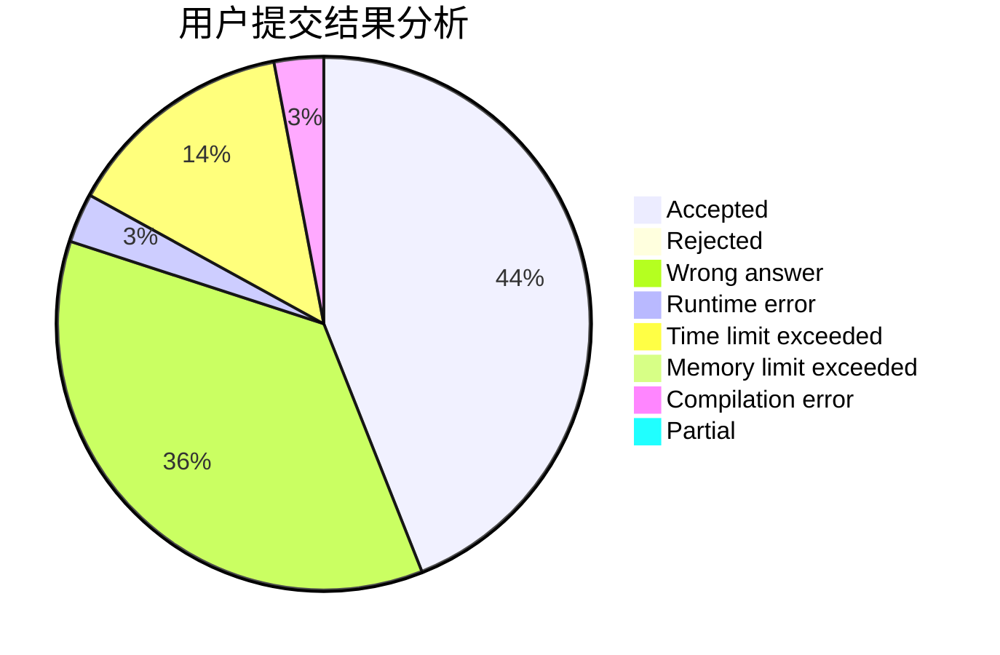
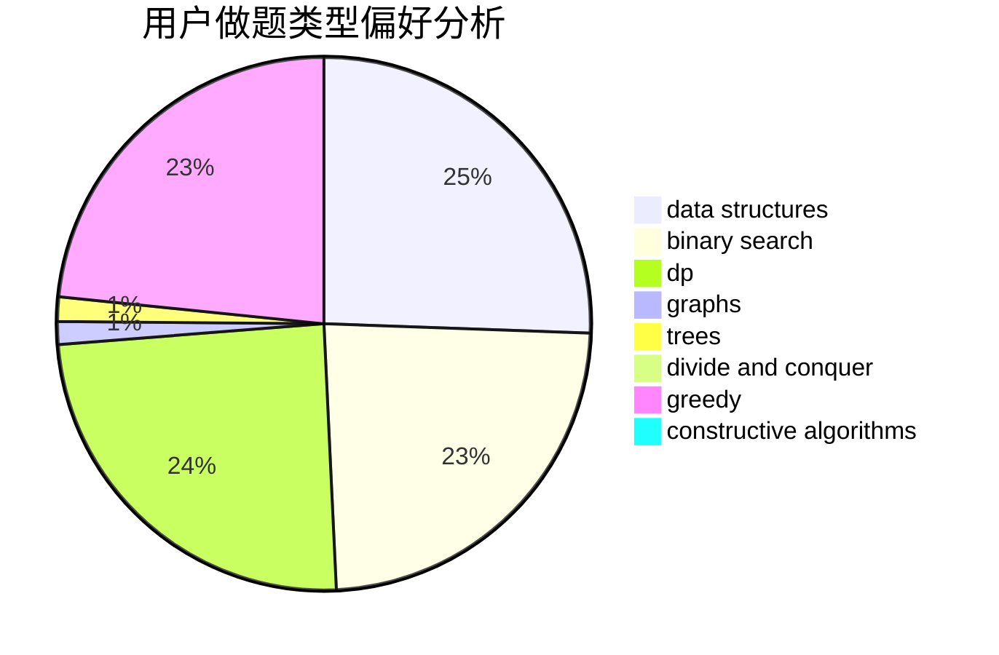

# HSJHSJ

<!-- tabs:start -->

#### **用户提交结果分析**

#### **用户做题类型偏好分析**

#### **用户错题知识点分析**

<!-- tabs:end -->
# 推荐题目
[1379D](https://codeforces.com/contest/1379/problem/D)		binary search,
                        brute force,
                        data structures,
                        sortings,
                        two pointers		  
[1199A](https://codeforces.com/contest/1199/problem/A)		implementation		  
[736E](https://codeforces.com/contest/736/problem/E)		constructive algorithms,
                        flows,
                        greedy,
                        math		  
[542E](https://codeforces.com/contest/542/problem/E)		graphs,
                        shortest paths		  
[701F](https://codeforces.com/contest/701/problem/F)		dsu,graphs,sortings,trees		  
[898F](https://codeforces.com/contest/898/problem/F)		brute force,
                        hashing,
                        math		  
[608B](https://codeforces.com/contest/608/problem/B)		combinatorics,
                        strings		  
[710B](https://codeforces.com/contest/710/problem/B)		brute force,
                        sortings		  
[1102E](https://codeforces.com/contest/1102/problem/E)		combinatorics,
                        sortings		  
[876F](https://codeforces.com/contest/876/problem/F)		dsu,graphs,sortings,trees		  
