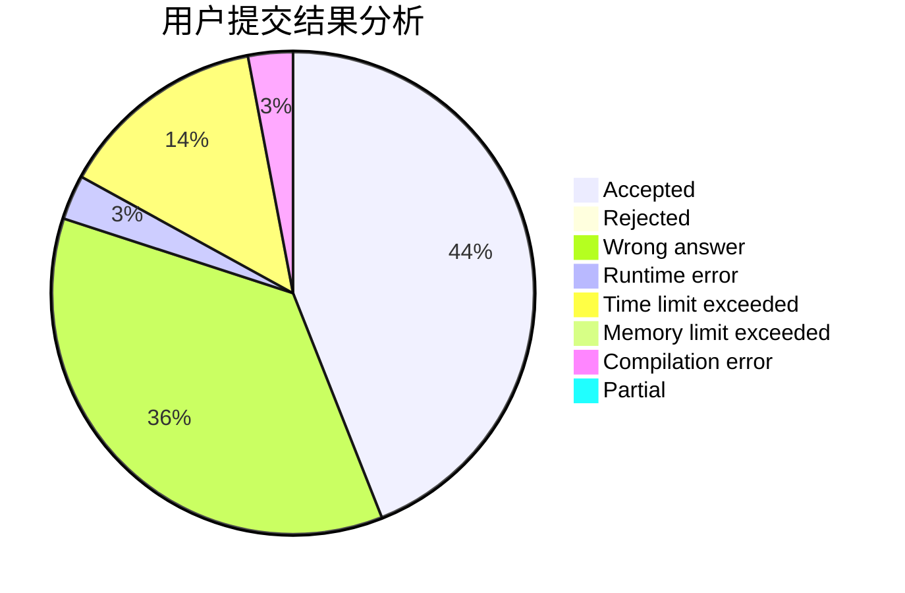
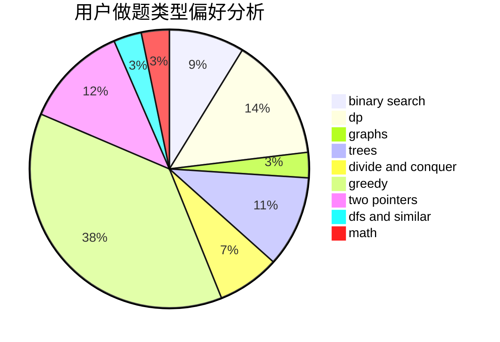

# HSJHSJ

<!-- tabs:start -->

#### **用户提交结果分析**

#### **用户做题类型偏好分析**

<!-- tabs:end -->
# 推荐题目
[1388D](https://codeforces.com/contest/1388/problem/D)
[1202E](https://codeforces.com/contest/1202/problem/E)
[758D](https://codeforces.com/contest/758/problem/D)
[567A](https://codeforces.com/contest/567/problem/A)
[720C](https://codeforces.com/contest/720/problem/C)
[914H](https://codeforces.com/contest/914/problem/H)
[627C](https://codeforces.com/contest/627/problem/C)
[730E](https://codeforces.com/contest/730/problem/E)
[1103B](https://codeforces.com/contest/1103/problem/B)
[897B](https://codeforces.com/contest/897/problem/B)
