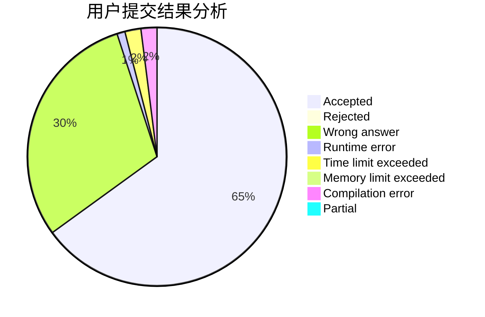
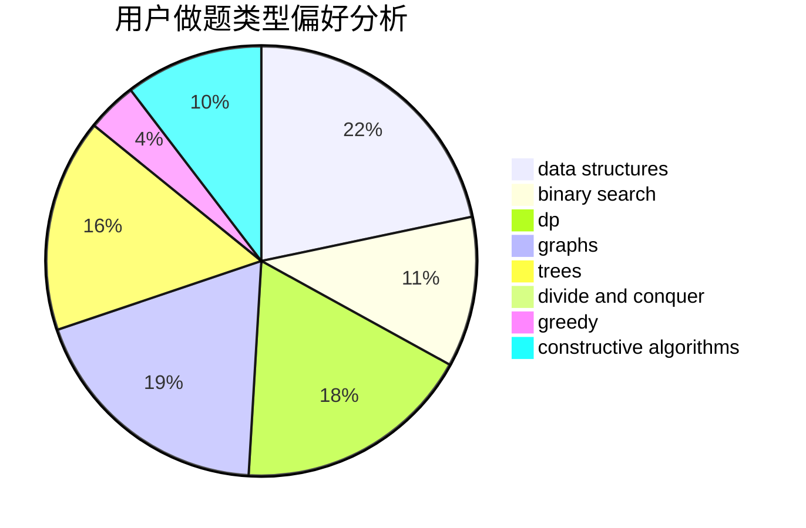

# HTL33

<!-- tabs:start -->

#### **用户提交结果分析**

#### **用户做题类型偏好分析**

#### **用户错题知识点分析**

<!-- tabs:end -->
# 推荐题目
[1051A](https://codeforces.com/contest/1051/problem/A)		greedy,
                        implementation,
                        strings		  
[869E](https://codeforces.com/contest/869/problem/E)		data structures,
                        hashing		  
[388D](https://codeforces.com/contest/388/problem/D)		math		  
[80A](https://codeforces.com/contest/80/problem/A)		brute force		  
[343A](https://codeforces.com/contest/343/problem/A)		math,
                        number theory		  
[1054C](https://codeforces.com/contest/1054/problem/C)		constructive algorithms,
                        implementation		  
[1174F](https://codeforces.com/contest/1174/problem/F)		constructive algorithms,
                        divide and conquer,
                        graphs,
                        implementation,
                        interactive,
                        trees		  
[365A](https://codeforces.com/contest/365/problem/A)		implementation		  
[596D](https://codeforces.com/contest/596/problem/D)		dp,
                        math,
                        probabilities,
                        sortings		  
[393C](https://codeforces.com/contest/393/problem/C)		dsu,graphs,sortings,trees		  
