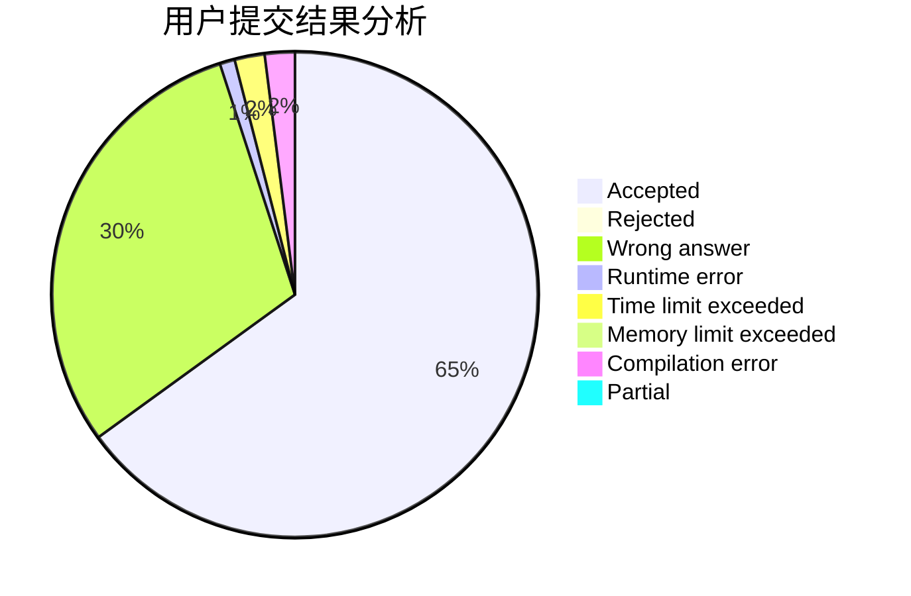
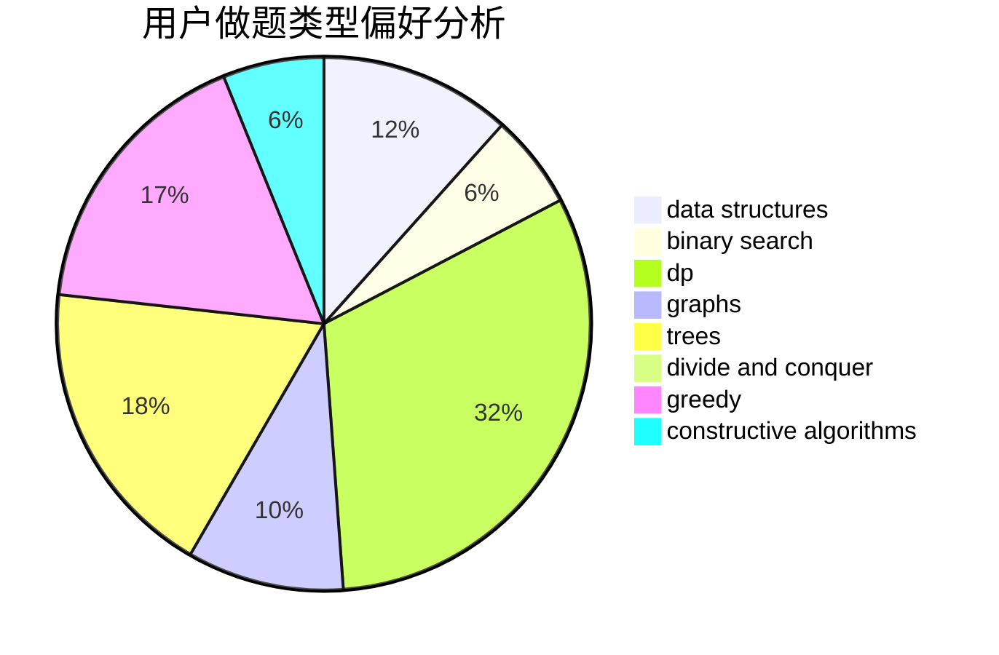
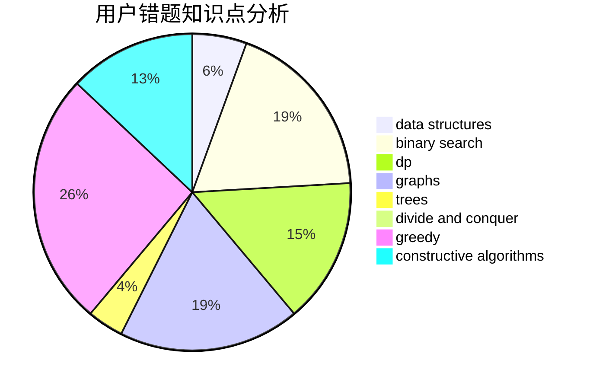

# HTL33

<!-- tabs:start -->

#### **用户提交结果分析**

#### **用户做题类型偏好分析**

#### **用户错题知识点分析**

<!-- tabs:end -->
# 推荐题目
[1047B](https://codeforces.com/contest/1047/problem/B)		geometry,
                        math		  
[850F](https://codeforces.com/contest/850/problem/F)		math		  
[360C](https://codeforces.com/contest/360/problem/C)		combinatorics,
                        dp		  
[794G](https://codeforces.com/contest/794/problem/G)		combinatorics,
                        dp,
                        math		  
[316E2](https://codeforces.com/contest/316E/problem/2)		data structures,
                        math		  
[1053E](https://codeforces.com/contest/1053/problem/E)		constructive algorithms,
                        trees		  
[1172C2](https://codeforces.com/contest/1172C/problem/2)		dp,
                        probabilities		  
[339B](https://codeforces.com/contest/339/problem/B)		implementation		  
[575C](https://codeforces.com/contest/575/problem/C)		bitmasks,
                        brute force,
                        graph matchings		  
[365A](https://codeforces.com/contest/365/problem/A)		implementation		  
