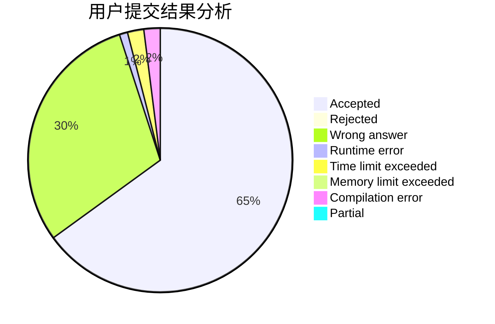
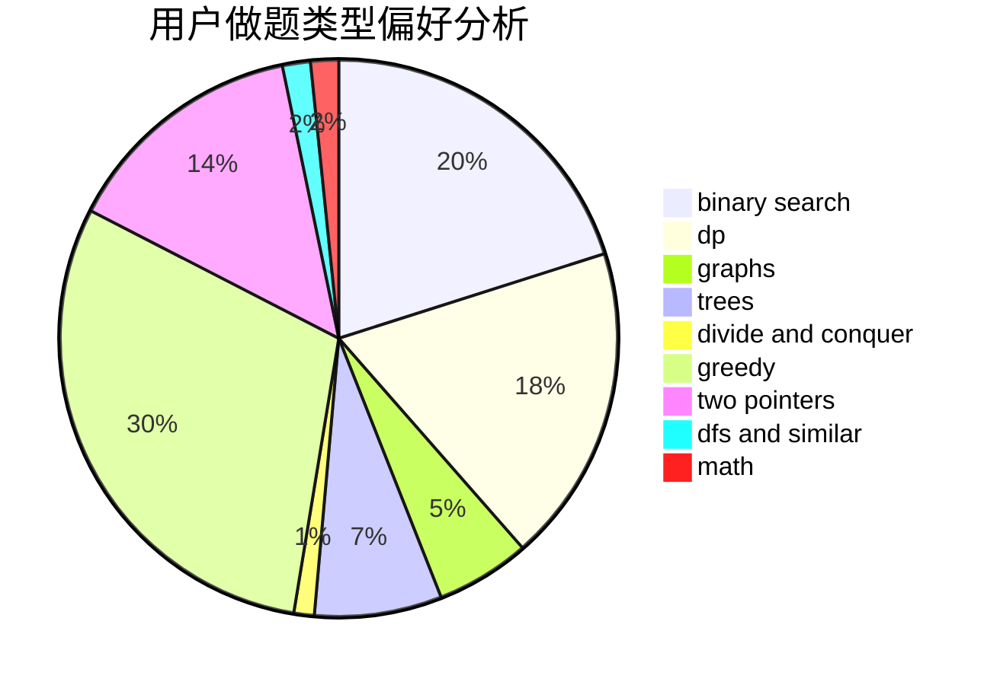

# HTL33

<!-- tabs:start -->

#### **用户提交结果分析**

#### **用户做题类型偏好分析**

<!-- tabs:end -->
# 推荐题目
[1051A](https://codeforces.com/contest/1051/problem/A)
[869E](https://codeforces.com/contest/869/problem/E)
[388D](https://codeforces.com/contest/388/problem/D)
[80A](https://codeforces.com/contest/80/problem/A)
[343A](https://codeforces.com/contest/343/problem/A)
[1054C](https://codeforces.com/contest/1054/problem/C)
[1174F](https://codeforces.com/contest/1174/problem/F)
[365A](https://codeforces.com/contest/365/problem/A)
[596D](https://codeforces.com/contest/596/problem/D)
[393C](https://codeforces.com/contest/393/problem/C)
