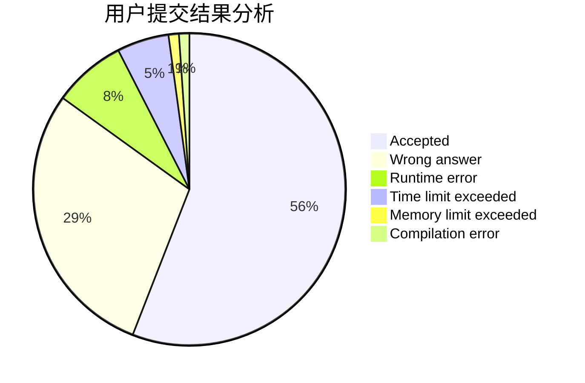
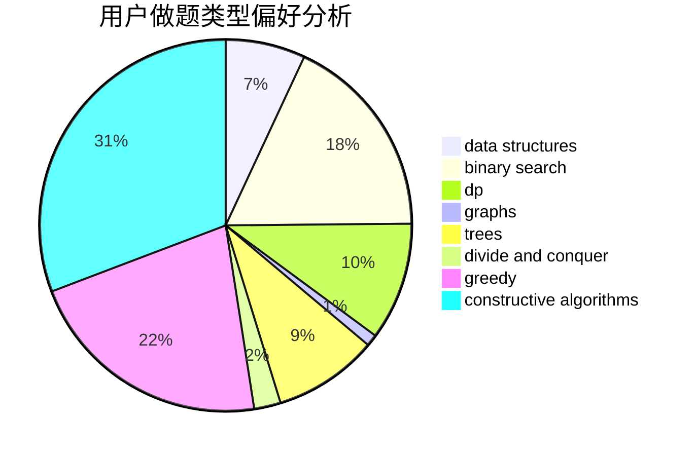
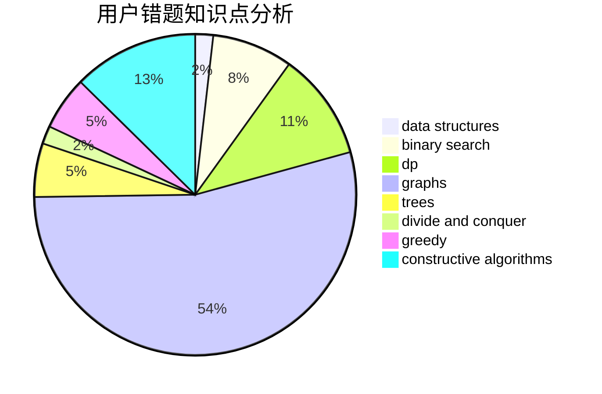

# HXLLL
<!-- tabs:start -->
#### **用户提交结果分析**

#### **用户做题类型偏好分析**

#### **用户错题知识点分析**

<!-- tabs:end -->
# 推荐题目
[Putting Bricks in the Wall](http://codeforces.com/problemset/problem/1421/B)		constructive algorithms,
                        implementation		  
[Unmerge](https://codeforces.com/contest/1382/problem/D)		dp		  
[a-Good String](http://codeforces.com/problemset/problem/1385/D)		bitmasks,
                        brute force,
                        divide and conquer,
                        dp,
                        implementation		  
[Sereja and Dividing](http://codeforces.com/problemset/problem/380/E)		data structures		  
[Letters Removing](http://codeforces.com/problemset/problem/899/F)		data structures,
                        strings		  
[Level Generation](http://codeforces.com/problemset/problem/818/F)		binary search,
                        math,
                        ternary search		  
[Obsession with Robots](http://codeforces.com/problemset/problem/8/B)		constructive algorithms,
                        graphs,
                        implementation		  
[Segments Removal](http://codeforces.com/problemset/problem/899/E)		data structures,
                        dsu,
                        flows,
                        implementation,
                        two pointers		  
[Island Puzzle](http://codeforces.com/problemset/problem/634/A)		constructive algorithms,
                        implementation		  
[Bank Hacking](http://codeforces.com/problemset/problem/796/C)		constructive algorithms,
                        data structures,
                        dp,
                        trees		  
<!-- tabs:start -->
#### **data structures**
[Sereja and Dividing](http://codeforces.com/problemset/problem/380/E)		data structures		  
[Letters Removing](http://codeforces.com/problemset/problem/899/F)		data structures,
                        strings		  
[Segments Removal](http://codeforces.com/problemset/problem/899/E)		data structures,
                        dsu,
                        flows,
                        implementation,
                        two pointers		  
[Bank Hacking](http://codeforces.com/problemset/problem/796/C)		constructive algorithms,
                        data structures,
                        dp,
                        trees		  
[Most Dangerous Shark](http://codeforces.com/problemset/problem/1131/G)		data structures,
                        dp,
                        two pointers		  
[Sereja ans Anagrams](http://codeforces.com/problemset/problem/367/B)		binary search,
                        data structures		  
[Two Strings](http://codeforces.com/problemset/problem/223/B)		data structures,
                        dp,
                        strings		  
[K Integers](http://codeforces.com/problemset/problem/1268/C)		binary search,
                        data structures		  
[Segment Tree](http://codeforces.com/problemset/problem/1278/D)		data structures,
                        dsu,
                        graphs,
                        trees		  
[Cow and Fields](http://codeforces.com/problemset/problem/1307/D)		binary search,
                        data structures,
                        dfs and similar,
                        graphs,
                        greedy,
                        shortest paths,
                        sortings		  
#### **binary search**
[Level Generation](http://codeforces.com/problemset/problem/818/F)		binary search,
                        math,
                        ternary search		  
[Sereja ans Anagrams](http://codeforces.com/problemset/problem/367/B)		binary search,
                        data structures		  
[K Integers](http://codeforces.com/problemset/problem/1268/C)		binary search,
                        data structures		  
[Cow and Fields](http://codeforces.com/problemset/problem/1307/D)		binary search,
                        data structures,
                        dfs and similar,
                        graphs,
                        greedy,
                        shortest paths,
                        sortings		  
[You Are Given Some Letters...](http://codeforces.com/problemset/problem/1202/F)		binary search,
                        implementation,
                        math		  
[Maximum width](http://codeforces.com/problemset/problem/1492/C)		binary search,
                        data structures,
                        dp,
                        greedy,
                        two pointers		  
[Pairs](http://codeforces.com/problemset/problem/1463/D)		binary search,
                        constructive algorithms,
                        greedy,
                        two pointers		  
[Old Floppy Drive](http://codeforces.com/problemset/problem/1490/G)		binary search,
                        data structures,
                        math		  
[Odd Mineral Resource](http://codeforces.com/problemset/problem/1479/D)		binary search,
                        bitmasks,
                        brute force,
                        data structures,
                        probabilities,
                        trees		  
[Complicated Computations](http://codeforces.com/problemset/problem/1436/E)		binary search,
                        data structures,
                        two pointers		  
#### **dp**
[Unmerge](https://codeforces.com/contest/1382/problem/D)		dp		  
[a-Good String](http://codeforces.com/problemset/problem/1385/D)		bitmasks,
                        brute force,
                        divide and conquer,
                        dp,
                        implementation		  
[Bank Hacking](http://codeforces.com/problemset/problem/796/C)		constructive algorithms,
                        data structures,
                        dp,
                        trees		  
[New Year and Ancient Prophecy](http://codeforces.com/problemset/problem/611/D)		dp,
                        hashing,
                        strings		  
[Most Dangerous Shark](http://codeforces.com/problemset/problem/1131/G)		data structures,
                        dp,
                        two pointers		  
[Two Strings](http://codeforces.com/problemset/problem/223/B)		data structures,
                        dp,
                        strings		  
[Bag of mice](http://codeforces.com/problemset/problem/148/D)		dp,
                        games,
                        math,
                        probabilities		  
[Maximum width](http://codeforces.com/problemset/problem/1492/C)		binary search,
                        data structures,
                        dp,
                        greedy,
                        two pointers		  
[Bouncing Ball](https://codeforces.com/contest/1457/problem/C)		brute force,
                        dp,
                        implementation		  
[Pekora and Trampoline](http://codeforces.com/problemset/problem/1491/C)		brute force,
                        data structures,
                        dp,
                        greedy,
                        implementation		  
#### **graph**
[Obsession with Robots](http://codeforces.com/problemset/problem/8/B)		constructive algorithms,
                        graphs,
                        implementation		  
[Okabe and City](http://codeforces.com/problemset/problem/821/D)		dfs and similar,
                        graphs,
                        shortest paths		  
[Petya and Graph](http://codeforces.com/problemset/problem/1082/G)		flows,
                        graphs		  
[Nezzar and Hidden Permutations](http://codeforces.com/problemset/problem/1477/D)		constructive algorithms,
                        dfs and similar,
                        graphs		  
[Segment Tree](http://codeforces.com/problemset/problem/1278/D)		data structures,
                        dsu,
                        graphs,
                        trees		  
[Cow and Fields](http://codeforces.com/problemset/problem/1307/D)		binary search,
                        data structures,
                        dfs and similar,
                        graphs,
                        greedy,
                        shortest paths,
                        sortings		  
[Graph and Queries](http://codeforces.com/problemset/problem/1416/D)		data structures,
                        dsu,
                        graphs,
                        implementation,
                        trees		  
[Minimum Ties](http://codeforces.com/problemset/problem/1487/C)		brute force,
                        constructive algorithms,
                        dfs and similar,
                        graphs,
                        greedy,
                        implementation,
                        math		  
[Chef Monocarp](http://codeforces.com/problemset/problem/1437/C)		dp,
                        flows,
                        graph matchings,
                        greedy,
                        math,
                        sortings		  
[Strange Housing](http://codeforces.com/problemset/problem/1470/D)		constructive algorithms,
                        dfs and similar,
                        graph matchings,
                        graphs,
                        greedy		  
#### **trees**
[Bank Hacking](http://codeforces.com/problemset/problem/796/C)		constructive algorithms,
                        data structures,
                        dp,
                        trees		  
[Segment Tree](http://codeforces.com/problemset/problem/1278/D)		data structures,
                        dsu,
                        graphs,
                        trees		  
[Graph and Queries](http://codeforces.com/problemset/problem/1416/D)		data structures,
                        dsu,
                        graphs,
                        implementation,
                        trees		  
[Odd Mineral Resource](http://codeforces.com/problemset/problem/1479/D)		binary search,
                        bitmasks,
                        brute force,
                        data structures,
                        probabilities,
                        trees		  
[Yet Another Card Deck](http://codeforces.com/problemset/problem/1511/C)		brute force,
                        data structures,
                        implementation,
                        trees		  
[Diameter Cuts](http://codeforces.com/problemset/problem/1499/F)		combinatorics,
                        dfs and similar,
                        dp,
                        trees		  
[Fib-tree](http://codeforces.com/problemset/problem/1491/E)		brute force,
                        dfs and similar,
                        divide and conquer,
                        number theory,
                        trees		  
[13th Labour of Heracles](http://codeforces.com/problemset/problem/1466/D)		data structures,
                        greedy,
                        sortings,
                        trees		  
[BFS Trees](http://codeforces.com/problemset/problem/1495/D)		combinatorics,
                        dfs and similar,
                        graphs,
                        math,
                        shortest paths,
                        trees		  
[Sum of Prefix Sums](http://codeforces.com/problemset/problem/1303/G)		data structures,
                        divide and conquer,
                        geometry,
                        trees		  
#### **divide and conquer**
[a-Good String](http://codeforces.com/problemset/problem/1385/D)		bitmasks,
                        brute force,
                        divide and conquer,
                        dp,
                        implementation		  
[Divide and Summarize](http://codeforces.com/problemset/problem/1461/D)		binary search,
                        brute force,
                        data structures,
                        divide and conquer,
                        implementation,
                        sortings		  
[Song of the Sirens](http://codeforces.com/problemset/problem/1466/G)		combinatorics,
                        divide and conquer,
                        hashing,
                        math,
                        string suffix structures,
                        strings		  
[Permutation Transformation](http://codeforces.com/problemset/problem/1490/D)		dfs and similar,
                        divide and conquer,
                        implementation		  
[Skyline Photo](https://codeforces.com/contest/1483/problem/C)		data structures,
                        divide and conquer,
                        dp		  
[Fib-tree](http://codeforces.com/problemset/problem/1491/E)		brute force,
                        dfs and similar,
                        divide and conquer,
                        number theory,
                        trees		  
[Sum of Prefix Sums](http://codeforces.com/problemset/problem/1303/G)		data structures,
                        divide and conquer,
                        geometry,
                        trees		  
[Dogeforces](http://codeforces.com/problemset/problem/1494/D)		constructive algorithms,
                        data structures,
                        dfs and similar,
                        divide and conquer,
                        dsu,
                        greedy,
                        sortings,
                        trees		  
[Logistical Questions](http://codeforces.com/problemset/problem/566/C)		dfs and similar,
                        divide and conquer,
                        trees		  
[Fruit Sequences](http://codeforces.com/problemset/problem/1428/F)		binary search,
                        data structures,
                        divide and conquer,
                        dp,
                        two pointers		  
#### **greedy**
[An abandoned sentiment from past](http://codeforces.com/problemset/problem/814/A)		constructive algorithms,
                        greedy,
                        implementation,
                        sortings		  
[Cow and Fields](http://codeforces.com/problemset/problem/1307/D)		binary search,
                        data structures,
                        dfs and similar,
                        graphs,
                        greedy,
                        shortest paths,
                        sortings		  
[Meximization](http://codeforces.com/problemset/problem/1497/A)		brute force,
                        data structures,
                        greedy,
                        sortings		  
[There Are Two Types Of Burgers](http://codeforces.com/problemset/problem/1207/A)		brute force,
                        greedy,
                        implementation,
                        math		  
[Maximum width](http://codeforces.com/problemset/problem/1492/C)		binary search,
                        data structures,
                        dp,
                        greedy,
                        two pointers		  
[Diamond Miner](https://codeforces.com/contest/1496/problem/C)		geometry,
                        greedy,
                        math,
                        sortings		  
[Anti-knapsack](http://codeforces.com/problemset/problem/1493/A)		constructive algorithms,
                        greedy		  
[Pairs](http://codeforces.com/problemset/problem/1463/D)		binary search,
                        constructive algorithms,
                        greedy,
                        two pointers		  
[Unique Number](http://codeforces.com/problemset/problem/1462/C)		brute force,
                        greedy,
                        math		  
[Berland Crossword](http://codeforces.com/problemset/problem/1494/B)		bitmasks,
                        brute force,
                        greedy,
                        implementation		  
#### **constructive algorithms**
[Putting Bricks in the Wall](http://codeforces.com/problemset/problem/1421/B)		constructive algorithms,
                        implementation		  
[Obsession with Robots](http://codeforces.com/problemset/problem/8/B)		constructive algorithms,
                        graphs,
                        implementation		  
[Island Puzzle](http://codeforces.com/problemset/problem/634/A)		constructive algorithms,
                        implementation		  
[Bank Hacking](http://codeforces.com/problemset/problem/796/C)		constructive algorithms,
                        data structures,
                        dp,
                        trees		  
[Shovel Sale](http://codeforces.com/problemset/problem/899/D)		constructive algorithms,
                        math		  
[An abandoned sentiment from past](http://codeforces.com/problemset/problem/814/A)		constructive algorithms,
                        greedy,
                        implementation,
                        sortings		  
[Nezzar and Hidden Permutations](http://codeforces.com/problemset/problem/1477/D)		constructive algorithms,
                        dfs and similar,
                        graphs		  
[Anti-knapsack](http://codeforces.com/problemset/problem/1493/A)		constructive algorithms,
                        greedy		  
[Pairs](http://codeforces.com/problemset/problem/1463/D)		binary search,
                        constructive algorithms,
                        greedy,
                        two pointers		  
[XOR-gun](https://codeforces.com/contest/1456/problem/B)		bitmasks,
                        brute force,
                        constructive algorithms		  
#### **sortings**
[An abandoned sentiment from past](http://codeforces.com/problemset/problem/814/A)		constructive algorithms,
                        greedy,
                        implementation,
                        sortings		  
[Cow and Fields](http://codeforces.com/problemset/problem/1307/D)		binary search,
                        data structures,
                        dfs and similar,
                        graphs,
                        greedy,
                        shortest paths,
                        sortings		  
[Meximization](http://codeforces.com/problemset/problem/1497/A)		brute force,
                        data structures,
                        greedy,
                        sortings		  
[Diamond Miner](https://codeforces.com/contest/1496/problem/C)		geometry,
                        greedy,
                        math,
                        sortings		  
[Avoiding Zero](http://codeforces.com/problemset/problem/1427/A)		math,
                        sortings		  
[Divide and Summarize](http://codeforces.com/problemset/problem/1461/D)		binary search,
                        brute force,
                        data structures,
                        divide and conquer,
                        implementation,
                        sortings		  
[Chef Monocarp](http://codeforces.com/problemset/problem/1437/C)		dp,
                        flows,
                        graph matchings,
                        greedy,
                        math,
                        sortings		  
[Replacing Elements](http://codeforces.com/problemset/problem/1473/A)		greedy,
                        implementation,
                        math,
                        sortings		  
[Eastern Exhibition](http://codeforces.com/problemset/problem/1486/B)		binary search,
                        geometry,
                        shortest paths,
                        sortings		  
[The Great Hero](http://codeforces.com/problemset/problem/1480/B)		greedy,
                        implementation,
                        sortings		  
<!-- tabs:end -->
